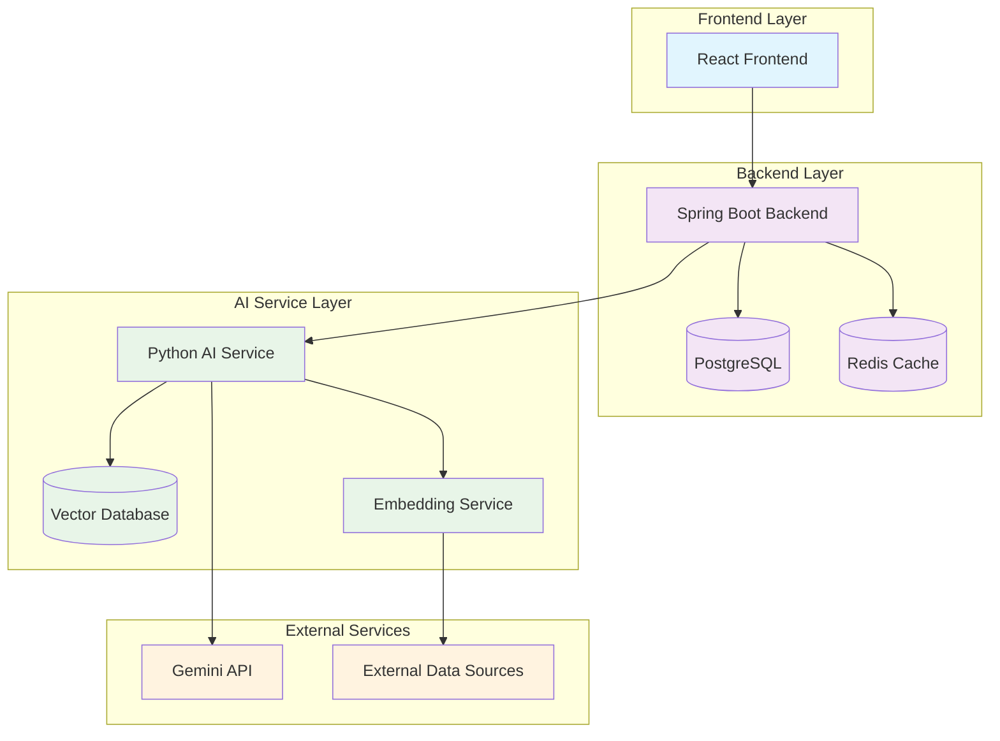
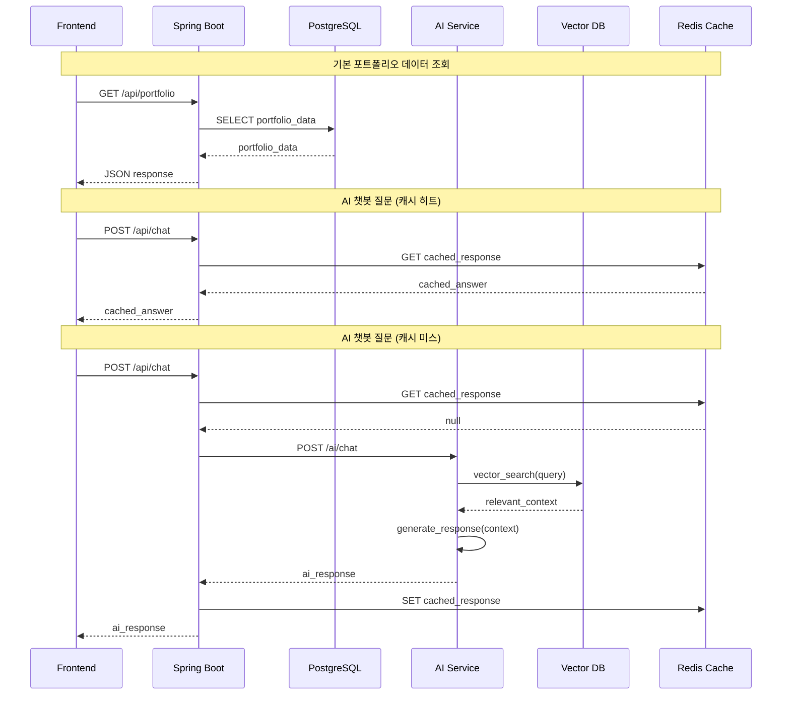
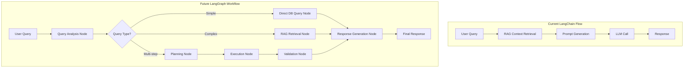
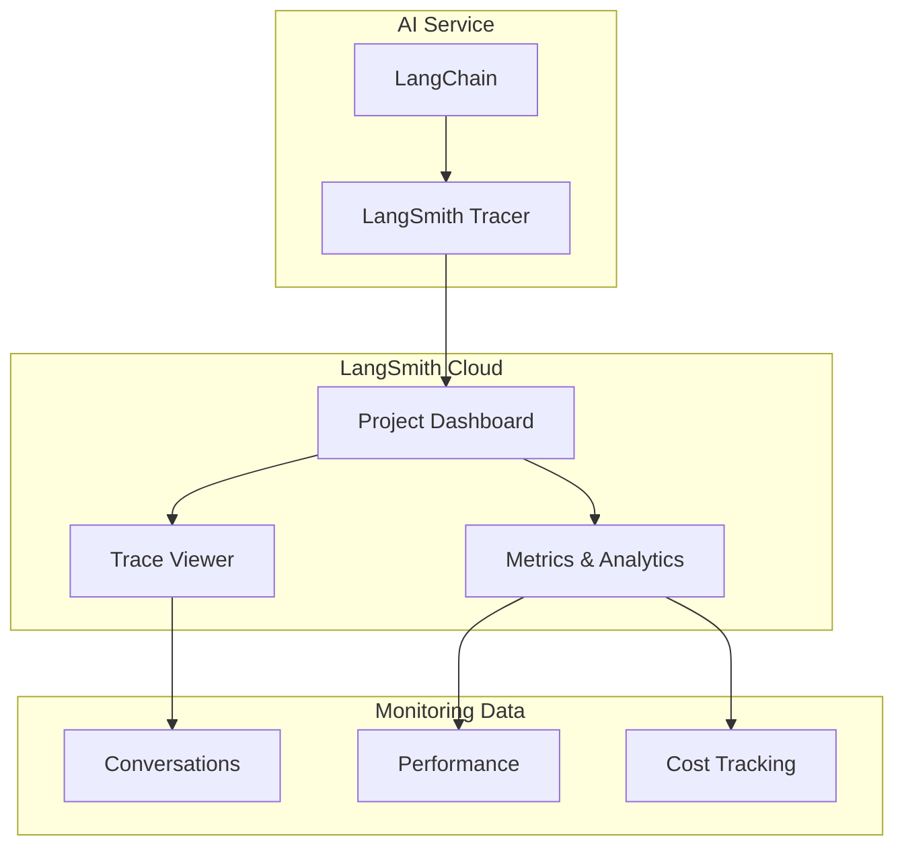

# AI 서비스 마이그레이션 설계 문서

## 개요

현재 Spring Boot 백엔드에 통합된 챗봇 기능을 독립적인 Python AI 서비스로 분리하고, RAG 기반 벡터 데이터베이스와 자동 업데이트 파이프라인을 구현하는 시스템 설계입니다. 이 설계는 안정성, 확장성, 그리고 사용자 경험을 모두 고려한 계층화된 아키텍처를 제공합니다.

## 아키텍처

### 전체 시스템 아키텍처



### 서비스 간 통신 흐름



## 컴포넌트 및 인터페이스

### 1. Spring Boot 백엔드 (기존 + 확장)

#### 주요 컴포넌트
- **ChatController**: 채팅 요청 라우팅 및 캐시 관리
- **PortfolioController**: 기본 포트폴리오 데이터 제공
- **AIServiceClient**: AI 서비스와의 통신 담당
- **CacheService**: Redis 기반 응답 캐시 관리
- **FallbackService**: AI 서비스 장애 시 대체 응답 생성

#### API 인터페이스
```java
// 기존 API 유지 (하위 호환성)
@PostMapping("/api/chat")
public ChatResponse chat(@RequestBody ChatRequest request);

@GetMapping("/api/portfolio")
public PortfolioResponse getPortfolio();

// 새로운 관리 API
@PostMapping("/api/admin/cache/clear")
public void clearCache();

@GetMapping("/api/health/ai-service")
public HealthStatus getAIServiceHealth();
```

### 2. Python AI 서비스 (신규)

#### 주요 컴포넌트
- **ChatAPI**: FastAPI 기반 채팅 엔드포인트
- **RAGService**: 벡터 검색 및 컨텍스트 생성
- **EmbeddingService**: 텍스트 임베딩 생성 및 관리
- **DataSyncService**: PostgreSQL과 벡터 DB 동기화
- **PromptManager**: 프롬프트 템플릿 관리

#### API 인터페이스
```python
# 채팅 API
@app.post("/ai/chat")
async def chat(request: ChatRequest) -> ChatResponse

# 데이터 동기화 API
@app.post("/ai/sync/portfolio")
async def sync_portfolio_data(data: PortfolioData)

@app.post("/ai/sync/projects")
async def sync_project_data(data: ProjectData)

# 관리 API
@app.get("/ai/health")
async def health_check()

@app.post("/ai/embeddings/rebuild")
async def rebuild_embeddings()
```

### 3. 벡터 데이터베이스 (Qdrant)

#### 데이터 구조
```python
# Qdrant 컬렉션 구조
from qdrant_client.models import Distance, VectorParams, PointStruct

collections_config = {
    "portfolio_general": {
        "vectors_config": VectorParams(size=384, distance=Distance.COSINE),
        "points": [
            PointStruct(
                id=1,
                vector=[0.1, 0.2, ...],  # 384차원 임베딩
                payload={
                    "text": "개발자 소개 텍스트",
                    "type": "profile",
                    "category": "intro",
                    "priority": 10
                }
            )
        ]
    },
    "projects": {
        "vectors_config": VectorParams(size=384, distance=Distance.COSINE),
        "points": [
            PointStruct(
                id=2,
                vector=[0.3, 0.4, ...],
                payload={
                    "text": "프로젝트 상세 설명",
                    "project_id": 1,
                    "category": "project",
                    "tech_stack": ["React", "Spring Boot"],
                    "priority": 8
                }
            )
        ]
    }
}
```

## 데이터 모델

### PostgreSQL 스키마 (기존 + 확장)

```sql
-- 기존 테이블 유지
CREATE TABLE projects (
    id SERIAL PRIMARY KEY,
    name VARCHAR(255) NOT NULL,
    description TEXT,
    tech_stack TEXT[],
    github_url VARCHAR(500),
    demo_url VARCHAR(500),
    created_at TIMESTAMP DEFAULT NOW(),
    updated_at TIMESTAMP DEFAULT NOW()
);

-- 새로운 테이블 추가
CREATE TABLE chat_cache (
    id SERIAL PRIMARY KEY,
    question_hash VARCHAR(64) UNIQUE NOT NULL,
    question TEXT NOT NULL,
    answer TEXT NOT NULL,
    cache_type VARCHAR(50) NOT NULL, -- 'ai_response', 'fallback'
    expires_at TIMESTAMP NOT NULL,
    created_at TIMESTAMP DEFAULT NOW()
);

CREATE TABLE ai_service_status (
    id SERIAL PRIMARY KEY,
    service_name VARCHAR(100) NOT NULL,
    is_available BOOLEAN DEFAULT TRUE,
    last_check TIMESTAMP DEFAULT NOW(),
    error_message TEXT
);

CREATE TABLE data_sync_log (
    id SERIAL PRIMARY KEY,
    sync_type VARCHAR(50) NOT NULL, -- 'portfolio', 'projects', 'skills'
    status VARCHAR(20) NOT NULL, -- 'success', 'failed', 'in_progress'
    records_processed INTEGER DEFAULT 0,
    error_details TEXT,
    started_at TIMESTAMP DEFAULT NOW(),
    completed_at TIMESTAMP
);
```

### 벡터 데이터베이스 스키마

```python
# Qdrant 페이로드 스키마
from typing import Optional, List
from pydantic import BaseModel

class QdrantPayload(BaseModel):
    text: str  # 원본 텍스트
    type: str  # "profile", "project", "skill", "experience"
    category: str  # 세부 카테고리
    project_id: Optional[int] = None  # 프로젝트 관련 데이터인 경우
    skill_name: Optional[str] = None  # 기술 관련 데이터인 경우
    tech_stack: Optional[List[str]] = None  # 기술 스택 목록
    priority: int = 5  # 검색 우선순위 (1-10)
    last_updated: str  # ISO 형식 날짜
    source: str = "postgresql"  # "postgresql", "manual", "external_api"
    
# Qdrant 컬렉션 설정
collection_configs = {
    "portfolio": {
        "size": 384,  # sentence-transformers 모델 차원
        "distance": "Cosine",
        "hnsw_config": {
            "m": 16,  # 연결 수 (메모리 vs 정확도 트레이드오프)
            "ef_construct": 100  # 인덱스 구축 시 탐색 깊이
        }
    }
}
```

## 오류 처리

### 1. AI 서비스 장애 처리

```java
@Service
public class ChatService {
    
    @Retryable(value = {AIServiceException.class}, maxAttempts = 3)
    public ChatResponse processChat(ChatRequest request) {
        try {
            // 1. 캐시 확인
            String cachedResponse = cacheService.getCachedResponse(request);
            if (cachedResponse != null) {
                return ChatResponse.fromCache(cachedResponse);
            }
            
            // 2. AI 서비스 호출
            ChatResponse aiResponse = aiServiceClient.chat(request);
            cacheService.cacheResponse(request, aiResponse);
            return aiResponse;
            
        } catch (AIServiceException e) {
            // 3. 대체 응답 생성
            return fallbackService.generateFallbackResponse(request);
        }
    }
}
```

### 2. 벡터 DB 장애 처리

```python
class RAGService:
    async def get_context(self, query: str) -> str:
        try:
            # 벡터 검색 시도
            results = await self.vector_db.similarity_search(query, k=5)
            return self._format_context(results)
        except VectorDBException:
            # PostgreSQL 기반 기본 컨텍스트 사용
            return await self._get_fallback_context(query)
    
    async def _get_fallback_context(self, query: str) -> str:
        # 키워드 기반으로 PostgreSQL에서 관련 데이터 검색
        keywords = self._extract_keywords(query)
        basic_data = await self.postgres_client.search_by_keywords(keywords)
        return self._format_basic_context(basic_data)
```

### 3. 데이터 동기화 오류 처리

```python
class DataSyncService:
    async def sync_portfolio_data(self):
        sync_log = await self._create_sync_log("portfolio")
        try:
            # 1. PostgreSQL에서 데이터 조회
            portfolio_data = await self.postgres_client.get_portfolio_data()
            
            # 2. 임베딩 생성
            embeddings = await self.embedding_service.generate_embeddings(portfolio_data)
            
            # 3. 벡터 DB 업데이트
            await self.vector_db.upsert_embeddings(embeddings)
            
            await self._complete_sync_log(sync_log.id, "success")
            
        except Exception as e:
            await self._complete_sync_log(sync_log.id, "failed", str(e))
            # 실패한 동기화는 재시도 큐에 추가
            await self.retry_queue.add_failed_sync(sync_log.id)
```

## 테스팅 전략

### 1. 단위 테스트

```java
// Spring Boot 서비스 테스트
@ExtendWith(MockitoExtension.class)
class ChatServiceTest {
    
    @Test
    void shouldReturnCachedResponseWhenAvailable() {
        // Given
        ChatRequest request = new ChatRequest("안녕하세요");
        String cachedResponse = "안녕하세요! 무엇을 도와드릴까요?";
        when(cacheService.getCachedResponse(request)).thenReturn(cachedResponse);
        
        // When
        ChatResponse response = chatService.processChat(request);
        
        // Then
        assertThat(response.getMessage()).isEqualTo(cachedResponse);
        verify(aiServiceClient, never()).chat(any());
    }
}
```

```python
# Python AI 서비스 테스트
import pytest
from unittest.mock import AsyncMock

@pytest.mark.asyncio
async def test_rag_service_fallback_on_vector_db_failure():
    # Given
    rag_service = RAGService()
    rag_service.vector_db = AsyncMock(side_effect=VectorDBException())
    rag_service.postgres_client = AsyncMock(return_value="기본 컨텍스트")
    
    # When
    context = await rag_service.get_context("프로젝트에 대해 알려주세요")
    
    # Then
    assert context == "기본 컨텍스트"
    rag_service.postgres_client.search_by_keywords.assert_called_once()
```

### 2. 통합 테스트

```java
@SpringBootTest(webEnvironment = SpringBootTest.WebEnvironment.RANDOM_PORT)
@Testcontainers
class ChatIntegrationTest {
    
    @Container
    static PostgreSQLContainer<?> postgres = new PostgreSQLContainer<>("postgres:15")
            .withDatabaseName("test_db")
            .withUsername("test")
            .withPassword("test");
    
    @Test
    void shouldHandleAIServiceFailureGracefully() {
        // AI 서비스 Mock을 실패하도록 설정
        // 대체 응답이 정상적으로 반환되는지 확인
    }
}
```

### 3. 성능 테스트

```python
# 벡터 검색 성능 테스트
import asyncio
import time

async def test_vector_search_performance():
    start_time = time.time()
    
    tasks = []
    for i in range(100):
        task = vector_db.similarity_search(f"테스트 쿼리 {i}", k=5)
        tasks.append(task)
    
    results = await asyncio.gather(*tasks)
    
    end_time = time.time()
    avg_response_time = (end_time - start_time) / 100
    
    assert avg_response_time < 0.5  # 500ms 이하
    assert all(len(result) <= 5 for result in results)
```

이 설계는 안정성과 확장성을 모두 고려하여 단계적 마이그레이션이 가능하도록 구성했습니다. 각 컴포넌트는 독립적으로 테스트 및 배포가 가능하며, 장애 상황에서도 서비스 연속성을 보장합니다.

## LangGraph 확장 고려사항

### 현재 설계의 LangGraph 호환성

현재 설계는 LangGraph 도입을 위한 확장 가능한 구조로 되어 있습니다:

#### 1. 워크플로우 기반 아키텍처 준비



#### 2. 상태 관리 인프라

```python
# 현재 설계에서 LangGraph 상태 관리를 위한 확장점
class ConversationState:
    """LangGraph 워크플로우 상태 관리를 위한 기반 클래스"""
    def __init__(self):
        self.conversation_id: str = ""
        self.user_context: Dict = {}
        self.retrieved_documents: List = []
        self.workflow_step: str = "initial"
        self.intermediate_results: Dict = {}
        self.error_state: Optional[str] = None

# Redis에 상태 저장을 위한 확장
class StateManager:
    async def save_conversation_state(self, state: ConversationState):
        await self.redis_client.setex(
            f"conversation:{state.conversation_id}",
            3600,  # 1시간 TTL
            json.dumps(state.__dict__)
        )
    
    async def load_conversation_state(self, conversation_id: str) -> ConversationState:
        data = await self.redis_client.get(f"conversation:{conversation_id}")
        if data:
            return ConversationState(**json.loads(data))
        return ConversationState()
```

#### 3. 노드 기반 처리 아키텍처

```python
# LangGraph 노드를 위한 인터페이스 설계
from abc import ABC, abstractmethod
from typing import Dict, Any

class WorkflowNode(ABC):
    """LangGraph 워크플로우 노드 기반 클래스"""
    
    @abstractmethod
    async def execute(self, state: Dict[str, Any]) -> Dict[str, Any]:
        pass
    
    @abstractmethod
    def get_next_nodes(self, state: Dict[str, Any]) -> List[str]:
        pass

class QueryAnalysisNode(WorkflowNode):
    """사용자 쿼리 분석 노드"""
    async def execute(self, state: Dict[str, Any]) -> Dict[str, Any]:
        query = state["user_query"]
        analysis = await self.analyze_query_intent(query)
        
        state["query_type"] = analysis.type
        state["entities"] = analysis.entities
        state["complexity"] = analysis.complexity
        
        return state
    
    def get_next_nodes(self, state: Dict[str, Any]) -> List[str]:
        query_type = state.get("query_type")
        if query_type == "simple_info":
            return ["database_query_node"]
        elif query_type == "complex_analysis":
            return ["rag_retrieval_node"]
        elif query_type == "multi_step":
            return ["planning_node"]
        return ["fallback_node"]

class RAGRetrievalNode(WorkflowNode):
    """RAG 기반 컨텍스트 검색 노드"""
    async def execute(self, state: Dict[str, Any]) -> Dict[str, Any]:
        query = state["user_query"]
        entities = state.get("entities", [])
        
        # 벡터 검색
        vector_results = await self.vector_search(query)
        
        # 엔티티 기반 필터링
        filtered_results = self.filter_by_entities(vector_results, entities)
        
        state["retrieved_context"] = filtered_results
        state["context_quality_score"] = self.calculate_quality_score(filtered_results)
        
        return state
    
    def get_next_nodes(self, state: Dict[str, Any]) -> List[str]:
        quality_score = state.get("context_quality_score", 0)
        if quality_score > 0.8:
            return ["response_generation_node"]
        elif quality_score > 0.5:
            return ["context_enhancement_node"]
        else:
            return ["fallback_retrieval_node"]
```

#### 4. 워크플로우 정의 및 관리

```python
# LangGraph 워크플로우 정의를 위한 구조
class PortfolioChatWorkflow:
    """포트폴리오 챗봇을 위한 LangGraph 워크플로우"""
    
    def __init__(self):
        self.nodes = {
            "query_analysis": QueryAnalysisNode(),
            "rag_retrieval": RAGRetrievalNode(),
            "database_query": DatabaseQueryNode(),
            "planning": PlanningNode(),
            "response_generation": ResponseGenerationNode(),
            "validation": ValidationNode(),
            "fallback": FallbackNode()
        }
        
        self.edges = {
            "query_analysis": ["rag_retrieval", "database_query", "planning"],
            "rag_retrieval": ["response_generation", "context_enhancement"],
            "database_query": ["response_generation"],
            "planning": ["execution", "fallback"],
            "response_generation": ["validation"],
            "validation": ["END", "response_generation"]
        }
    
    async def execute_workflow(self, initial_state: Dict[str, Any]) -> Dict[str, Any]:
        current_node = "query_analysis"
        state = initial_state.copy()
        
        while current_node != "END":
            # 노드 실행
            node = self.nodes[current_node]
            state = await node.execute(state)
            
            # 다음 노드 결정
            next_nodes = node.get_next_nodes(state)
            current_node = self.select_next_node(next_nodes, state)
            
            # 상태 저장 (디버깅 및 복구용)
            await self.save_intermediate_state(state, current_node)
        
        return state
```

### 데이터베이스 스키마 확장

```sql
-- LangGraph 워크플로우 실행 로그
CREATE TABLE workflow_executions (
    id SERIAL PRIMARY KEY,
    conversation_id VARCHAR(255) NOT NULL,
    workflow_name VARCHAR(100) NOT NULL,
    initial_state JSONB NOT NULL,
    final_state JSONB,
    execution_path TEXT[], -- 실행된 노드 순서
    total_duration_ms INTEGER,
    status VARCHAR(20) NOT NULL, -- 'running', 'completed', 'failed'
    error_details TEXT,
    created_at TIMESTAMP DEFAULT NOW(),
    completed_at TIMESTAMP
);

-- 노드별 실행 성능 추적
CREATE TABLE node_executions (
    id SERIAL PRIMARY KEY,
    workflow_execution_id INTEGER REFERENCES workflow_executions(id),
    node_name VARCHAR(100) NOT NULL,
    input_state JSONB,
    output_state JSONB,
    duration_ms INTEGER,
    success BOOLEAN DEFAULT TRUE,
    error_message TEXT,
    executed_at TIMESTAMP DEFAULT NOW()
);

-- 워크플로우 성능 메트릭
CREATE INDEX idx_workflow_executions_conversation ON workflow_executions(conversation_id);
CREATE INDEX idx_workflow_executions_status ON workflow_executions(status);
CREATE INDEX idx_node_executions_workflow ON node_executions(workflow_execution_id);
CREATE INDEX idx_node_executions_node_name ON node_executions(node_name);
```

### API 확장 계획

```python
# LangGraph 기능을 위한 API 확장
@app.post("/ai/chat/workflow")
async def chat_with_workflow(request: WorkflowChatRequest) -> WorkflowChatResponse:
    """LangGraph 워크플로우 기반 채팅"""
    workflow = PortfolioChatWorkflow()
    
    initial_state = {
        "user_query": request.message,
        "conversation_id": request.conversation_id,
        "user_context": request.context
    }
    
    final_state = await workflow.execute_workflow(initial_state)
    
    return WorkflowChatResponse(
        message=final_state["response"],
        conversation_id=final_state["conversation_id"],
        execution_path=final_state["execution_path"],
        confidence_score=final_state.get("confidence_score", 0.0)
    )

@app.get("/ai/workflow/debug/{conversation_id}")
async def get_workflow_debug_info(conversation_id: str):
    """워크플로우 실행 디버그 정보 조회"""
    execution = await db.get_workflow_execution(conversation_id)
    nodes = await db.get_node_executions(execution.id)
    
    return {
        "execution_summary": execution,
        "node_details": nodes,
        "performance_metrics": calculate_performance_metrics(nodes)
    }
```

### 마이그레이션 전략

1. **Phase 1**: 현재 LangChain 기반 구현
2. **Phase 2**: 상태 관리 및 노드 인터페이스 도입
3. **Phase 3**: 간단한 워크플로우 구현 (2-3개 노드)
4. **Phase 4**: 복잡한 멀티스텝 워크플로우 구현
5. **Phase 5**: 동적 워크플로우 생성 및 최적화

이렇게 설계하면 현재 LangChain 구현에서 LangGraph로 자연스럽게 확장할 수 있으며, 각 단계별로 점진적인 마이그레이션이 가능합니다.#
# LangSmith 통합 설계

### LangSmith 모니터링 아키텍처



### LangSmith 구현 예시

```python
# LangSmith 설정
import os
from langsmith import Client
from langchain.callbacks import LangChainTracer

# 환경변수 설정
os.environ["LANGCHAIN_TRACING_V2"] = "true"
os.environ["LANGCHAIN_ENDPOINT"] = "https://api.smith.langchain.com"
os.environ["LANGCHAIN_API_KEY"] = "your_langsmith_api_key"
os.environ["LANGCHAIN_PROJECT"] = "ai-portfolio-chatbot"

class AIService:
    def __init__(self):
        self.tracer = LangChainTracer(
            project_name="ai-portfolio-chatbot",
            client=Client()
        )
    
    async def process_chat(self, user_query: str, conversation_id: str):
        # LangSmith 메타데이터 설정
        metadata = {
            "conversation_id": conversation_id,
            "user_type": "portfolio_visitor",
            "query_type": self._classify_query(user_query)
        }
        
        # 체인 실행 (자동으로 LangSmith에 로깅됨)
        with self.tracer.trace(
            name="portfolio_chat",
            metadata=metadata
        ) as trace:
            # RAG 검색
            context = await self.rag_service.get_context(user_query)
            trace.add_metadata({"context_quality": len(context)})
            
            # LLM 호출
            response = await self.llm_chain.ainvoke({
                "query": user_query,
                "context": context
            })
            
            # 응답 품질 평가
            quality_score = self._evaluate_response(user_query, response)
            trace.add_metadata({"response_quality": quality_score})
            
            return response

# 커스텀 메트릭 수집
class LangSmithMetrics:
    def __init__(self):
        self.client = Client()
    
    async def log_user_feedback(self, run_id: str, feedback: dict):
        """사용자 피드백을 LangSmith에 기록"""
        await self.client.create_feedback(
            run_id=run_id,
            key="user_satisfaction",
            score=feedback.get("rating", 0),
            comment=feedback.get("comment", "")
        )
    
    async def get_performance_metrics(self, days: int = 7):
        """성능 메트릭 조회"""
        runs = await self.client.list_runs(
            project_name="ai-portfolio-chatbot",
            start_time=datetime.now() - timedelta(days=days)
        )
        
        return {
            "total_conversations": len(runs),
            "avg_response_time": sum(r.total_time for r in runs) / len(runs),
            "success_rate": len([r for r in runs if r.status == "success"]) / len(runs),
            "token_usage": sum(r.prompt_tokens + r.completion_tokens for r in runs)
        }
```

### Qdrant Cloud 설정

```python
# Qdrant Cloud 연동
from qdrant_client import QdrantClient
from qdrant_client.models import Distance, VectorParams

class QdrantService:
    def __init__(self):
        self.client = QdrantClient(
            url="https://your-cluster.qdrant.tech",
            api_key=os.getenv("QDRANT_API_KEY")
        )
        
    async def setup_collections(self):
        """컬렉션 초기 설정"""
        collections = {
            "portfolio": {
                "size": 384,  # sentence-transformers 차원
                "distance": Distance.COSINE
            }
        }
        
        for name, config in collections.items():
            try:
                await self.client.create_collection(
                    collection_name=name,
                    vectors_config=VectorParams(**config)
                )
            except Exception as e:
                print(f"Collection {name} already exists: {e}")
    
    async def search_similar(self, query_vector: List[float], limit: int = 5):
        """유사도 검색"""
        results = await self.client.search(
            collection_name="portfolio",
            query_vector=query_vector,
            limit=limit,
            with_payload=True
        )
        
        return [
            {
                "text": result.payload["text"],
                "score": result.score,
                "metadata": result.payload
            }
            for result in results
        ]
```

### 비용 최적화 전략

```yaml
cost_optimization:
  qdrant_cloud:
    free_tier: "1GB 벡터, 100만 요청/월"
    estimated_usage: "~1000 벡터, ~10K 요청/월"
    cost: "$0/월"
    
  langsmith:
    free_tier: "5K 트레이스/월"
    estimated_usage: "~1K 트레이스/월"
    cost: "$0/월"
    
  total_ai_infrastructure: "$0/월 (Free Tier 범위 내)"
```

이제 구현 계획이 Qdrant Cloud + LangSmith 조합으로 완성되었습니다. 구현 계획이 적절한가요? 다음 단계로 넘어가도 될까요?