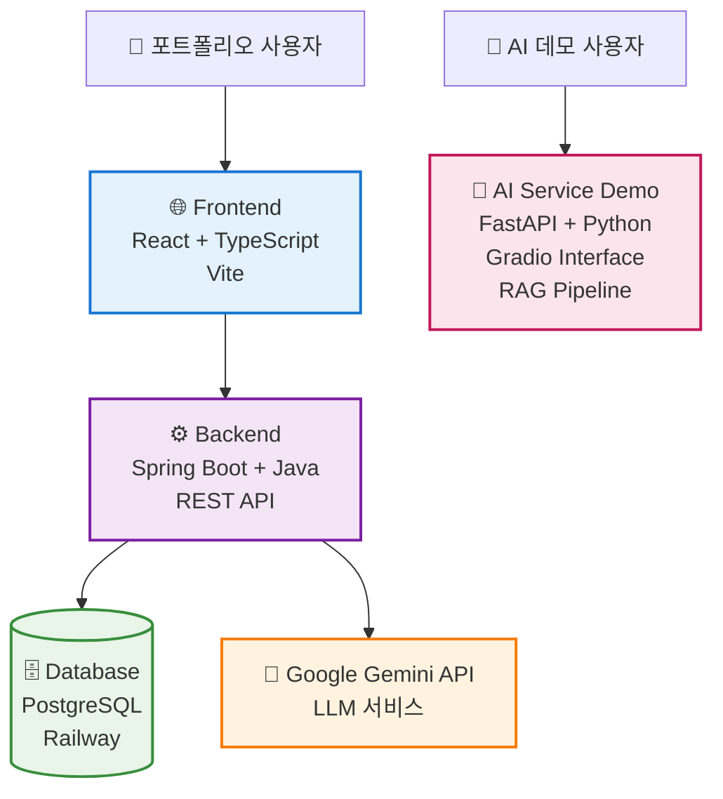
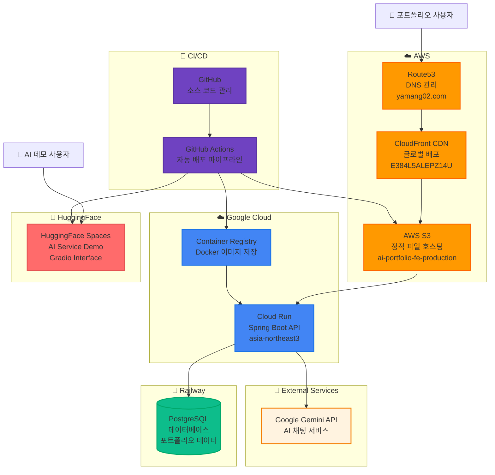

# AI Portfolio

AI 포트폴리오는 Google Gemini API를 활용한 개발자 포트폴리오 AI 챗봇입니다.

## 🏗️ 서비스 구조

## 🏗️ 인프라 구성

## 📞 연락처

- **이메일**: ljj0210@gmail.com
- **GitHub**: https://github.com/Yamang02
- **포트폴리오**: https://www.yamang02.com