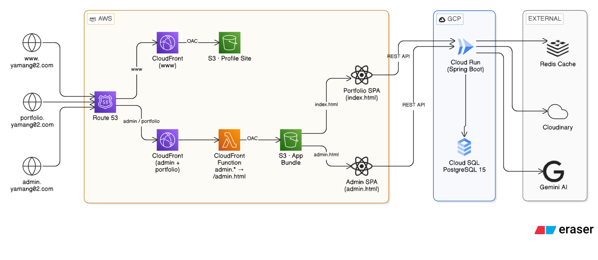

# AI Portfolio

Google Gemini API를 활용한 개발자 포트폴리오 AI 챗봇

- **프로필 랜딩**: https://www.yamang02.com
- **포트폴리오(SPA)**: https://portfolio.yamang02.com
- **어드민**: https://admin.yamang02.com

## 클라우드 아키텍처



## 로컬 개발

```bash
# 데이터베이스 및 Redis 시작
docker-compose up -d postgres redis

# 백엔드 시작
docker-compose up -d backend
```

접속 정보: 프론트엔드 `localhost:3000` / 백엔드 API `localhost:8080`

## 연락처

- **이메일**: ljj0210@gmail.com
- **GitHub**: https://github.com/Yamang02
