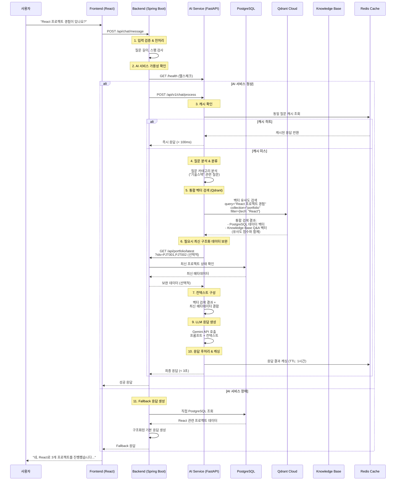

# 사용자 질문 처리 플로우

## 🔄 전체 아키텍처 플로우



## 📝 단계별 상세 설명

### 1. Frontend → Backend (질문 전송)

```typescript
// Frontend에서 질문 전송
const sendMessage = async (message: string) => {
  const response = await fetch('/api/chat/message', {
    method: 'POST',
    headers: { 'Content-Type': 'application/json' },
    body: JSON.stringify({
      message: message,
      sessionId: sessionId,
      timestamp: new Date().toISOString()
    })
  });
  
  return await response.json();
};
```

### 2. Backend 입력 검증 & 라우팅

```java
@RestController
public class ChatController {
    
    @PostMapping("/api/chat/message")
    public ResponseEntity<ChatResponse> processMessage(@RequestBody ChatRequest request) {
        
        // 1. 입력 검증
        if (!isValidInput(request.getMessage())) {
            return ResponseEntity.ok(ChatResponse.error("잘못된 입력입니다"));
        }
        
        // 2. AI 서비스 가용성 확인
        if (aiServiceHealthChecker.isHealthy()) {
            // AI 서비스로 전달
            return aiServiceClient.processChat(request);
        } else {
            // Fallback 응답 생성
            return fallbackService.generateResponse(request);
        }
    }
}
```

### 3. AI Service 처리 로직

```python
# AI Service의 메인 처리 로직
class ChatService:
    async def process_chat(self, request: ChatRequest) -> ChatResponse:
        
        # 1. 캐시 확인
        cached_response = await self.cache.get(request.message)
        if cached_response:
            return cached_response
        
        # 2. 질문 분석
        question_category = await self.classify_question(request.message)
        
        # 3. 통합 벡터 검색 (Qdrant)
        vector_results = await self.qdrant_service.search(
            collection_name="portfolio",
            query=request.message,
            filters={"category": question_category},
            limit=10  # PostgreSQL 데이터 + Knowledge Base 통합 검색
        )
        
        # 4. 필요시 최신 메타데이터 보완 (선택적)
        if self.needs_fresh_data(vector_results):
            fresh_data = await self.postgres_service.get_latest_metadata(
                extract_project_ids(vector_results)
            )
        else:
            fresh_data = None
        
        # 5. 컨텍스트 구성
        context = self.build_unified_context(
            vector_results=vector_results,
            fresh_metadata=fresh_data
        )
        
        # 7. LLM 응답 생성
        response = await self.llm_service.generate_response(
            question=request.message,
            context=context
        )
        
        # 8. 캐싱 및 반환
        await self.cache.set(request.message, response, ttl=3600)
        return response
```

### 4. 각 데이터 소스별 역할

#### A. Qdrant Cloud (통합 벡터 검색)
```python
# 통합된 벡터 검색 - PostgreSQL 데이터 + Knowledge Base 모두 포함
query = "React 프로젝트 경험이 있나요?"
results = await qdrant.search(
    collection_name="portfolio",
    query_vector=embedding_model.encode(query),
    query_filter={
        "should": [
            # PostgreSQL 프로젝트 데이터
            {
                "must": [
                    {"key": "source_type", "match": {"value": "postgresql"}},
                    {"key": "content_type", "match": {"value": "project"}},
                    {"key": "technologies", "match": {"any": ["React"]}}
                ]
            },
            # Knowledge Base Q&A 데이터
            {
                "must": [
                    {"key": "source_type", "match": {"value": "knowledge_base"}},
                    {"key": "category", "match": {"value": "frontend"}},
                    {"key": "tags", "match": {"any": ["React", "frontend"]}}
                ]
            }
        ]
    },
    limit=10,
    score_threshold=0.7
)

# 통합 검색 결과 예시:
# [
#   {
#     "content": "AI Portfolio Chatbot 프로젝트에서 React와 TypeScript를 사용하여 포트폴리오 UI를 구현했습니다...",
#     "metadata": {
#       "source_type": "postgresql",
#       "content_type": "project", 
#       "project_id": "PJT001",
#       "technologies": ["React", "TypeScript"],
#       "last_updated": "2024-12-31"
#     },
#     "score": 0.92
#   },
#   {
#     "content": "React는 컴포넌트 기반 라이브러리로, 함수형 컴포넌트와 Hooks를 주로 활용합니다...",
#     "metadata": {
#       "source_type": "knowledge_base",
#       "content_type": "qa",
#       "category": "frontend",
#       "tags": ["React", "hooks", "components"]
#     },
#     "score": 0.87
#   }
# ]
```

#### B. PostgreSQL (최신 메타데이터 보완 - 선택적)
```sql
-- 벡터 검색 결과에서 오래된 데이터가 발견될 때만 호출
SELECT 
    business_id,
    title,
    status,
    updated_at,
    live_url,
    github_url
FROM projects 
WHERE business_id = ANY($1) -- 벡터 검색에서 찾은 프로젝트 IDs
  AND updated_at > $2; -- 벡터 데이터보다 최신인 것만
```

### 5. 최종 응답 구성

```python
# AI가 생성하는 최종 응답 (통합된 컨텍스트 사용)
def build_unified_response(question, vector_results, fresh_metadata=None):
    
    # 벡터 검색 결과를 소스별로 분류
    project_data = [r for r in vector_results if r.metadata.get("source_type") == "postgresql"]
    knowledge_data = [r for r in vector_results if r.metadata.get("source_type") == "knowledge_base"]
    
    # 최신 메타데이터로 보완
    if fresh_metadata:
        project_data = merge_with_fresh_data(project_data, fresh_metadata)
    
    prompt = f"""
    사용자 질문: {question}
    
    관련 프로젝트 정보:
    {format_project_context(project_data)}
    
    전문 지식 및 경험:
    {format_knowledge_context(knowledge_data)}
    
    위 정보를 바탕으로 정확하고 구체적으로 답변해주세요.
    개인적인 경험과 구체적인 프로젝트 사례를 포함하여 답변하세요.
    """
    
    return gemini_api.generate(prompt)
```

### 6. Fallback 응답 (AI 서비스 장애 시)

```java
@Service
public class FallbackService {
    
    public ChatResponse generateFallbackResponse(String question) {
        String category = questionClassifier.classify(question);
        
        switch(category) {
            case "projects":
                List<Project> projects = portfolioRepository.findAllProjects();
                return createProjectSummary(projects);
                
            case "skills":
                List<Skill> skills = skillRepository.findAllSkills();
                return createSkillSummary(skills);
                
            default:
                return ChatResponse.builder()
                    .message("죄송합니다. 현재 일시적인 문제로 상세한 답변이 어렵습니다. 기본 포트폴리오 정보는 메인 페이지에서 확인하실 수 있습니다.")
                    .type(ResponseType.SYSTEM_ERROR)
                    .build();
        }
    }
}
```

## ⚡ 성능 최적화 포인트

### 1. **캐싱 전략**
- **L1 (메모리)**: 자주 묻는 질문 (1분)
- **L2 (Redis)**: 일반 질문-답변 (1시간)  
- **L3 (PostgreSQL)**: 기본 포트폴리오 데이터 (24시간)

### 2. **응답 시간 목표**
- **캐시 히트**: < 100ms
- **벡터 검색**: < 500ms
- **AI 생성**: < 3초
- **Fallback**: < 200ms

### 3. **장애 대응**
- AI 서비스 다운 → PostgreSQL 기반 구조화된 응답
- Qdrant 다운 → Knowledge Base + PostgreSQL 조합
- PostgreSQL 다운 → 캐시된 기본 정보

이런 플로우로 사용자가 질문하면 최대한 정확하고 빠른 답변을 제공할 수 있습니다!