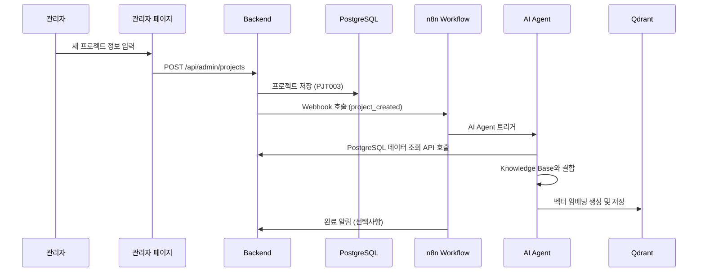
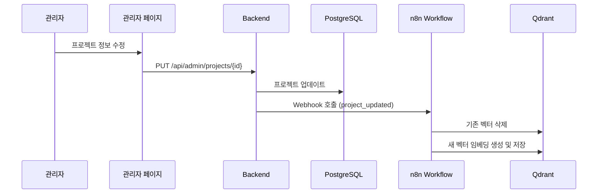

# 포트폴리오 데이터 통합 전략 (수정됨)

## 🎯 핵심 전략: 관리자 중심 데이터 관리 + AI Agent 자동화

### 1. PostgreSQL을 Master Data Source로 설정

**PostgreSQL이 모든 포트폴리오 데이터의 신뢰할 수 있는 소스 (Single Source of Truth)**
**관리자 페이지를 통한 직접 데이터 입력 및 관리**

```sql
-- 마스터 데이터 구조 (GitHub API 제거)
projects (business_id: PJT001, PJT002...)
├── 기본 정보: title, description, technologies
├── 프로젝트 상세: detailed_description, live_url, image_url
├── 메타데이터: type, status, is_team
└── 관리자 입력: my_contributions, achievements, external_url

experiences (business_id: EXP001, EXP002...)
├── 기본 정보: title, organization, role
├── 기간: start_date, end_date
├── 상세: main_responsibilities, achievements
└── 연관: technologies, projects

education (business_id: EDU001, EDU002...)
certifications (business_id: CRT001, CRT002...)
```

### 2. 데이터 관리 및 동기화 파이프라인

#### A. 관리자 페이지 → PostgreSQL 직접 입력

```java
// 관리자 페이지용 CRUD API
@RestController
@RequestMapping("/api/admin")
@PreAuthorize("hasRole('ADMIN')")
public class AdminPortfolioController {
    
    @PostMapping("/projects")
    public ResponseEntity<ProjectDto> createProject(@RequestBody CreateProjectRequest request) {
        Project project = portfolioService.createProject(request);
        
        // n8n webhook 호출하여 VectorDB 업데이트 트리거
        n8nWebhookService.triggerVectorUpdate("project", project.getId());
        
        return ResponseEntity.ok(projectMapper.toDto(project));
    }
    
    @PutMapping("/projects/{id}")
    public ResponseEntity<ProjectDto> updateProject(
            @PathVariable String id, 
            @RequestBody UpdateProjectRequest request) {
        
        Project project = portfolioService.updateProject(id, request);
        
        // VectorDB 업데이트 트리거
        n8nWebhookService.triggerVectorUpdate("project", project.getId());
        
        return ResponseEntity.ok(projectMapper.toDto(project));
    }
}
```

#### B. n8n + AI Agent → Qdrant 자동 업데이트

```python
# AI Service의 n8n 연동 엔드포인트
@app.post("/api/v1/sync/vector-update")
async def handle_vector_update(request: VectorUpdateRequest):
    """n8n에서 호출하는 벡터 업데이트 엔드포인트"""
    
    try:
        # 1. PostgreSQL에서 변경된 데이터 조회
        updated_data = await postgres_client.get_item_by_id(
            request.content_type, 
            request.content_id
        )
        
        # 2. Knowledge Base와 결합하여 컨텍스트 생성
        enriched_context = knowledge_base_service.enrich_data(updated_data)
        
        # 3. AI Agent를 통한 벡터 임베딩 생성
        embeddings = await ai_agent_service.generate_embeddings(enriched_context)
        
        # 4. Qdrant 업데이트
        await qdrant_service.upsert_vectors(
            collection_name="portfolio",
            vectors=embeddings,
            metadata=updated_data.to_metadata()
        )
        
        return {"status": "success", "updated_items": len(embeddings)}
        
    except Exception as e:
        logger.error(f"Vector update failed: {e}")
        return {"status": "error", "message": str(e)}
```

### 3. 계층별 데이터 제공 방식

#### Frontend용 데이터 (직접 PostgreSQL)

```java
// 기본 포트폴리오 데이터는 PostgreSQL에서 직접 제공
@RestController
public class PortfolioController {
    
    @GetMapping("/api/portfolio/projects")
    public ResponseEntity<List<ProjectDto>> getProjects() {
        // PostgreSQL에서 직접 조회 - 빠르고 안정적
        List<Project> projects = portfolioService.getAllProjects();
        return ResponseEntity.ok(projectMapper.toDto(projects));
    }
    
    @GetMapping("/api/portfolio/experiences") 
    public ResponseEntity<List<ExperienceDto>> getExperiences() {
        List<Experience> experiences = portfolioService.getAllExperiences();
        return ResponseEntity.ok(experienceMapper.toDto(experiences));
    }
}
```

#### AI 챗봇용 데이터 (RAG 파이프라인)

```python
# AI 서비스의 RAG 처리
class RAGService:
    async def process_chat(self, user_question: str) -> ChatResponse:
        # 1. 질문 분석 및 카테고리 분류
        question_category = await self.classify_question(user_question)
        
        # 2. 벡터 검색 (Qdrant)
        relevant_docs = await self.vector_search(
            query=user_question,
            filters={"category": question_category}
        )
        
        # 3. PostgreSQL 기반 구조화된 데이터 추가
        structured_data = await self.get_structured_context(question_category)
        
        # 4. 컨텍스트 구성
        context = self.build_context(relevant_docs, structured_data)
        
        # 5. LLM 응답 생성
        response = await self.generate_response(user_question, context)
        
        return response
```

### 4. 데이터 형식 및 구조

#### A. PostgreSQL 데이터 (구조화된 정보)

```json
{
  "projects": [
    {
      "id": "PJT001",
      "title": "AI Portfolio Chatbot",
      "description": "개발자 포트폴리오와 AI 챗봇을 결합한 웹 애플리케이션",
      "technologies": ["React", "Spring Boot", "Python", "PostgreSQL"],
      "type": "project",
      "githubUrl": "https://github.com/Yamang02/AI_Portfolio",
      "startDate": "2024-07-01",
      "endDate": "2024-12-31",
      "isTeam": false,
      "myContributions": [
        "헥사고날 아키텍처 설계 및 구현",
        "RAG 기반 AI 챗봇 개발",
        "PostgreSQL 데이터베이스 설계"
      ]
    }
  ]
}
```

#### B. Knowledge Base 데이터 (AI 학습용)

```json
{
  "ai_knowledge": [
    {
      "id": "hexagonal-architecture-overview",
      "category": "architecture", 
      "question": "백엔드는 어떤 아키텍처 패턴을 사용하나요?",
      "answer": "헥사고날 아키텍처(Ports and Adapters)를 적용했습니다...",
      "tags": ["hexagonal", "architecture", "ports-and-adapters"],
      "priority": 9,
      "related_projects": ["PJT001"]
    }
  ]
}
```

#### C. 통합된 벡터 데이터 (Qdrant)

```python
# Qdrant에 저장되는 통합 데이터
vector_document = {
    "id": "project_PJT001_overview",
    "content": """
    AI Portfolio Chatbot 프로젝트는 개발자 포트폴리오와 AI 챗봇을 결합한 웹 애플리케이션입니다.
    
    주요 기술 스택:
    - Frontend: React, TypeScript, Tailwind CSS
    - Backend: Spring Boot, 헥사고날 아키텍처
    - AI Service: Python FastAPI, LangChain, Google Gemini
    - Database: PostgreSQL, Qdrant Vector DB
    
    핵심 기능:
    - RAG 기반 AI 챗봇으로 포트폴리오 질문 답변
    - GitHub API 연동으로 실시간 프로젝트 정보 업데이트
    - 헥사고날 아키텍처로 확장 가능한 백엔드 설계
    """,
    "metadata": {
        "source_type": "project",
        "source_id": "PJT001", 
        "category": "overview",
        "technologies": ["React", "Spring Boot", "Python"],
        "priority": 10,
        "last_updated": "2024-12-31T00:00:00Z"
    }
}
```

### 5. 데이터 업데이트 워크플로우

#### 시나리오 1: 관리자 페이지에서 새 프로젝트 추가



#### 시나리오 2: 기존 프로젝트 정보 수정



### 6. 장애 대응 전략

#### A. AI 서비스 장애 시

```java
@Service
public class ChatFallbackService {
    
    public ChatResponse handleAIServiceDown(String question) {
        // PostgreSQL 기반 구조화된 응답 생성
        String category = questionClassifier.classify(question);
        
        switch(category) {
            case "projects":
                return createProjectSummaryResponse();
            case "experience": 
                return createExperienceSummaryResponse();
            case "skills":
                return createSkillSummaryResponse();
            default:
                return createGeneralInfoResponse();
        }
    }
}
```

#### B. PostgreSQL 장애 시

```python
# AI 서비스의 캐시 기반 대응
class EmergencyResponseService:
    async def handle_postgres_down(self, question: str):
        # Redis 캐시에서 기본 정보 조회
        cached_data = await self.redis.get("portfolio_summary")
        
        if cached_data:
            return self.generate_cached_response(question, cached_data)
        else:
            return self.get_minimal_response()

#### C. n8n 워크플로우 장애 시

```java
// Backend의 n8n 장애 대응
@Service
public class N8nFallbackService {
    
    public void handleN8nFailure(String contentType, String contentId) {
        // n8n 호출 실패 시 대기열에 저장
        VectorUpdateTask task = VectorUpdateTask.builder()
            .contentType(contentType)
            .contentId(contentId)
            .retryCount(0)
            .createdAt(LocalDateTime.now())
            .build();
            
        updateTaskQueue.add(task);
        
        // 주기적으로 재시도
        scheduleRetry(task);
    }
}
```

### 7. 성능 최적화 전략

#### A. 다층 캐싱

```python
# 캐시 계층 구조
class CacheManager:
    def __init__(self):
        self.l1_cache = {}  # 메모리 캐시 (1분)
        self.l2_cache = RedisCache()  # Redis 캐시 (1시간)
        self.l3_cache = PostgreSQLCache()  # DB 캐시 (24시간)
    
    async def get_portfolio_data(self, key: str):
        # L1 -> L2 -> L3 -> 원본 데이터 순으로 조회
        data = self.l1_cache.get(key)
        if not data:
            data = await self.l2_cache.get(key)
            if not data:
                data = await self.l3_cache.get(key)
                if not data:
                    data = await self.fetch_from_source(key)
                    await self.populate_all_caches(key, data)
        return data
```

#### B. 지능형 프리로딩

```python
# 자주 묻는 질문 사전 캐싱
class PreloadService:
    async def preload_common_queries(self):
        common_questions = [
            "어떤 프로젝트를 했나요?",
            "사용 가능한 기술 스택은?", 
            "경력은 어떻게 되나요?",
            "연락처 정보를 알려주세요"
        ]
        
        for question in common_questions:
            response = await self.rag_service.process_chat(question)
            await self.cache_manager.store(question, response, ttl=3600)
```

### 8. 모니터링 및 품질 관리

#### A. 데이터 일관성 검증

```python
class DataConsistencyChecker:
    async def verify_sync_status(self):
        # PostgreSQL과 Qdrant 간 데이터 일치성 확인
        pg_projects = await self.postgres_client.get_all_projects()
        qd_projects = await self.qdrant_client.get_all_project_vectors()
        
        inconsistencies = self.compare_data(pg_projects, qd_projects)
        
        if inconsistencies:
            await self.trigger_resync(inconsistencies)
            await self.notify_admin(inconsistencies)
```

#### B. 응답 품질 모니터링

```python
class QualityMonitor:
    async def track_response_quality(self, question: str, response: str):
        metrics = {
            "response_time": self.measure_response_time(),
            "context_relevance": self.calculate_relevance_score(question, response),
            "factual_accuracy": await self.verify_facts(response),
            "user_satisfaction": await self.get_feedback_score()
        }
        
        await self.store_metrics(metrics)
        
        if metrics["factual_accuracy"] < 0.8:
            await self.trigger_quality_alert()
```

## 🎯 결론: 관리자 중심 + AI Agent 자동화 전략

### 1. **관리자 페이지 중심의 데이터 관리**
- PostgreSQL을 단일 진실 소스로 사용
- 관리자가 직접 포트폴리오 데이터 입력/수정
- GitHub API 의존성 제거로 단순하고 안정적인 구조
- 데이터 품질을 관리자가 직접 통제

### 2. **n8n + AI Agent 자동화 파이프라인**
- 관리자 페이지에서 데이터 변경 시 n8n 워크플로우 자동 트리거
- AI Agent가 PostgreSQL 데이터와 Knowledge Base 결합
- Qdrant 벡터 DB 자동 업데이트
- 비동기 처리로 관리자 페이지 응답성 유지

### 3. **Knowledge Base 기반 AI 학습 데이터**
- JSON 스키마로 구조화된 Q&A 데이터
- 카테고리별, 우선순위별 체계적 관리
- AI Agent가 포트폴리오 데이터와 자동 결합

### 4. **계층화된 서비스 제공**
- **Frontend**: PostgreSQL 직접 조회 (빠른 기본 정보)
- **AI 챗봇**: RAG 파이프라인 (지능형 상호작용)
- **관리자 페이지**: 직관적인 데이터 관리 인터페이스
- **장애 대응**: 각 계층별 독립적 fallback 메커니즘

### 5. **주요 장점**
- **단순성**: GitHub API 제거로 복잡성 감소
- **제어성**: 관리자가 모든 데이터 직접 관리
- **자동화**: n8n을 통한 VectorDB 업데이트 자동화
- **확장성**: AI Agent 기반으로 향후 다양한 자동화 가능

이 전략을 통해 **관리 편의성, 안정성, 자동화**를 모두 확보하면서 사용자에게 최적의 포트폴리오 경험을 제공할 수 있습니다.