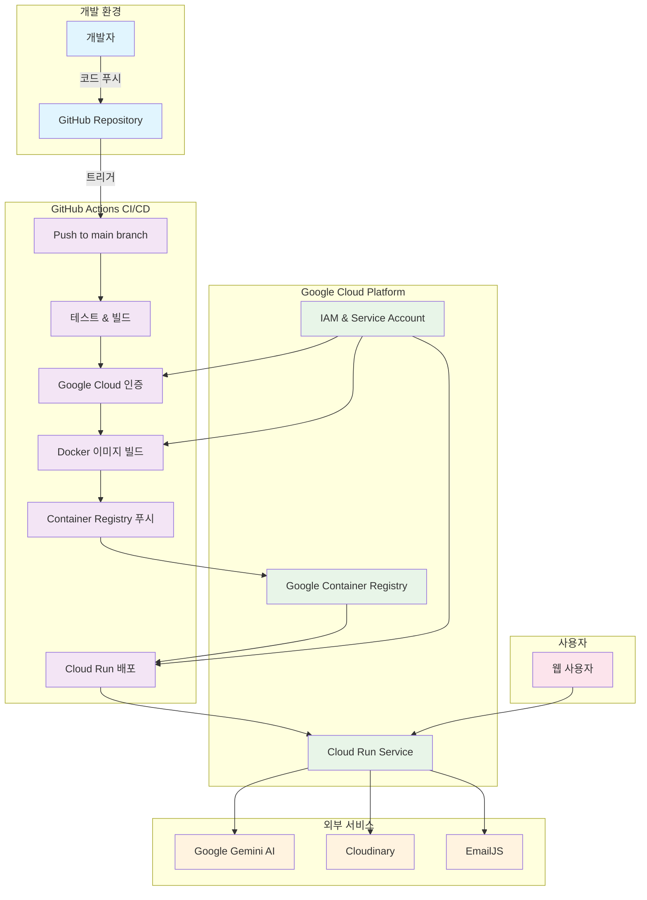
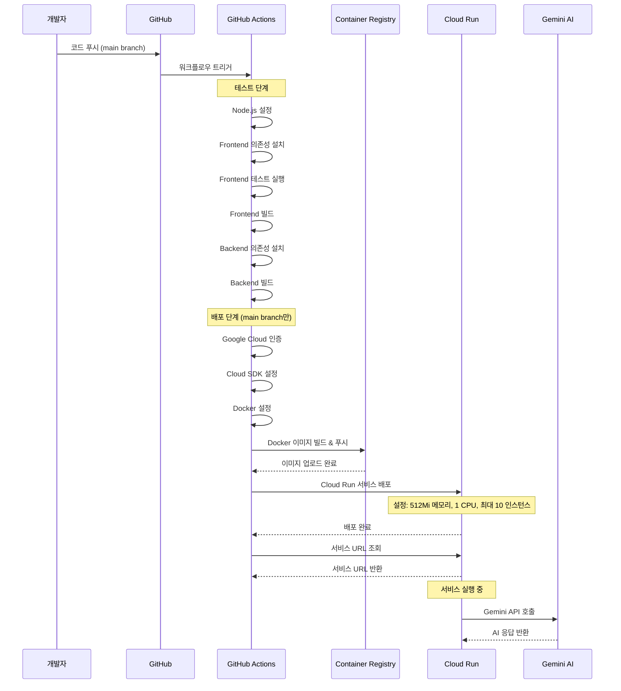

# AI Portfolio Development Guide

## 📋 개요

AI Portfolio 프로젝트의 개발 환경 설정, API 명세, 배포 아키텍처, 그리고 배포 가이드를 통합한 문서입니다.

## 🚀 기술 스택

### Frontend
- **React 19.1.0** - 최신 React 기능 활용
- **TypeScript** - 타입 안정성 및 개발 생산성 향상
- **Tailwind CSS** - 유틸리티 퍼스트 CSS 프레임워크
- **Vite** - 빠른 개발 서버 및 빌드 도구

### Backend & API (헥사고날 아키텍처)
- **Spring Boot 3.x** - Java 기반 백엔드 프레임워크
- **헥사고날 아키텍처** - Domain-Application-Infrastructure 레이어 분리
  - **Domain Layer**: 핵심 비즈니스 로직 (의존성 없음)
  - **Application Layer**: Use Case 구현체
  - **Infrastructure Layer**: 외부 어댑터 (DB, Web, AI)
- **LangChain4j** - AI 모델 연동 및 프롬프트 관리
- **Google Gemini API** - AI 자연어 처리 (Gemini 2.5 Flash)
- **GitHub REST API** - 프로젝트 정보 수집
- **PostgreSQL** - 메인 데이터베이스 (헥사고날 구조로 확장 준비)
- **Maven** - Java 프로젝트 빌드 및 의존성 관리

### Infrastructure & Deployment
- **Google Cloud Run** - 서버리스 컨테이너 플랫폼
- **Docker** - 멀티스테이지 빌드 컨테이너화
- **GitHub Actions** - CI/CD 자동화
- **Eclipse Temurin** - Java 런타임 환경

## 🏗️ 백엔드 아키텍처

### 헥사고날 아키텍처 구조

```
backend/src/main/java/com/aiportfolio/backend/
├── domain/                     # 도메인 레이어 (의존성 없는 핵심 비즈니스 로직)
│   ├── model/                  # 도메인 엔티티
│   │   ├── Project.java        # 프로젝트 도메인 모델
│   │   ├── Education.java      # 교육 도메인 모델
│   │   ├── Experience.java     # 경력 도메인 모델
│   │   └── Certification.java  # 자격증 도메인 모델
│   ├── port/                   # 인터페이스 정의 (포트)
│   │   ├── in/                 # Primary Port (Use Cases)
│   │   │   └── ProjectUseCase.java
│   │   └── out/                # Secondary Port (Repository, External Services)
│   │       └── ProjectRepository.java
│   └── service/                # 도메인 서비스
│       └── chat/               # 채팅 관련 도메인 서비스
│           ├── ChatService.java
│           ├── LLMPort.java
│           ├── PromptPort.java
│           └── QuestionAnalysisPort.java
│
├── application/                # 어플리케이션 레이어 (Use Case 구현체)
│   └── service/
│       └── ProjectApplicationService.java
│
├── infrastructure/             # 인프라 레이어 (외부 어댑터 구현)
│   ├── persistence/            # 데이터베이스 어댑터
│   │   ├── JsonProjectRepository.java    # JSON 파일 기반 구현체
│   │   └── PostgresProjectRepository.java # PostgreSQL 구현체
│   ├── web/                    # HTTP 어댑터 (Controllers, DTOs)
│   │   ├── ProjectController.java
│   │   ├── ChatRequest.java
│   │   └── ChatResponse.java
│   └── external/               # 외부 서비스 어댑터
│       ├── GeminiLLMAdapter.java         # Gemini AI 어댑터
│       ├── JsonPromptAdapter.java        # 프롬프트 어댑터
│       └── RuleBasedQuestionAnalysisAdapter.java
│
└── shared/                     # 공통 유틸리티
    ├── config/                 # 설정 클래스
    │   ├── AppConfig.java
    │   └── WebConfig.java
    ├── exception/              # 예외 처리
    └── common/                 # 공통 모델 및 유틸리티
        └── ApiResponse.java
```

### 아키텍처 특징

1. **의존성 역전**: 도메인 레이어는 어떤 외부 의존성도 갖지 않음
2. **포트와 어댑터**: 인터페이스를 통한 느슨한 결합
3. **확장성**: 새로운 데이터베이스나 외부 서비스 추가가 용이
4. **테스트 용이성**: 각 레이어별 독립적인 테스트 가능
5. **비즈니스 로직 보호**: 핵심 로직이 기술적 세부사항에 오염되지 않음

## 🔌 API 명세

### 기본 정보
- **Base URL**: `http://localhost:8080`
- **API Documentation**: `http://localhost:8080/swagger-ui.html`
- **Health Check**: `http://localhost:8080/api/chat/health`

### 표준 응답 형식

#### 성공 응답
```json
{
  "success": true,
  "message": "요청이 성공적으로 처리되었습니다.",
  "data": {
    // 실제 데이터
  }
}
```

#### 비즈니스 로직 오류 응답 (200 OK)
```json
{
  "success": false,
  "message": "비즈니스 로직 오류 메시지",
  "data": {
    // 오류 상세 정보
  }
}
```

### 주요 API 엔드포인트

#### 1. AI 챗봇 API

##### POST `/api/chat/message`
AI 챗봇 응답을 생성합니다.

**Request Body:**
```json
{
  "question": "AI 포트폴리오 챗봇 프로젝트에 대해 알려줘",
  "selectedProject": "AI 포트폴리오 챗봇" // 선택사항
}
```

**Response:**
```json
{
  "success": true,
  "message": "챗봇 응답 성공",
  "data": {
    "response": "AI 포트폴리오 챗봇은 Google Gemini API를 활용한 개발자 포트폴리오 AI 챗봇입니다...",
    "success": true,
    "responseType": "SUCCESS",
    "showEmailButton": false,
    "reason": null
  }
}
```

#### 2. 프로젝트 API

##### GET `/api/projects`
모든 프로젝트 목록을 조회합니다.

**Query Parameters:**
- `type`: 프로젝트 타입 필터 (`project`, `certification`)
- `source`: 데이터 소스 필터 (`github`, `local`, `certification`)
- `isTeam`: 팀 프로젝트 여부 필터 (`true`, `false`)

##### GET `/api/projects/{id}`
특정 프로젝트의 상세 정보를 조회합니다.

#### 3. GitHub API

##### GET `/api/github/projects`
GitHub 프로젝트 목록을 조회합니다.

##### GET `/api/github/project/{repoName}`
특정 GitHub 프로젝트의 상세 정보를 조회합니다.

#### 4. 정적 데이터 API

##### GET `/api/data/experiences`
경력 정보를 조회합니다.

##### GET `/api/data/education`
교육 정보를 조회합니다.

##### GET `/api/data/certifications`
자격증 정보를 조회합니다.

##### GET `/api/data/all`
모든 정적 데이터를 한 번에 조회합니다.

## 🏗️ 배포 아키텍처

### 서비스 구성도

**Mermaid 소스**: [docs/mermaid/service-architecture.mmd](docs/mermaid/service-architecture.mmd)



### 배포 프로세스

**Mermaid 소스**: [docs/mermaid/deployment-process.mmd](docs/mermaid/deployment-process.mmd)



### 멀티스테이지 빌드 아키텍처

```
Stage 1: Frontend Build (Node.js 18)
├── npm ci (의존성 설치)
├── npm run build (Vite 빌드)
└── dist/ (정적 파일 생성)

Stage 2: Backend Build (Maven + Java 17)
├── mvn dependency:resolve
├── mvn clean package -DskipTests
└── target/*.jar (Spring Boot JAR)

Stage 3: Production Image (Eclipse Temurin 17)
├── JAR 파일 복사
├── 정적 파일 복사
└── 포트 8080 노출
```

## 🚀 배포 가이드

### 사전 요구사항

#### 1. Google Cloud 계정 및 프로젝트
- Google Cloud 계정 생성
- 새 프로젝트 생성 또는 기존 프로젝트 선택
- 결제 계정 연결

#### 2. 필요한 도구 설치
```bash
# Google Cloud CLI 설치
curl https://sdk.cloud.google.com | bash
exec -l $SHELL

# Docker 설치 (Windows/Mac/Linux)
# https://docs.docker.com/get-docker/

# Node.js 18+ 설치
# https://nodejs.org/
```

#### 3. Google Cloud 서비스 활성화
```bash
# 필요한 API 활성화
gcloud services enable run.googleapis.com
gcloud services enable secretmanager.googleapis.com
gcloud services enable containerregistry.googleapis.com
```

### 환경 설정

#### 1. 환경 변수 파일 생성
```bash
# env.example을 복사하여 .env.local 생성
cp env.example .env.local
```

#### 2. .env.local 파일 편집
```bash
# 실제 값으로 변경
VITE_GEMINI_API_KEY=your_actual_gemini_api_key
VITE_GITHUB_USERNAME=your_github_username
VITE_CONTACT_EMAIL=your_email@example.com
```

#### 3. Google Cloud 프로젝트 설정
```bash
# 프로젝트 ID 설정
gcloud config set project YOUR_PROJECT_ID

# 기본 리전 설정
gcloud config set run/region asia-northeast3
```

### Secret Manager 설정

#### 1. Gemini API 키 설정
```bash
# Secret 생성
echo -n "your_gemini_api_key" | gcloud secrets create gemini-api-key --data-file=-
```

#### 2. GitHub 사용자명 설정
```bash
echo -n "your_github_username" | gcloud secrets create github-username --data-file=-
```

### 배포 방법

#### 방법 1: GitHub Actions 자동 배포 (권장)

1. **GitHub Secrets 설정**
   - `GCP_PROJECT_ID`: Google Cloud 프로젝트 ID
   - `GCP_SA_KEY`: 서비스 계정 키 (JSON)

2. **서비스 계정 생성**
```bash
# 서비스 계정 생성
gcloud iam service-accounts create github-actions \
  --display-name="GitHub Actions"

# 필요한 권한 부여
gcloud projects add-iam-policy-binding YOUR_PROJECT_ID \
  --member="serviceAccount:github-actions@YOUR_PROJECT_ID.iam.gserviceaccount.com" \
  --role="roles/run.admin"

gcloud projects add-iam-policy-binding YOUR_PROJECT_ID \
  --member="serviceAccount:github-actions@YOUR_PROJECT_ID.iam.gserviceaccount.com" \
  --role="roles/secretmanager.secretAccessor"

gcloud projects add-iam-policy-binding YOUR_PROJECT_ID \
  --member="serviceAccount:github-actions@YOUR_PROJECT_ID.iam.gserviceaccount.com" \
  --role="roles/storage.admin"

# 서비스 계정 키 생성
gcloud iam service-accounts keys create key.json \
  --iam-account=github-actions@YOUR_PROJECT_ID.iam.gserviceaccount.com
```

3. **GitHub에 Secret 추가**
   - GitHub 레포지토리 → Settings → Secrets and variables → Actions
   - `GCP_SA_KEY`에 key.json 내용 추가
   - `GCP_PROJECT_ID`에 프로젝트 ID 추가

4. **main 브랜치에 푸시**
```bash
git add .
git commit -m "Add deployment configuration"
git push origin main
```

#### 방법 2: 수동 배포 (스크립트 사용)

1. **배포 스크립트 수정**
```bash
# scripts/deploy.sh 파일에서 PROJECT_ID 수정
PROJECT_ID="your-actual-project-id"
```

2. **스크립트 실행 권한 부여**
```bash
chmod +x scripts/deploy.sh
```

3. **배포 실행**
```bash
./scripts/deploy.sh
```

### 배포 확인

#### 1. 서비스 상태 확인
```bash
gcloud run services describe ai-portfolio-chatbot --region=asia-northeast3
```

#### 2. 로그 확인
```bash
gcloud logs read --service=ai-portfolio-chatbot --limit=50
```

#### 3. 브라우저에서 접속
- 배포 완료 후 제공되는 URL로 접속
- AI 챗봇 기능 테스트

## 🛠️ 개발 환경 설정

### 1. 의존성 설치
```bash
npm install
```

### 2. 환경변수 설정
`.env.local` 파일을 생성하고 다음 내용을 추가:
```env
# AI API 설정
GEMINI_API_KEY=your_gemini_api_key_here

# GitHub 설정
GITHUB_USERNAME=Yamang02

# 서버 설정
PORT=3001
NODE_ENV=development

# CORS 설정
ALLOWED_ORIGINS=http://localhost:5173
```

### 3. 서버 실행
```bash
# 개발 모드
npm run server:dev

# 프로덕션 모드
npm run server
```

## 🔒 보안

### Rate Limiting
- **기본 제한**: 15분당 100회 요청
- **챗봇 API**: 추가 제한 적용 가능

### CORS 설정
- **허용된 도메인**: `http://localhost:5173`, `https://your-frontend-domain.com`
- **Credentials**: 지원

### 보안 헤더
- **Helmet**: 보안 헤더 자동 설정
- **Compression**: 응답 압축
- **Morgan**: 요청 로깅

## 🚨 문제 해결

### 일반적인 문제들

1. **API 키 오류**
   - Secret Manager에서 API 키 확인
   - Cloud Run 서비스에 Secret 연결 확인

2. **GitHub API 제한**
   - GitHub API 요청 제한 확인
   - 인증 토큰 사용 고려

3. **메모리 부족**
   - Cloud Run 서비스 메모리 증가
   - 이미지 최적화

4. **빌드 실패**
   - Docker 로그 확인
   - 의존성 문제 해결

### 로그 확인 명령어
```bash
# 실시간 로그 확인
gcloud logs tail --service=ai-portfolio-chatbot

# 특정 시간대 로그
gcloud logs read --service=ai-portfolio-chatbot --format="table(timestamp,textPayload)" --limit=100
```

## 📊 모니터링

### 1. Cloud Monitoring 설정
- Google Cloud Console → Monitoring
- 대시보드 생성
- 알림 정책 설정

### 2. 주요 메트릭
- 요청 수
- 응답 시간
- 에러율
- 메모리 사용량

## 🔄 업데이트

### 자동 업데이트 (GitHub Actions)
- main 브랜치에 푸시하면 자동 배포

### 수동 업데이트
```bash
# 새 이미지 빌드 및 배포
docker build -t gcr.io/YOUR_PROJECT_ID/ai-portfolio-chatbot .
docker push gcr.io/YOUR_PROJECT_ID/ai-portfolio-chatbot
gcloud run deploy ai-portfolio-chatbot --image gcr.io/YOUR_PROJECT_ID/ai-portfolio-chatbot
```

## 💰 비용 최적화

### 1. 리소스 설정
- 메모리: 512Mi (필요시 조정)
- CPU: 1 (필요시 조정)
- 최대 인스턴스: 10 (트래픽에 따라 조정)

### 2. 비용 모니터링
- Google Cloud Console → Billing
- 예산 알림 설정
- 사용량 분석

## 📝 리팩토링 이력

### 하드코딩 제거 리팩토링 (완료)
- **중앙화된 설정 시스템**: `config/app.config.ts` 구축
- **환경 변수 확장**: GitHub 사용자명, 연락처 이메일 등 설정화
- **보안 강화**: 민감한 정보를 환경 변수로 분리
- **유지보수성 향상**: 설정 변경 시 코드 수정 불필요

### 주요 변경 사항
- ✅ GitHub 사용자명 하드코딩 제거
- ✅ 연락처 이메일 하드코딩 제거
- ✅ GitHub URL 하드코딩 제거
- ✅ 배포 설정 하드코딩 제거
- ✅ 환경 변수 확장 및 설정 유효성 검사 추가

---

*마지막 업데이트: 2024년 12월*
