# AI Service 헥사고날 아키텍처 레이어 구조

## 전체 아키텍처 구조

```mermaid
graph TB
    %% 헥사고날 아키텍처 레이어 구조
    
    %% Primary Adapters (들어오는)
    subgraph Primary ["Primary Adapters (들어오는)"]
        WebRouter[Web API Router]
        GradioDemo[Gradio Demo]
        CLI[CLI Interface]
    end
    
    %% Application Layer
    subgraph Application ["Application Layer"]
        RAGService[RAG Service]
        ChatService[Chat Service]
        KnowledgeBaseService[Knowledge Base Service]
        HybridRAGService[Hybrid RAG Service]
    end
    
    %% Core Domain
    subgraph Core ["Core Domain"]
        Models[Domain Models]
        Ports[Ports/Interfaces]
        Strategies[Business Strategies]
    end
    
    %% Secondary Adapters (나가는)
    subgraph Secondary ["Secondary Adapters (나가는)"]
        LLMAdapter[LLM Adapter]
        VectorAdapter[Vector Adapter]
        DatabaseAdapter[Database Adapter]
        CacheAdapter[Cache Adapter]
    end
    
    %% 구현체들
    subgraph Implementations ["구현체들"]
        MockLLM[Mock LLM]
        OpenAILLM[OpenAI LLM]
        MemoryVector[Memory Vector Store]
        QdrantVector[Qdrant Vector Store]
        PostgreSQL[PostgreSQL]
        Redis[Redis Cache]
    end
    
    %% 의존성 방향
    Primary --> Application
    Application --> Core
    Core --> Secondary
    Secondary --> Implementations
    
    %% 포트 인터페이스
    Core -.->|Ports| Secondary
    Application -.->|Ports| Secondary
    
    %% 스타일링
    classDef primary fill:#e3f2fd,stroke:#1976d2,stroke-width:3px
    classDef application fill:#e8f5e8,stroke:#388e3c,stroke-width:3px
    classDef core fill:#fff3e0,stroke:#f57c00,stroke-width:3px
    classDef secondary fill:#f3e5f5,stroke:#7b1fa2,stroke-width:3px
    classDef implementation fill:#ffebee,stroke:#d32f2f,stroke-width:2px
    
    class WebRouter,GradioDemo,CLI primary
    class RAGService,ChatService,KnowledgeBaseService,HybridRAGService application
    class Models,Ports,Strategies core
    class LLMAdapter,VectorAdapter,DatabaseAdapter,CacheAdapter secondary
    class MockLLM,OpenAILLM,MemoryVector,QdrantVector,PostgreSQL,Redis implementation
```

## 아키텍처 레이어 설명

### 1. Primary Adapters (들어오는)
**역할**: 외부 시스템과의 인터페이스 제공

#### 구성 요소
- **Web API Router**: FastAPI 기반 HTTP REST API
- **Gradio Demo**: 웹 기반 데모 인터페이스
- **CLI Interface**: 명령줄 인터페이스

#### 특징
- 비즈니스 로직에 직접적인 의존성 없음
- 사용자 요청을 Application Layer로 전달
- 응답 형식 변환 및 HTTP 상태 코드 처리

### 2. Application Layer
**역할**: 비즈니스 유스케이스 구현 및 조율

#### 구성 요소
- **RAG Service**: RAG 파이프라인 핵심 로직
- **Chat Service**: 채팅 기능 처리
- **Knowledge Base Service**: 지식베이스 관리
- **Hybrid RAG Service**: 하이브리드 검색 전략

#### 특징
- Core Domain의 비즈니스 규칙 활용
- Secondary Adapters를 통한 외부 시스템 연동
- 트랜잭션 관리 및 에러 처리

### 3. Core Domain
**역할**: 비즈니스 핵심 로직 및 규칙 정의

#### 구성 요소
- **Domain Models**: 엔티티, 값 객체, 집계
- **Ports/Interfaces**: 어댑터와의 계약 정의
- **Business Strategies**: 비즈니스 전략 및 알고리즘

#### 특징
- 외부 시스템에 대한 의존성 없음
- 순수한 비즈니스 로직만 포함
- 테스트 용이성 및 유지보수성 향상

### 4. Secondary Adapters (나가는)
**역할**: 외부 시스템과의 인터페이스 구현

#### 구성 요소
- **LLM Adapter**: 대형 언어 모델 연동
- **Vector Adapter**: 벡터 데이터베이스 연동
- **Database Adapter**: 관계형 데이터베이스 연동
- **Cache Adapter**: 캐시 시스템 연동

#### 특징
- Core Domain의 Port 인터페이스 구현
- 외부 시스템의 세부사항을 Application Layer로부터 격리
- 플러그인 방식으로 교체 가능

### 5. Implementations
**역할**: 실제 외부 시스템 구현체

#### 구성 요소
- **Mock LLM**: 개발/테스트용 가짜 LLM
- **OpenAI LLM**: OpenAI API 연동
- **Memory Vector Store**: 인메모리 벡터 저장소
- **Qdrant Vector Store**: Qdrant 벡터 데이터베이스
- **PostgreSQL**: 관계형 데이터베이스
- **Redis**: 인메모리 캐시

## 의존성 방향 및 원칙

### 의존성 규칙
1. **Primary Adapters** → **Application Layer**
2. **Application Layer** → **Core Domain**
3. **Core Domain** → **Secondary Adapters** (인터페이스만)
4. **Secondary Adapters** → **Implementations**

### 포트 인터페이스
- Core Domain과 Application Layer에서 Secondary Adapters와의 계약 정의
- 구현 세부사항에 대한 의존성 제거
- 테스트 시 Mock 객체로 쉽게 대체 가능

## 아키텍처의 장점

### 1. 관심사 분리
- 각 레이어가 명확한 책임을 가짐
- 비즈니스 로직과 기술적 구현의 분리

### 2. 테스트 용이성
- 각 레이어를 독립적으로 테스트 가능
- Mock 객체를 통한 의존성 격리

### 3. 유지보수성
- 코드 변경 시 영향 범위 최소화
- 새로운 기능 추가 시 기존 코드 수정 최소화

### 4. 확장성
- 새로운 어댑터 추가 시 기존 코드 변경 없음
- 플러그인 방식의 아키텍처

### 5. 기술 독립성
- 비즈니스 로직이 특정 기술에 종속되지 않음
- 프레임워크나 라이브러리 교체 시 영향 최소화
