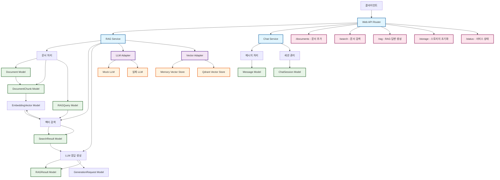

# AI Service 데이터 흐름 다이어그램

## 전체 데이터 흐름 구조



## 컴포넌트 설명

### Primary Adapters (들어오는)
- **Web API Router**: FastAPI 기반 HTTP 엔드포인트 제공
- **Chat Service**: 채팅 관련 기능 처리

### Application Layer
- **RAG Service**: RAG(Retrieval-Augmented Generation) 핵심 로직 구현
  - 문서 처리: 텍스트 문서를 청크로 분할하고 벡터화
  - 벡터 검색: 유사도 기반 문서 검색
  - LLM 응답 생성: 검색된 컨텍스트를 바탕으로 답변 생성

### Core Domain Models
- **Document**: 문서 기본 정보 (ID, 내용, 소스, 메타데이터)
- **DocumentChunk**: 문서를 작은 단위로 분할한 청크
- **RAGQuery**: RAG 질의 정보
- **SearchResult**: 검색 결과 (청크, 유사도 점수, 순위)
- **RAGResult**: RAG 처리 최종 결과

### Secondary Adapters (나가는)
- **LLM Adapter**: 대형 언어 모델과의 인터페이스
  - Mock LLM: 개발/테스트용 가짜 LLM
  - 실제 LLM: OpenAI 등 실제 AI 모델
- **Vector Adapter**: 벡터 데이터베이스 인터페이스
  - Memory Vector Store: 인메모리 벡터 저장소 (개발용)
  - Qdrant Vector Store: 프로덕션용 벡터 데이터베이스

## 데이터 흐름 과정

### 1. 문서 추가 과정
```
클라이언트 → Web API → RAG Service → Document 생성 → DocumentChunk 분할 → 벡터화 → Vector Store 저장
```

### 2. 검색 과정
```
쿼리 → 벡터화 → Vector Store에서 유사도 검색 → SearchResult 반환
```

### 3. RAG 답변 생성 과정
```
질문 → 관련 문서 검색 → 컨텍스트 구성 → LLM에 전달 → 답변 생성 → RAGResult 반환
```

## API 엔드포인트

| 엔드포인트 | 메서드 | 설명 |
|-----------|--------|------|
| `/documents` | POST | 문서 추가 |
| `/search` | POST | 문서 검색 |
| `/rag` | POST | RAG 답변 생성 |
| `/storage` | DELETE | 스토리지 초기화 |
| `/status` | GET | 서비스 상태 확인 |
