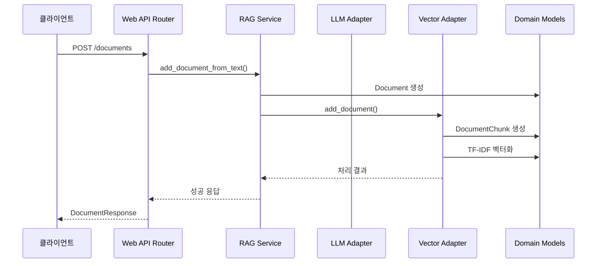
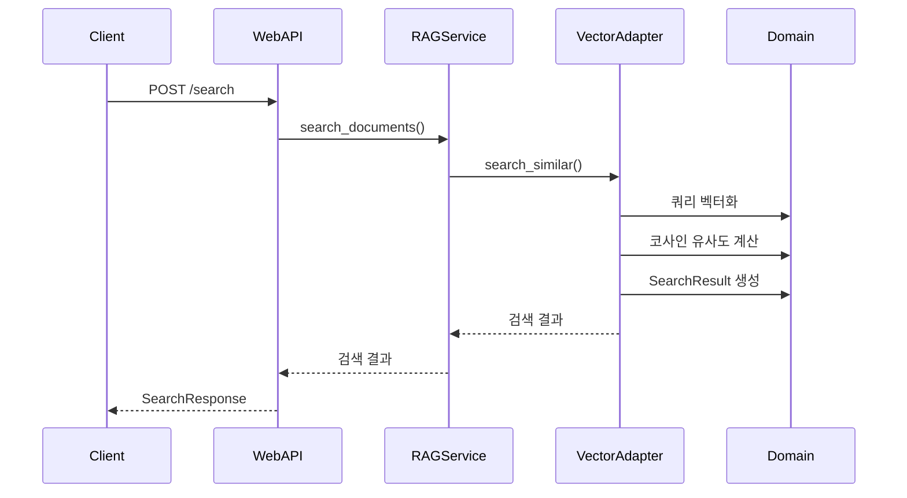
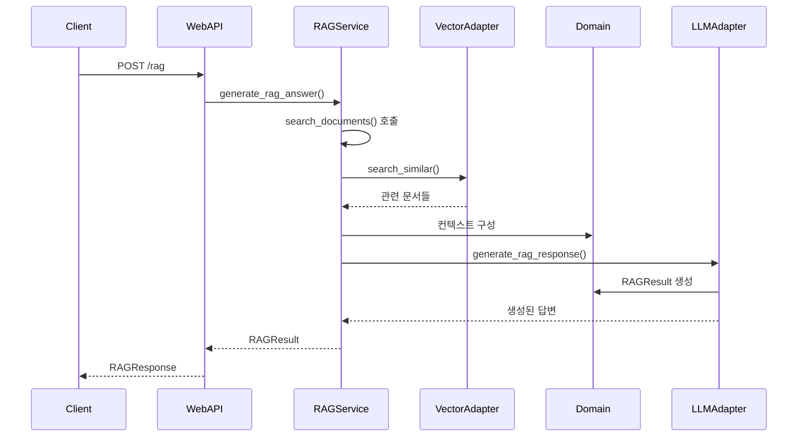
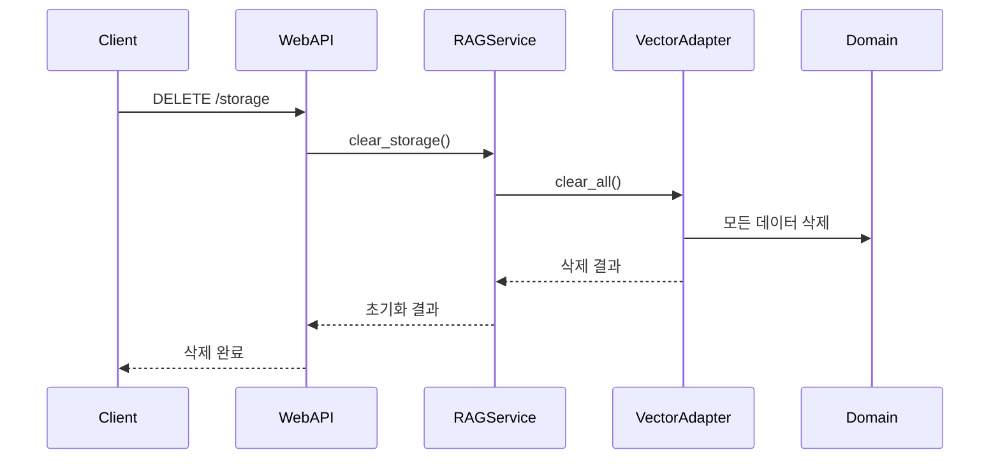
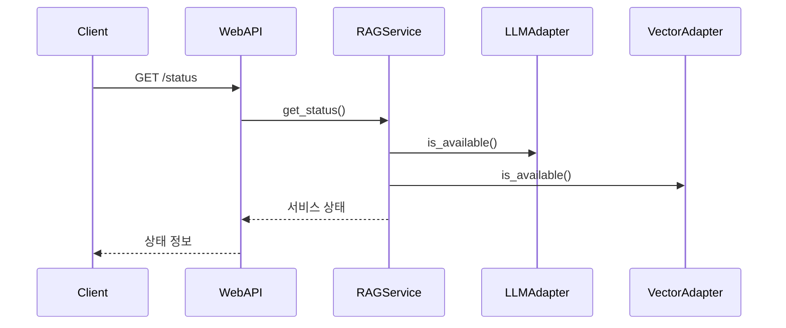

# AI Service 시퀀스 데이터 흐름

## 주요 사용 사례별 데이터 흐름

### 1. 문서 추가 플로우

**과정 설명:**
1. 클라이언트가 문서 내용을 `/documents` 엔드포인트로 전송
2. Web API Router가 요청을 RAG Service로 전달
3. RAG Service가 Document 도메인 모델 생성
4. Vector Adapter를 통해 문서를 청크로 분할하고 벡터화
5. 처리 결과를 클라이언트에게 반환

### 2. 문서 검색 플로우

**과정 설명:**
1. 클라이언트가 검색 쿼리를 `/search` 엔드포인트로 전송
2. RAG Service가 Vector Adapter를 통해 유사도 검색 수행
3. 쿼리를 벡터화하고 저장된 문서들과 코사인 유사도 계산
4. 유사도 순으로 정렬된 SearchResult 반환

### 3. RAG 답변 생성 플로우

**과정 설명:**
1. 클라이언트가 질문을 `/rag` 엔드포인트로 전송
2. RAG Service가 먼저 관련 문서를 검색
3. 검색된 문서들을 컨텍스트로 구성
4. LLM Adapter를 통해 컨텍스트 기반 답변 생성
5. 최종 RAGResult를 클라이언트에게 반환

### 4. 스토리지 초기화 플로우

**과정 설명:**
1. 클라이언트가 `/storage` 엔드포인트로 DELETE 요청
2. RAG Service가 Vector Adapter를 통해 모든 데이터 삭제
3. 삭제 완료 결과를 클라이언트에게 반환

### 5. 서비스 상태 확인

**과정 설명:**
1. 클라이언트가 `/status` 엔드포인트로 GET 요청
2. RAG Service가 각 어댑터의 사용 가능 여부 확인
3. 전체 서비스 상태 정보를 클라이언트에게 반환

## 데이터 전달 패턴

### 요청-응답 패턴
- 모든 API 호출은 **동기식 요청-응답** 패턴 사용
- FastAPI의 비동기 처리로 동시 요청 처리 가능

### 에러 처리
- 각 단계에서 예외 발생 시 적절한 HTTP 상태 코드와 에러 메시지 반환
- 로깅을 통한 디버깅 정보 제공

### 성능 최적화
- 벡터 검색 시 유사도 임계값을 통한 결과 필터링
- 청크 단위 처리로 메모리 효율성 향상
- TF-IDF 벡터화로 빠른 유사도 계산
