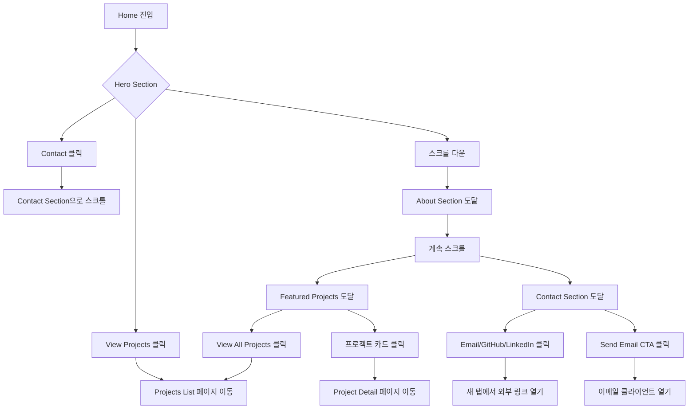
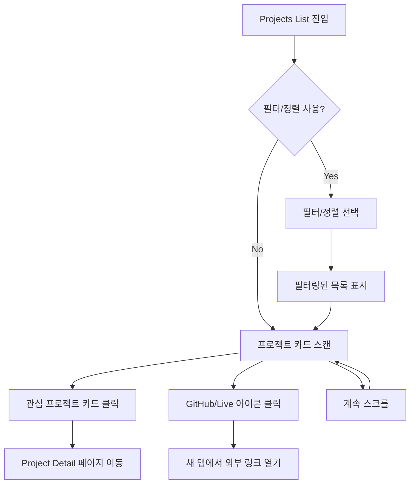

# Phase 2: Site Structure & UI/UX Design

> **목표**: Landing/Profile/Archive 3단 구조에서 Landing(Home)과 Archive(Projects List) 페이지의 UI/UX 설계

**작성일**: 2025-01-04
**작성자**: AI Agent (Claude)
**버전**: 1.0

---

## 📌 개요

### 목적

Phase 1에서 정리한 콘텐츠 인벤토리를 기반으로:
1. **Home 페이지** (Landing): 사용자의 첫 진입점, 핵심 메시지와 네비게이션 제공
2. **Projects List 페이지** (Archive): 프로젝트 목록을 효과적으로 탐색하고 선택할 수 있도록 설계

### 설계 원칙 (Global Constraints)

```text
- 디자인은 최소화한다
- 새로운 기능을 만들지 않는다
- 기존 기능은 필요 시 제거한다
- 디자인 시스템을 벗어난 UI 추가 금지
```

### Phase 2 범위

**포함:**
- Home 페이지 구조 및 섹션 정의
- Projects List 페이지 구조 및 인터랙션
- 페이지별 사용자 여정 및 플로우
- 반응형 디자인 전략
- 접근성 고려사항

**제외:**
- Profile 페이지 (Phase 3 이후)
- Project Detail 페이지 (Phase 3 이후)
- 실제 비주얼 디자인 (Phase 4에서 다룸)
- 컴포넌트 구현 (Phase 5에서 다룸)

---

## 🎯 사용자 경험 설계

### 타겟 사용자 페르소나

#### 페르소나 1: 채용 담당자 (Primary)
- **목표**: 빠르게 역량 파악 및 적합도 판단
- **행동 패턴**:
  - 1-2분 내 핵심 정보 스캔
  - 관련 프로젝트만 선별적으로 확인
  - 기술 스택 및 역할 중심 평가
- **Pain Points**:
  - 정보 과부하로 인한 피로감
  - 핵심 정보를 찾기 어려움
  - 모바일 환경에서의 불편함

#### 페르소나 2: 개발자 동료 (Secondary)
- **목표**: 기술적 깊이와 문제 해결 과정 이해
- **행동 패턴**:
  - 프로젝트 상세 내용 심층 탐색
  - GitHub 코드 및 README 확인
  - 기술 선택의 이유와 트레이드오프 관심
- **Pain Points**:
  - 결과만 나열된 프로젝트 설명
  - 의사결정 과정이 보이지 않음
  - 기술적 도전과제 파악 어려움

#### 페르소나 3: 잠재 협업자 (Tertiary)
- **목표**: 협업 스타일 및 커뮤니케이션 능력 파악
- **행동 패턴**:
  - 팀 프로젝트 경험 확인
  - 역할 및 기여도 파악
  - 연락 방법 탐색
- **Pain Points**:
  - 개인 vs 팀 프로젝트 구분 불명확
  - 협업 경험 파악 어려움

---

## 🏠 Home 페이지 설계

### 페이지 목적

> "3초 안에 누구인지, 무엇을 하는지, 다음 액션이 무엇인지 명확히 전달"

**핵심 목표:**
1. 첫인상 형성: 개발자로서의 정체성과 차별점 제시
2. 신뢰 구축: 핵심 역량과 주요 성과 요약
3. 행동 유도: 명확한 다음 단계 제시 (프로젝트 보기, 연락하기)

### 사용자 여정 (User Journey)

```text
[진입]
  ↓ (0-3초)
[Hero Section 스캔]
  - 누구인가? (이름, 역할)
  - 무엇을 하는가? (핵심 키워드)
  ↓ (3-10초)
[신뢰 요소 확인]
  - AX 활용 역량 확인
  - 주요 성과/경력 훑어보기
  ↓ (10-30초)
[Featured Projects 스캔]
  - 대표 AX 프로젝트 2-3개 빠르게 확인
  - 클릭할 만한 프로젝트 선택
  ↓ (30초+)
[행동 결정]
  - Option A: 프로젝트 상세 보기
  - Option B: 전체 프로젝트 목록 보기
  - Option C: 연락하기
  - Option D: 이탈
```

**디자인 결정:**
- 스크롤 없이 Hero Section에서 핵심 메시지 전달 (Above the fold)
- 각 섹션은 5-10초 내 스캔 가능한 정보량
- 명확한 CTA 버튼으로 다음 행동 유도

### 섹션 구조 및 우선순위

#### Section 1: Hero Section (Above the fold) - P0
**목적**: 첫인상 형성 및 핵심 메시지 전달

**콘텐츠 우선순위:**
1. 이름 (Primary headline)
2. 역할/정체성 (Secondary headline)
   - 예: "AI 적극 활용 개발자"
   - 예: "Developer who actively leverages AI to solve problems"
3. 한 줄 소개 (Supporting text)
   - AI 활용 역량 및 차별점 강조
   - 1-2문장, 최대 20단어
4. Primary CTA: "View Projects" / "프로젝트 보기"
5. Secondary CTA: "Contact" / "연락하기"

**레이아웃 (데스크톱):**
```
┌─────────────────────────────────────────────┐
│              [Navigation Bar]               │
├─────────────────────────────────────────────┤
│                                             │
│              [Name - H1]                    │
│         [Role/Title - H2]                   │
│                                             │
│      [One-line intro paragraph]             │
│                                             │
│   [Primary CTA]  [Secondary CTA]            │
│                                             │
│          [Scroll indicator]                 │
└─────────────────────────────────────────────┘
```

**레이아웃 (모바일):**
```
┌─────────────────┐
│ [Hamburger Nav] │
├─────────────────┤
│                 │
│  [Name - H1]    │
│  [Role - H2]    │
│                 │
│  [One-line      │
│   intro]        │
│                 │
│  [Primary CTA]  │
│  [Secondary CTA]│
│                 │
│  [Scroll ↓]     │
└─────────────────┘
```

**- [ ] 결정 필요: Hero Section 비주얼 요소**
  - Option A: 텍스트만 (미니멀)
  - Option B: 간단한 아이콘/로고 추가
  - Option C: 프로필 사진 추가
  - **권장**: Option A (텍스트만) - 정보에 집중, 로딩 속도 최적화

**- [ ] 결정 필요: 한 줄 소개 톤 앤 매너**
  - ✅ **Option A (추천)**: AI 적극 활용 중심 (예: "AI를 적극 활용하여 개발 효율성과 사용자 경험을 개선하는 개발자")
  - Option B: 문제 해결 중심 (예: "AI 도구를 적극 활용해 복잡한 문제를 우아하게 해결합니다")
  - Option C: 프로젝트 중심 (예: "AX 프로젝트를 통해 실무 경험을 쌓아온 개발자")

---

#### Section 2: About/Summary - P0
**목적**: 핵심 역량 및 차별점 요약 (AI 활용 역량 중심)

**콘텐츠 우선순위:**
1. 핵심 역량 요약 (3-4문장)
   - AI를 어떻게 활용하는가?
   - 어떤 문제를 AI로 해결하는가?
   - 개발 프로세스에서 AI의 역할은?
   - 어떤 가치를 제공하는가?
2. 주요 경력 하이라이트 (2-3개)
   - 회사명, 역할, 기간
   - AI 활용 관련 핵심 성과 1-2개

**레이아웃 (데스크톱):**
```
┌─────────────────────────────────────────────┐
│          [Section Title: "About"]           │
│                                             │
│  [핵심 역량 요약 - 3-4문장]                    │
│                                             │
│  ┌─────────────┐  ┌─────────────┐          │
│  │  [경력 1]    │  │  [경력 2]    │          │
│  │  회사명      │  │  회사명      │          │
│  │  역할        │  │  역할        │          │
│  │  기간        │  │  기간        │          │
│  │  핵심 성과   │  │  핵심 성과   │          │
│  └─────────────┘  └─────────────┘          │
└─────────────────────────────────────────────┘
```

**레이아웃 (모바일):** 세로 스택

**DB 매핑:**
- 경력 정보: `experiences` 테이블
  - `exp-004` (리콘랩스) - 현재
  - `exp-001` (디아이티) - 2023-2025
- 주요 성과: `experiences.achievements`

**- [ ] 결정 필요: About 섹션 깊이**
  - Option A: 간략 (3-4문장 + 경력 2개)
  - Option B: 상세 (6-8문장 + 경력 전체)
  - **권장**: Option A - Home은 요약만, 상세는 Profile 페이지로 유도

---

#### Section 3: Skills/Tech Stack - P1 (선택적)
**목적**: 프로젝트에서 활용한 주요 기술 스택 하이라이트

**전략 변경:**
- ❌ **제거**: 카테고리별 기술 스택 나열 방식
- ✅ **변경**: 프로젝트 기반으로 선별한 주요 기술만 표시
- ✅ **방향**: 기술 스택은 프로젝트에서 직접 선별하여 강조

**콘텐츠 우선순위:**
1. 프로젝트에서 선별한 주요 기술 스택 (10-15개)
   - AI 관련 기술 우선 (예: Gemini, OpenAI, LangChain 등)
   - 프로젝트에서 실제 사용한 기술 중심
   - 카테고리 구분 없이 단순 나열 또는 그룹핑

**레이아웃 (데스크톱):**
```
┌─────────────────────────────────────────────┐
│    [Section Title: "Key Technologies"]      │
│                                             │
│  [Java] [Spring Boot] [React] [TypeScript]  │
│  [PostgreSQL] [Docker] [Gemini] [OpenAI]... │
│                                             │
│  * 프로젝트에서 실제 사용한 기술 중심          │
└─────────────────────────────────────────────┘
```

**또는 섹션 제거 고려:**
- Home 페이지는 AI 활용 역량과 프로젝트 중심
- 기술 스택은 프로젝트 카드에서 확인 가능
- Profile 페이지에서 상세 기술 스택 제공

**- [ ] 결정 필요: Tech Stack Section 포함 여부**
  - Option A: 섹션 제거 (프로젝트 중심으로 단순화)
  - Option B: 프로젝트 기반 선별 기술만 간단히 표시 (10-15개)
  - **권장**: Option A - Home은 AI 활용 역량과 프로젝트에 집중, 기술 스택은 프로젝트 카드에서 확인

---

#### Section 4: Featured Projects - P0
**목적**: 대표 프로젝트 소개 및 클릭 유도

**콘텐츠 우선순위:**
1. 대표 프로젝트 2-3개
   - 프로젝트명
   - 한 줄 설명
   - 주요 기술 스택 (3-5개)
   - 썸네일 이미지 (옵션)
   - "View Details" CTA
2. "View All Projects" CTA

**레이아웃 (데스크톱):**
```
┌─────────────────────────────────────────────┐
│    [Section Title: "Featured Projects"]     │
│                                             │
│  ┌──────────┐  ┌──────────┐  ┌──────────┐  │
│  │[Thumb 1] │  │[Thumb 2] │  │[Thumb 3] │  │
│  │Project 1 │  │Project 2 │  │Project 3 │  │
│  │Description│  │Description│  │Description│ │
│  │[Tech]... │  │[Tech]... │  │[Tech]... │  │
│  │[View →]  │  │[View →]  │  │[View →]  │  │
│  └──────────┘  └──────────┘  └──────────┘  │
│                                             │
│         [View All Projects →]               │
└─────────────────────────────────────────────┘
```

**레이아웃 (모바일):** 세로 스택 또는 Carousel

**DB 매핑:**
- `projects` 테이블에서 선별
- Featured 선정 기준:
  - Option 1: `is_featured` 플래그 추가 (DB 스키마 확장 필요)
  - Option 2: 수동으로 3개 선정 (하드코딩)
  - Option 3: 최신 프로젝트 3개 자동 선택

**- [ ] 결정 필요: Featured Projects 선정 방식**
  - Option A: DB에 `is_featured` BOOLEAN 필드 추가
  - Option B: 프론트엔드에서 business_id로 하드코딩
  - Option C: 최신 3개 자동 선택
  - **권장**: Option B (단기), Option A (장기) - 우선 하드코딩 후 Phase 3에서 DB 확장

**- [ ] 결정 필요: Featured Projects 추천**
  - [ ] prj-011: Genpresso (최신, 팀 프로젝트, AX 플랫폼)
  - [ ] prj-007: 노루화학 ERP (팀 프로젝트, 상용 경험)
  - [ ] prj-003: AI Portfolio Chatbot (개인, 현재 사이트와 연관, AX)
  - 또는 다른 조합?

**- [ ] 결정 필요: 프로젝트 카드 썸네일**
  - Option A: 썸네일 이미지 사용
  - Option B: 텍스트만 (미니멀)
  - **권장**: Option B - 초기 로딩 속도 우선, 이미지는 Detail 페이지에서

---

#### Section 5: Contact CTA - P0
**목적**: 명확한 연락 방법 제시

**콘텐츠 우선순위:**
1. CTA 메시지 (예: "AX 프로젝트에 관심이 있으신가요?" / "Interested in AX projects?")
2. 연락 방법:
   - 이메일
   - GitHub
   - LinkedIn (있는 경우)
3. Primary CTA: "Send Email" / "이메일 보내기"

**레이아웃 (데스크톱):**
```
┌─────────────────────────────────────────────┐
│    [Section Title: "Get In Touch"]          │
│                                             │
│      [CTA 메시지 - 2-3문장]                   │
│                                             │
│  [Email Icon] email@example.com             │
│  [GitHub Icon] github.com/username          │
│  [LinkedIn Icon] linkedin.com/in/username   │
│                                             │
│         [Send Email Button]                 │
└─────────────────────────────────────────────┘
```

**레이아웃 (모바일):** 동일 구조

**- [ ] 결정 필요: 연락처 정보**
  - 이메일 주소 확인 필요
  - GitHub URL 확인 필요
  - LinkedIn URL 확인 필요 (없으면 제외)

---

### Home 페이지 정보 아키텍처

```
Home (/)
├── Navigation Bar (Sticky)
│   ├── Logo/Name (좌측)
│   └── Menu (우측)
│       ├── Projects
│       ├── About (Profile)
│       └── Contact
│
├── Hero Section (Above the fold)
│   ├── Name (H1)
│   ├── Role/Title (H2)
│   ├── One-line intro (P)
│   └── CTAs
│       ├── Primary: View Projects
│       └── Secondary: Contact
│
├── About/Summary Section
│   ├── Section Title (H2)
│   ├── Core competencies (P) - AI 활용 역량 중심
│   └── Experience highlights (Cards)
│       ├── Experience 1 (AI 활용 관련 성과)
│       └── Experience 2 (AI 활용 관련 성과)
│
├── Tech Stack Section (선택적 - 프로젝트 기반 선별)
│   ├── Section Title (H2)
│   └── Key Technologies (프로젝트에서 선별)
│       └── [기술 목록] (10-15개)
│
├── Featured Projects Section
│   ├── Section Title (H2)
│   ├── Project Cards (3개)
│   │   ├── Project 1
│   │   ├── Project 2
│   │   └── Project 3
│   └── CTA: View All Projects
│
├── Contact Section
│   ├── Section Title (H2)
│   ├── CTA Message
│   ├── Contact info
│   └── Primary CTA: Send Email
│
└── Footer
    ├── Copyright
    └── Social links
```

---

## 📂 Projects List 페이지 설계

### 페이지 목적

> "프로젝트를 효과적으로 탐색하고, 클릭할 프로젝트를 선택하도록 유도"

**핵심 목표:**
1. 전체 프로젝트 개요 제공 (11개)
2. 필터링/정렬로 원하는 프로젝트 빠르게 찾기
3. 각 프로젝트의 핵심 정보 요약 제시
4. 상세 페이지로 유도

### 사용자 여정 (User Journey)

```text
[진입]
  - From Home Featured Projects
  - From Navigation Menu
  ↓ (0-5초)
[전체 프로젝트 수 파악]
  - 11개 프로젝트 확인
  - 필터/정렬 옵션 인지
  ↓ (5-20초)
[탐색 전략 선택]
  - Option A: 순차 스크롤 (전체 훑어보기)
  - Option B: 필터 사용 (관심 기술/타입)
  - Option C: 정렬 사용 (최신순/오래된순)
  ↓ (20-60초)
[프로젝트 카드 스캔]
  - 제목 읽기
  - 기술 스택 확인
  - 한 줄 설명 읽기
  - 팀/개인 여부 확인
  ↓ (60초+)
[행동 결정]
  - Option A: 프로젝트 상세 보기 (클릭)
  - Option B: 계속 탐색
  - Option C: 다른 페이지로 이동
  - Option D: 이탈
```

**디자인 결정:**
- 한 화면에 2-3개 프로젝트 카드 표시 (스크롤 부담 최소화)
- 필터/정렬은 상단 고정 (항상 접근 가능)
- 카드 정보는 스캔 가능한 수준 (상세 정보는 Detail 페이지)

### 섹션 구조 및 우선순위

#### Section 1: Page Header - P0
**목적**: 페이지 목적 및 전체 개요 제시

**콘텐츠:**
1. 페이지 제목 (H1): "Projects" / "프로젝트"
2. 소개 문구 (옵션): "AX 프로젝트를 통해 배우고 성장합니다" / "Building AX projects, experimenting, and learning"
3. 프로젝트 총 개수: "11 projects"

**레이아웃 (데스크톱):**
```
┌─────────────────────────────────────────────┐
│              [Navigation Bar]               │
├─────────────────────────────────────────────┤
│                                             │
│         [Projects - H1]                     │
│    [소개 문구 - optional]                     │
│         [11 projects]                       │
│                                             │
└─────────────────────────────────────────────┘
```

---

#### Section 2: Filters & Sort - P1
**목적**: 프로젝트 탐색 효율성 제공

**콘텐츠 우선순위:**
1. 필터 옵션
   - 프로젝트 타입: All / BUILD / LAB / MAINTENANCE
   - 팀 여부: All / Personal / Team
   - 기술 스택: 주요 기술별 (옵션)
2. 정렬 옵션
   - 최신순 (기본)
   - 오래된순
   - 이름순

**레이아웃 (데스크톱):**
```
┌─────────────────────────────────────────────┐
│  Filter:  [All] [BUILD] [LAB] [MAINTENANCE] │
│           [All] [Personal] [Team]           │
│                                             │
│  Sort:    [Latest] [Oldest] [Name]          │
└─────────────────────────────────────────────┘
```

**레이아웃 (모바일):** Dropdown 또는 Bottom sheet

**DB 매핑:**
- 프로젝트 타입: `projects.project_type`
  - BUILD: 7개
  - LAB: 3개
  - MAINTENANCE: 1개
- 팀 여부: `projects.is_team`
  - Personal: 7개
  - Team: 4개

**- [ ] 결정 필요: 필터/정렬 구현 우선순위**
  - Option A: Phase 2에서 모두 구현
  - Option B: Phase 2에서 타입 필터만, 나머지는 Phase 3
  - Option C: Phase 2에서는 정렬만, 필터는 Phase 3
  - **권장**: Option C - 정렬만 구현, 필터는 프로젝트 수(11개)가 많지 않아 나중에 추가

**- [ ] 결정 필요: 기술 스택 필터 필요 여부**
  - Option A: 주요 기술별 필터 제공 (예: Java, React, Spring Boot)
  - Option B: 필터 없이 카드에 기술 스택만 표시
  - **권장**: Option B - 11개 프로젝트는 스크롤로 충분, 필터는 과잉

---

#### Section 3: Project Cards Grid - P0
**목적**: 프로젝트 목록 표시 및 클릭 유도

**콘텐츠 우선순위 (카드당):**
1. 프로젝트명 (H3)
2. 프로젝트 타입 + 팀 여부 (Badge)
   - 예: "BUILD · Team" / "LAB · Personal"
3. 한 줄 설명 (Description)
4. 기간 (Date range)
5. 주요 기술 스택 (3-5개)
6. 상태 (Status): COMPLETED / IN_PROGRESS / MAINTENANCE
7. Links (GitHub, Live) - 아이콘만

**레이아웃 (데스크톱):**
```
┌─────────────────────────────────────────────┐
│  ┌─────────────────┐  ┌─────────────────┐   │
│  │ [Badge]         │  │ [Badge]         │   │
│  │ Project Title 1 │  │ Project Title 2 │   │
│  │ Description...  │  │ Description...  │   │
│  │ 2025.01-2025.03 │  │ 2024.11-2025.01 │   │
│  │ [Tech][Tech]... │  │ [Tech][Tech]... │   │
│  │ [GitHub] [Live] │  │ [GitHub] [Live] │   │
│  └─────────────────┘  └─────────────────┘   │
│                                             │
│  ┌─────────────────┐  ┌─────────────────┐   │
│  │ [Badge]         │  │ [Badge]         │   │
│  │ Project Title 3 │  │ Project Title 4 │   │
│  │ ...             │  │ ...             │   │
│  └─────────────────┘  └─────────────────┘   │
└─────────────────────────────────────────────┘
```

**레이아웃 (태블릿):** 2-column grid
**레이아웃 (모바일):** 1-column stack

**DB 매핑:**
- 프로젝트명: `projects.title`
- 타입: `projects.project_type`
- 팀 여부: `projects.is_team`
- 설명: `projects.description` (간략) - 최대 80자 (말줄임표)
- 기간: `projects.start_date`, `projects.end_date`
- 기술 스택: `project_tech_stack` 조인 - 상위 3-5개만 표시
- 상태: `projects.status`
- 링크: `projects.github_url`, `projects.live_url`

**- [ ] 결정 필요: 카드 클릭 영역**
  - Option A: 카드 전체 클릭 가능 (→ Project Detail)
  - Option B: 제목만 클릭 가능, 링크 아이콘은 별도
  - **권장**: Option A - 카드 전체 클릭, 외부 링크는 아이콘 클릭 시 새 탭

**- [ ] 결정 필요: 기술 스택 표시 개수**
  - Option A: 모든 기술 표시 (4-10개)
  - Option B: 상위 3개만 표시 + "... +5 more"
  - Option C: 상위 5개만 표시
  - **권장**: Option C - 5개까지만, 나머지는 Detail 페이지

---

### Projects List 페이지 정보 아키텍처

```
Projects List (/projects)
├── Navigation Bar (Sticky)
│
├── Page Header
│   ├── Title (H1): "Projects"
│   ├── Intro text (optional)
│   └── Total count: "11 projects"
│
├── Filters & Sort (optional - Phase 3)
│   ├── Filter by Type
│   ├── Filter by Team
│   └── Sort by Date/Name
│
├── Project Cards Grid
│   ├── Card 1
│   │   ├── Badge (Type · Team)
│   │   ├── Title (H3)
│   │   ├── Description
│   │   ├── Date range
│   │   ├── Tech stack (5개)
│   │   ├── Status
│   │   └── Links (GitHub, Live)
│   │
│   ├── Card 2
│   ├── ...
│   └── Card 11
│
└── Footer
```

---

## 📱 반응형 디자인 전략

### 브레이크포인트 정의

```scss
// 권장 브레이크포인트
$breakpoint-mobile: 0-767px      // Mobile First
$breakpoint-tablet: 768px-1023px // Tablet
$breakpoint-desktop: 1024px+     // Desktop
$breakpoint-wide: 1440px+        // Wide Desktop (optional)
```

**- [ ] 결정 필요: 브레이크포인트 확정**
  - 위 값 사용 OR 기존 디자인 시스템 값 사용?

### Home 페이지 반응형 전략

#### Mobile (0-767px)
**레이아웃:**
- Single column 스택
- Navigation: Hamburger menu
- Hero Section: 세로 정렬, CTA 버튼 Full-width
- About Section: 경력 카드 세로 스택
- Tech Stack: 카테고리별 세로 스택
- Featured Projects: 1-column 또는 Carousel
- Contact: 세로 스택

**타이포그래피:**
- H1: 32px → 28px
- H2: 24px → 20px
- Body: 16px (유지)

**스페이싱:**
- Section padding: 60px → 40px
- Element margin: 24px → 16px

#### Tablet (768-1023px)
**레이아웃:**
- 2-column grid (일부 섹션)
- Navigation: Full menu bar (축소)
- Featured Projects: 2-column grid
- About Section: 2-column grid

**타이포그래피:**
- H1: 32px → 30px
- H2: 24px → 22px

#### Desktop (1024px+)
**레이아웃:**
- 3-column grid (Featured Projects)
- Full navigation bar
- Max-width: 1200px (중앙 정렬)

---

### Projects List 페이지 반응형 전략

#### Mobile (0-767px)
**레이아웃:**
- Project Cards: 1-column stack
- Filters/Sort: Bottom sheet 또는 Accordion
- Card padding 축소

#### Tablet (768-1023px)
**레이아웃:**
- Project Cards: 2-column grid
- Filters/Sort: Horizontal bar (축소)

#### Desktop (1024px+)
**레이아웃:**
- Project Cards: 2-column grid (여유 있는 간격)
- Filters/Sort: Horizontal bar (full)
- Max-width: 1200px

**- [ ] 결정 필요: 데스크톱 카드 레이아웃**
  - Option A: 2-column grid (카드 크기 크게)
  - Option B: 3-column grid (카드 수 많이)
  - **권장**: Option A - 정보 가독성 우선, 11개는 스크롤 가능

---

## 🎨 비주얼 디자인 가이드

> **중요**: Phase 2는 구조 설계에 집중. 실제 비주얼 디자인은 Phase 4에서 구체화

### 색상 팔레트 제안

**전략**: 미니멀 & 콘텐츠 중심

```scss
// Primary Colors (브랜드 색상 - 기존 유지 또는 최소 조정)
$primary: #000000;        // 기본 텍스트, 강조
$primary-light: #333333;  // 보조 텍스트
$primary-dark: #000000;   // 액센트

// Neutral Colors (배경, 테두리)
$background: #FFFFFF;     // 기본 배경
$background-alt: #F9F9F9; // 섹션 구분 배경
$border: #E0E0E0;         // 테두리, 구분선
$text-primary: #000000;   // 주요 텍스트
$text-secondary: #666666; // 보조 텍스트
$text-muted: #999999;     // Muted 텍스트

// Accent Colors (CTA, 링크, 상태)
$accent: #0066CC;         // CTA 버튼, 링크
$accent-hover: #0052A3;   // Hover 상태
$success: #28A745;        // COMPLETED 상태
$warning: #FFC107;        // IN_PROGRESS 상태
$info: #17A2B8;           // MAINTENANCE 상태
```

**- [ ] 결정 필요: Primary/Accent 색상**
  - 기존 브랜드 색상이 있는지 확인 필요
  - 없으면 위 제안 사용 OR 선호 색상 지정

**접근성 고려:**
- 모든 텍스트-배경 조합은 WCAG 2.1 AA 대비율 4.5:1 이상
- 색상만으로 정보 전달 금지 (아이콘, 텍스트 레이블 병행)

---

### 타이포그래피 시스템

**폰트 스택 제안:**

```scss
// Primary Font (본문, UI)
$font-primary: 'Inter', 'Pretendard', -apple-system, BlinkMacSystemFont,
               'Segoe UI', 'Roboto', 'Helvetica', 'Arial', sans-serif;

// Monospace Font (코드, 기술명)
$font-mono: 'JetBrains Mono', 'Fira Code', 'Monaco', 'Courier New', monospace;
```

**타입 스케일:**

```scss
// Desktop
$font-size-h1: 48px;      // Hero Section 제목
$font-size-h2: 32px;      // Section 제목
$font-size-h3: 24px;      // Card 제목
$font-size-body: 16px;    // 본문
$font-size-small: 14px;   // 보조 정보
$font-size-caption: 12px; // 캡션, 메타 정보

// Line Height
$line-height-heading: 1.2;
$line-height-body: 1.6;

// Font Weight
$font-weight-regular: 400;
$font-weight-medium: 500;
$font-weight-semibold: 600;
$font-weight-bold: 700;
```

**- [ ] 결정 필요: 폰트 선택**
  - Option A: 시스템 폰트만 사용 (성능 최적화)
  - Option B: Google Fonts (Inter, Pretendard)
  - **권장**: Option A - 초기 로딩 속도 우선, 나중에 웹폰트 추가 가능

---

### 스페이싱 & 그리드 시스템

**스페이싱 스케일 (8px 기준):**

```scss
$spacing-xs: 4px;
$spacing-sm: 8px;
$spacing-md: 16px;
$spacing-lg: 24px;
$spacing-xl: 32px;
$spacing-2xl: 48px;
$spacing-3xl: 64px;
$spacing-4xl: 96px;
```

**그리드 시스템:**

```scss
// Container
$container-max-width: 1200px;
$container-padding: 24px; // Mobile
$container-padding-desktop: 48px;

// Grid
$grid-columns: 12;
$grid-gutter: 24px;
```

**사용 예시:**
- Section padding (세로): `$spacing-3xl` (Desktop), `$spacing-2xl` (Mobile)
- Card gap: `$spacing-lg`
- Element margin: `$spacing-md` ~ `$spacing-lg`

---

### 컴포넌트 스타일 가이드

#### Button

```scss
// Primary Button (CTA)
.button-primary {
  padding: 12px 24px;
  background: $accent;
  color: #FFFFFF;
  border: none;
  border-radius: 4px;
  font-weight: $font-weight-semibold;

  &:hover {
    background: $accent-hover;
  }
}

// Secondary Button
.button-secondary {
  padding: 12px 24px;
  background: transparent;
  color: $text-primary;
  border: 1px solid $border;
  border-radius: 4px;

  &:hover {
    background: $background-alt;
  }
}
```

#### Card (Project Card)

```scss
.project-card {
  padding: 24px;
  background: $background;
  border: 1px solid $border;
  border-radius: 8px;
  transition: all 0.2s ease;

  &:hover {
    border-color: $accent;
    box-shadow: 0 4px 12px rgba(0, 0, 0, 0.08);
    transform: translateY(-2px);
  }
}
```

#### Badge (프로젝트 타입)

```scss
.badge {
  display: inline-block;
  padding: 4px 8px;
  background: $background-alt;
  border: 1px solid $border;
  border-radius: 4px;
  font-size: $font-size-small;
  font-weight: $font-weight-medium;
  color: $text-secondary;
}
```

---

### 애니메이션 & 트랜지션 가이드

**원칙**: 미니멀하고 자연스러운 움직임

**사용 시나리오:**
1. 페이지 전환: Fade in (0.3s)
2. 호버 상태: Transform + Shadow (0.2s)
3. 스크롤 애니메이션: Fade in + Slide up (0.4s) - 옵션
4. 메뉴 토글: Slide in/out (0.3s)

**트랜지션 타이밍:**

```scss
$transition-fast: 0.15s ease;
$transition-normal: 0.2s ease;
$transition-slow: 0.3s ease;
```

**- [ ] 결정 필요: 스크롤 애니메이션 사용 여부**
  - Option A: 섹션 진입 시 Fade in + Slide up
  - Option B: 애니메이션 없음 (미니멀)
  - **권장**: Option B - 초기 버전은 애니메이션 최소화, 성능 우선

---

## ♿ 접근성 (Accessibility)

### WCAG 2.1 AA 준수 체크리스트

#### 인지 가능 (Perceivable)

**1.1 텍스트 대안**
- [ ] 모든 이미지에 `alt` 속성 제공
- [ ] 아이콘에 `aria-label` 또는 `title` 제공
- [ ] 장식 이미지는 `alt=""` (빈 값)

**1.3 적응 가능**
- [ ] 시맨틱 HTML 사용 (h1, h2, nav, main, section, article)
- [ ] 제목 계층 구조 명확 (h1 → h2 → h3)
- [ ] 랜드마크 역할 명시 (`role="navigation"`, `role="main"`)

**1.4 구별 가능**
- [ ] 텍스트-배경 대비율 4.5:1 이상 (AA)
- [ ] 텍스트 크기 200%까지 확대 가능
- [ ] 색상만으로 정보 전달 금지

#### 운용 가능 (Operable)

**2.1 키보드 접근**
- [ ] 모든 인터랙티브 요소 키보드 접근 가능
- [ ] Tab 순서 논리적 (좌→우, 상→하)
- [ ] Focus indicator 명확 (outline 제거 금지)
- [ ] Skip to content 링크 제공

**2.4 네비게이션**
- [ ] 페이지 제목 명확 (`<title>`)
- [ ] 링크 목적 명확 (링크 텍스트만으로 이해 가능)
- [ ] 헤딩 구조로 페이지 구조 파악 가능
- [ ] Breadcrumb 제공 (옵션)

#### 이해 가능 (Understandable)

**3.1 읽기 쉬움**
- [ ] HTML lang 속성 설정 (`<html lang="ko">` 또는 `lang="en"`)
- [ ] 전문 용어 설명 제공 (옵션)

**3.2 예측 가능**
- [ ] 일관된 네비게이션
- [ ] 일관된 컴포넌트 동작
- [ ] Focus 시 예상치 못한 변화 없음

**3.3 입력 지원**
- [ ] 에러 메시지 명확 (있는 경우)
- [ ] Label 제공 (있는 경우)

#### 견고함 (Robust)

**4.1 호환성**
- [ ] HTML 유효성 검사 통과
- [ ] ARIA 속성 올바르게 사용
- [ ] Name, Role, Value 제공

---

### 키보드 네비게이션 명세

**Tab 순서 (Home 페이지):**

```text
1. Skip to content 링크 (숨김, Focus 시 표시)
2. Logo/Home 링크
3. Navigation Menu
   - Projects
   - About
   - Contact
4. Hero Section
   - Primary CTA: View Projects
   - Secondary CTA: Contact
5. About Section (링크 없으면 Skip)
6. Tech Stack Section (링크 없으면 Skip)
7. Featured Projects
   - Project 1 Card (전체 클릭 가능)
   - Project 2 Card
   - Project 3 Card
   - View All Projects CTA
8. Contact Section
   - Email link
   - GitHub link
   - LinkedIn link
   - Send Email CTA
9. Footer links
```

**Tab 순서 (Projects List 페이지):**

```text
1. Skip to content 링크
2. Logo/Home 링크
3. Navigation Menu
4. Filters (if implemented)
   - Type filters
   - Team filters
5. Sort dropdown (if implemented)
6. Project Cards
   - Card 1
   - Card 2
   - ...
   - Card 11
7. Footer links
```

**키보드 단축키 (옵션):**
- `/`: Search/Filter에 Focus (if implemented)
- `Esc`: 모달/드롭다운 닫기

---

### 스크린 리더 지원

**ARIA 레이블 예시:**

```html
<!-- Navigation -->
<nav role="navigation" aria-label="Main navigation">
  <ul>
    <li><a href="/projects">Projects</a></li>
    <li><a href="/about">About</a></li>
    <li><a href="/contact">Contact</a></li>
  </ul>
</nav>

<!-- Project Card -->
<article class="project-card" aria-labelledby="project-1-title">
  <h3 id="project-1-title">Genpresso</h3>
  <p>AI-powered design platform...</p>
  <a href="/projects/prj-011" aria-label="View Genpresso project details">
    View Details
  </a>
</article>

<!-- External Links -->
<a href="https://github.com/..."
   target="_blank"
   rel="noopener noreferrer"
   aria-label="View project on GitHub (opens in new tab)">
  <svg aria-hidden="true">...</svg>
  GitHub
</a>
```

**시각적으로 숨기기 (스크린 리더용 텍스트):**

```scss
.sr-only {
  position: absolute;
  width: 1px;
  height: 1px;
  padding: 0;
  margin: -1px;
  overflow: hidden;
  clip: rect(0, 0, 0, 0);
  white-space: nowrap;
  border-width: 0;
}
```

---

## 🚀 성능 고려사항

### 초기 로딩 성능 목표

**Core Web Vitals 목표:**
- **LCP (Largest Contentful Paint)**: < 2.5s
- **FID (First Input Delay)**: < 100ms
- **CLS (Cumulative Layout Shift)**: < 0.1

**추가 메트릭:**
- **FCP (First Contentful Paint)**: < 1.5s
- **TTI (Time to Interactive)**: < 3.5s

---

### 이미지 최적화 전략

**현재 상황 (Phase 1 인벤토리 기반):**
- 프로젝트 스크린샷: `project_screenshots` 테이블 존재
- 썸네일 이미지: 별도 관리 필요 여부 확인 필요

**최적화 전략:**

1. **이미지 포맷**
   - 우선순위: WebP > JPEG/PNG
   - Fallback: JPEG (구형 브라우저)

2. **이미지 크기**
   ```
   - Thumbnail (Project List): 400x300px
   - Hero Image (Detail): 1200x800px
   - Responsive variants:
     - Mobile: 400x300px
     - Tablet: 800x600px
     - Desktop: 1200x800px
   ```

3. **레이지 로딩**
   ```html
   
   ```

4. **Next.js Image 컴포넌트 활용**
   ```jsx
   <Image
     src="..."
     alt="..."
     width={400}
     height={300}
     loading="lazy"
     placeholder="blur"
   />
   ```

**- [ ] 결정 필요: Phase 2에서 이미지 사용 여부**
  - Option A: 텍스트만 (최적 성능)
  - Option B: 썸네일 이미지 사용 (비주얼 개선)
  - **권장**: Option A - Phase 2는 구조 설계, 이미지는 Phase 4-5에서 추가

---

### 레이지 로딩 전략

**우선순위:**

1. **Above the fold (즉시 로드)**
   - Hero Section
   - Navigation
   - 첫 2-3개 섹션 (Home)
   - 첫 4개 프로젝트 카드 (Projects List)

2. **Below the fold (레이지 로드)**
   - Featured Projects (Home)
   - Contact Section (Home)
   - 5번째 이후 프로젝트 카드 (Projects List)

**구현:**

```jsx
// React Lazy Loading
import { lazy, Suspense } from 'react';

const FeaturedProjects = lazy(() => import('./FeaturedProjects'));

function Home() {
  return (
    <>
      <HeroSection />
      <AboutSection />
      <Suspense fallback={<div>Loading...</div>}>
        <FeaturedProjects />
      </Suspense>
    </>
  );
}
```

---

### 코드 스플리팅

**페이지별 번들 분리:**
- Home: `/` - 별도 번들
- Projects List: `/projects` - 별도 번들
- Project Detail: `/projects/:id` - 별도 번들

**Next.js 자동 코드 스플리팅 활용**

---

### 폰트 로딩 최적화

**전략:**

1. **시스템 폰트 우선 사용**
   ```scss
   font-family: -apple-system, BlinkMacSystemFont, 'Segoe UI', 'Roboto', sans-serif;
   ```

2. **웹폰트 사용 시 (옵션)**
   ```html
   <!-- Preload -->
   <link rel="preload" href="/fonts/inter.woff2" as="font" type="font/woff2" crossorigin>

   <!-- font-display: swap -->
   @font-face {
     font-family: 'Inter';
     src: url('/fonts/inter.woff2') format('woff2');
     font-display: swap;
   }
   ```

---

### 캐싱 전략

**정적 리소스:**
- HTML: `Cache-Control: no-cache` (재검증 필요)
- CSS/JS: `Cache-Control: public, max-age=31536000, immutable` (해시 기반 파일명)
- 이미지: `Cache-Control: public, max-age=31536000`

**API 응답:**
- 프로젝트 목록: `Cache-Control: public, max-age=3600` (1시간)
- 프로젝트 상세: `Cache-Control: public, max-age=3600`

**CDN 활용:**
- Vercel Edge Network (Next.js 배포 시 자동)
- 또는 Cloudflare CDN

---

## 🔄 인터랙션 플로우

### Home 페이지 인터랙션



### Projects List 페이지 인터랙션



### 주요 인터랙션 요소

**1. Navigation Bar (Global)**
- **상태**: Sticky (스크롤 시 상단 고정)
- **호버**: 링크 색상 변경 (`$accent`)
- **모바일**: Hamburger 메뉴 → 오른쪽에서 슬라이드 인

**2. CTA Buttons**
- **Primary**: 배경색 변경 (Hover), Subtle shadow
- **Secondary**: 테두리/배경색 변경 (Hover)
- **Focus**: Outline 표시 (접근성)

**3. Project Cards**
- **Hover**: Border 색상 변경, Shadow 추가, Subtle transform (translateY -2px)
- **Click**: 전체 카드 클릭 → Detail 페이지
- **External Links**: 아이콘만 클릭 → 새 탭

**4. Filters/Sort (if implemented)**
- **Active State**: 배경색 변경, Bold font
- **Dropdown**: Click → 옵션 표시

---

## 📐 와이어프레임 스케치

> **참고**: 실제 와이어프레임은 Phase 4에서 Figma/Sketch로 작성. 여기서는 텍스트 기반 스케치 제공

### Home 페이지 와이어프레임 (Desktop)

```
┌───────────────────────────────────────────────────────────┐
│  [Logo]                      [Projects] [About] [Contact] │ ← Navigation (Sticky)
├───────────────────────────────────────────────────────────┤
│                                                           │
│                        John Doe                           │ ← H1 (48px)
│              AI 적극 활용 개발자                          │ ← H2 (32px)
│                                                           │
│      AI를 적극 활용하여 개발 효율성과 사용자 경험을        │ ← P (16px)
│           개선하는 개발자                                  │
│                                                           │
│       [View Projects →]    [Contact ↗]                    │ ← CTAs
│                                                           │
│                      [↓ Scroll]                           │
└───────────────────────────────────────────────────────────┘

┌───────────────────────────────────────────────────────────┐
│                         About                             │ ← H2
│                                                           │
│  AI를 적극 활용하여 개발 프로세스를 혁신하고 사용자 경험을   │
│  향상시키는 개발자. Gemini, OpenAI 등을 활용한 AX 프로젝트를│ ← 3-4 sentences
│  통해 챗봇, 자동화, 콘텐츠 생성 등 다양한 경험을 쌓았습니다.│
│  AI와 개발을 결합하여 실무 문제를 해결하고 생산성을 개선.  │
│                                                           │
│  ┌──────────────────────┐  ┌──────────────────────┐      │
│  │ 리콘랩스                │  │ 디아이티              │      │
│  │ Software Engineer     │  │ ERP Engineer          │      │
│  │ 2025.09 - Present     │  │ 2023.07 - 2025.01     │      │
│  │ • Genpresso Admin     │  │ • SAP ERP Migration   │      │ ← Experience Cards
│  │   Tool Development    │  │ • REST API Integration│      │
│  └──────────────────────┘  └──────────────────────┘      │
└───────────────────────────────────────────────────────────┘

┌───────────────────────────────────────────────────────────┐
│                  Key Technologies                         │ ← H2 (선택적)
│                                                           │
│  [Java] [Spring Boot] [React] [TypeScript] [PostgreSQL]   │
│  [Docker] [Gemini] [OpenAI] [LangChain] [Vercel]...      │ ← 프로젝트 기반 선별
│                                                           │
│  * 프로젝트에서 실제 사용한 기술 중심                       │
└───────────────────────────────────────────────────────────┘

┌───────────────────────────────────────────────────────────┐
│                   Featured Projects                       │ ← H2
│                                                           │
│  ┌──────────────┐  ┌──────────────┐  ┌──────────────┐    │
│  │ BUILD · Team │  │ BUILD · Team │  │ BUILD · Solo │    │ ← Badge
│  │ Genpresso    │  │ Noroo ERP    │  │ AI Portfolio │    │ ← H3
│  │              │  │              │  │  Chatbot     │    │
│  │ AI-powered   │  │ Legacy ERP   │  │ Google Gemini│    │ ← Description
│  │ design       │  │ migration to │  │ based chat   │    │
│  │ platform     │  │ SAP system   │  │ interface    │    │
│  │              │  │              │  │              │    │
│  │ [Java] [AI]  │  │ [SAP] [ABAP] │  │ [React] [AI] │    │ ← Tech (5개)
│  │ [Spring]...  │  │ [Oracle]...  │  │ [Gemini]...  │    │
│  │              │  │              │  │              │    │
│  │ [View →]     │  │ [View →]     │  │ [View →]     │    │ ← CTA
│  └──────────────┘  └──────────────┘  └──────────────┘    │
│                                                           │
│                 [View All Projects →]                     │ ← CTA
└───────────────────────────────────────────────────────────┘

┌───────────────────────────────────────────────────────────┐
│                    Get In Touch                           │ ← H2
│                                                           │
│       I'm always open to new opportunities and            │
│         collaboration. Feel free to reach out!            │ ← 2-3 sentences
│                                                           │
│       📧 email@example.com                                │
│       🐙 github.com/username                              │ ← Contact info
│       💼 linkedin.com/in/username                         │
│                                                           │
│              [Send Email →]                               │ ← Primary CTA
└───────────────────────────────────────────────────────────┘

┌───────────────────────────────────────────────────────────┐
│       © 2025 John Doe. All rights reserved.               │ ← Footer
│       [GitHub] [LinkedIn] [Email]                         │
└───────────────────────────────────────────────────────────┘
```

### Projects List 페이지 와이어프레임 (Desktop)

```
┌───────────────────────────────────────────────────────────┐
│  [Logo]                      [Projects] [About] [Contact] │ ← Navigation (Sticky)
├───────────────────────────────────────────────────────────┤
│                                                           │
│                       Projects                            │ ← H1
│       Building, experimenting, and learning through code  │ ← Subtitle
│                     11 projects                           │ ← Total count
│                                                           │
└───────────────────────────────────────────────────────────┘

┌───────────────────────────────────────────────────────────┐
│  Filter: [All] [BUILD] [LAB] [MAINTENANCE]                │ ← Filters (Optional)
│          [All] [Personal] [Team]                          │
│                                                           │
│  Sort: [Latest ▼] [Oldest] [Name]                         │ ← Sort (Optional)
└───────────────────────────────────────────────────────────┘

┌───────────────────────────────────────────────────────────┐
│  ┌──────────────────────────┐  ┌──────────────────────────┐│
│  │ BUILD · Team             │  │ BUILD · Solo             ││ ← Badge
│  │                          │  │                          ││
│  │ Genpresso                │  │ SKKU FAC Gallery         ││ ← H3 (Title)
│  │                          │  │                          ││
│  │ AI-powered design        │  │ Online art gallery for   ││ ← Description
│  │ platform for creative    │  │ university art club      ││   (80 chars)
│  │ professionals            │  │ exhibitions              ││
│  │                          │  │                          ││
│  │ 2025.09 - 2025.12        │  │ 2025.02 - 2025.05        ││ ← Date
│  │                          │  │                          ││
│  │ [Java] [Spring Boot]     │  │ [React] [Next.js]        ││ ← Tech (5개)
│  │ [PostgreSQL] [Docker]    │  │ [PostgreSQL] [Vercel]    ││
│  │ [AI]                     │  │ [TailwindCSS]            ││
│  │                          │  │                          ││
│  │ COMPLETED                │  │ COMPLETED                ││ ← Status
│  │ 🔗 GitHub  🌐 Live       │  │ 🔗 GitHub  🌐 Live       ││ ← Links (Icons)
│  └──────────────────────────┘  └──────────────────────────┘│
│                                                           │
│  ┌──────────────────────────┐  ┌──────────────────────────┐│
│  │ BUILD · Solo             │  │ LAB · Solo               ││
│  │                          │  │                          ││
│  │ File Tagger              │  │ Jooongo                  ││
│  │ Desktop file tagging     │  │ Second-hand market       ││
│  │ application with PyQt5   │  │ crawler for aggregation  ││
│  │ ...                      │  │ ...                      ││
│  └──────────────────────────┘  └──────────────────────────┘│
│                                                           │
│  [... 7 more projects ...]                                │
└───────────────────────────────────────────────────────────┘

┌───────────────────────────────────────────────────────────┐
│       © 2025 John Doe. All rights reserved.               │ ← Footer
└───────────────────────────────────────────────────────────┘
```

---

## 📊 콘텐츠 매핑 (DB → UI)

### Home 페이지 콘텐츠 매핑

| 섹션 | UI 요소 | DB 소스 | 비고 |
|------|---------|---------|------|
| Hero | Name | 하드코딩 | "이정준" 또는 영문명 |
| Hero | Role/Title | 하드코딩 | "AI 적극 활용 개발자" |
| Hero | One-line intro | 하드코딩 | AI 활용 역량 중심 메시지 (사용자 작성 필요) |
| About | 핵심 역량 요약 | 하드코딩 | AI 활용 역량 중심 3-4문장 (사용자 작성 필요) |
| About | 경력 카드 1 | `experiences` (exp-004) | 리콘랩스, AI 활용 관련 성과 |
| About | 경력 카드 2 | `experiences` (exp-001) | 디아이티, AI 활용 관련 성과 |
| Tech Stack | 주요 기술 | 프로젝트 기반 선별 | 사용자가 프로젝트에서 직접 선별한 기술 (10-15개, 선택적) |
| Featured Projects | Project 1 | `projects` (prj-011) | Genpresso (권장) |
| Featured Projects | Project 2 | `projects` (prj-007) | Noroo ERP (권장) |
| Featured Projects | Project 3 | `projects` (prj-003) | AI Chatbot (권장) |
| Contact | Email | 하드코딩 | 사용자 이메일 입력 필요 |
| Contact | GitHub | 하드코딩 | 사용자 GitHub URL 입력 필요 |
| Contact | LinkedIn | 하드코딩 | 사용자 LinkedIn URL 입력 필요 (옵션) |

**- [ ] 결정 필요: 하드코딩 콘텐츠 작성**
  - Hero Section 한 줄 소개 (AI 활용 역량 중심)
  - About Section 핵심 역량 요약 (AI 활용 역량 중심, 3-4문장)
  - Tech Stack Section 포함 여부 및 선별 기술 목록 (프로젝트 기반)
  - Contact Section CTA 메시지
  - 이메일, GitHub, LinkedIn URL

---

### Projects List 페이지 콘텐츠 매핑

| UI 요소 | DB 소스 | 쿼리/로직 | 비고 |
|---------|---------|----------|------|
| 총 프로젝트 수 | `projects` | `COUNT(*)` | "11 projects" |
| 프로젝트 카드: Title | `projects.title` | - | H3 |
| 프로젝트 카드: Badge | `projects.project_type`, `projects.is_team` | 조합 | "BUILD · Team" |
| 프로젝트 카드: Description | `projects.description` | 최대 80자 + 말줄임표 | - |
| 프로젝트 카드: Date | `projects.start_date`, `projects.end_date` | Format: "YYYY.MM - YYYY.MM" | - |
| 프로젝트 카드: Tech | `project_tech_stack` JOIN | 상위 5개만 | 나머지는 "... +N more" |
| 프로젝트 카드: Status | `projects.status` | Enum → Label 변환 | COMPLETED, IN_PROGRESS 등 |
| 프로젝트 카드: GitHub | `projects.github_url` | 있으면 아이콘 표시 | 새 탭 열기 |
| 프로젝트 카드: Live | `projects.live_url` | 있으면 아이콘 표시 | 새 탭 열기 |
| 정렬: Latest | `projects.start_date` | `ORDER BY start_date DESC` | 기본값 |
| 정렬: Oldest | `projects.start_date` | `ORDER BY start_date ASC` | - |
| 정렬: Name | `projects.title` | `ORDER BY title ASC` | - |
| 필터: Type | `projects.project_type` | `WHERE project_type = ?` | Optional |
| 필터: Team | `projects.is_team` | `WHERE is_team = ?` | Optional |

---

## 🧪 사용성 테스트 계획

> **참고**: Phase 2는 설계 단계이므로 테스트는 Phase 5 구현 후 진행. 여기서는 테스트 시나리오 정의

### 테스트 시나리오

#### 시나리오 1: 첫 방문자 - 빠른 정보 파악
**목표**: 3분 내에 개발자 역량 파악 및 관심 프로젝트 찾기

**작업:**
1. Home 페이지 진입
2. Hero Section에서 역할/정체성 확인 (AI 적극 활용 개발자)
3. About Section에서 AI 활용 역량 확인
4. Featured Projects에서 관심 프로젝트 선택
5. 프로젝트 상세 보기 OR 전체 프로젝트 목록 보기

**성공 기준:**
- [ ] 3초 내 역할/정체성 파악 가능 (AI 적극 활용 개발자)
- [ ] 1분 내 AI 활용 역량 및 주요 프로젝트 파악 가능
- [ ] 2분 내 관심 프로젝트 1개 이상 발견
- [ ] 3분 내 다음 액션 (프로젝트 상세/목록) 진행

#### 시나리오 2: 채용 담당자 - 특정 기술 경험 확인
**목표**: Spring Boot 및 PostgreSQL 사용 프로젝트 찾기

**작업:**
1. Projects List 페이지 진입
2. (Option A) 정렬/필터 사용 OR (Option B) 순차 스크롤
3. Spring Boot/PostgreSQL 태그가 있는 프로젝트 카드 확인
4. 프로젝트 상세 보기
5. README에서 기술적 상세 내용 확인

**성공 기준:**
- [ ] 1분 내 관련 프로젝트 3개 이상 발견
- [ ] 카드 정보만으로 기술 스택 파악 가능
- [ ] 2분 내 프로젝트 상세 페이지 진입

#### 시나리오 3: 모바일 사용자 - 연락처 찾기
**목표**: 모바일에서 이메일 또는 GitHub 연락 방법 찾기

**작업:**
1. Home 페이지 진입 (모바일)
2. 네비게이션 메뉴에서 "Contact" 선택 OR 스크롤
3. Contact Section에서 이메일 클릭
4. 이메일 클라이언트 열기

**성공 기준:**
- [ ] 30초 내 Contact 섹션 도달
- [ ] 터치 타겟 크기 충분 (44x44px 이상)
- [ ] 이메일 클릭 시 이메일 앱 정상 실행

#### 시나리오 4: 키보드 사용자 - 접근성 확인
**목표**: 키보드만으로 전체 페이지 탐색 및 프로젝트 상세 보기

**작업:**
1. Tab 키로 네비게이션
2. Skip to content 링크 사용
3. 프로젝트 카드에 Focus
4. Enter 키로 프로젝트 상세 진입

**성공 기준:**
- [ ] 모든 인터랙티브 요소 Tab 접근 가능
- [ ] Focus indicator 명확히 표시
- [ ] Tab 순서 논리적
- [ ] Enter/Space로 모든 액션 실행 가능

---

### 사용성 메트릭

**정량 메트릭:**
- Task 완료율: > 90%
- Task 완료 시간: 시나리오별 목표 시간 내
- 에러율: < 5%
- 이탈률 (Home): < 40%

**정성 메트릭:**
- SUS (System Usability Scale): > 70점
- 만족도: 5점 만점에 4점 이상
- NPS (Net Promoter Score): > 0

---

## 📝 구현 가이드 (Phase 5 준비)

### 컴포넌트 분할 전략

#### Home 페이지 컴포넌트 구조

```
pages/
└── index.tsx (Home)
    ├── components/
    │   ├── HeroSection.tsx
    │   ├── AboutSection.tsx
    │   ├── TechStackSection.tsx
    │   ├── FeaturedProjectsSection.tsx
    │   └── ContactSection.tsx
    │
    └── shared/
        ├── Navigation.tsx (Global)
        ├── Footer.tsx (Global)
        ├── ProjectCard.tsx (Reusable)
        ├── Button.tsx (Reusable)
        └── Badge.tsx (Reusable)
```

#### Projects List 페이지 컴포넌트 구조

```
pages/
└── projects/
    └── index.tsx (Projects List)
        ├── components/
        │   ├── PageHeader.tsx
        │   ├── FiltersBar.tsx (Optional)
        │   ├── SortDropdown.tsx (Optional)
        │   └── ProjectsGrid.tsx
        │
        └── shared/
            └── ProjectCard.tsx (Reused from Home)
```

---

### API 엔드포인트 정의

**Home 페이지:**
```typescript
// GET /api/profile/summary
// → About Section 데이터
{
  name: string;
  role: string;
  bio: string;
  experiences: [
    {
      id: string;
      company: string;
      title: string;
      startDate: string;
      endDate: string | null;
      achievements: string[];
    }
  ];
}

// GET /api/tech-stack/featured (선택적 - Tech Stack Section 포함 시)
// → 프로젝트 기반 선별 기술 스택
{
  technologies: string[]; // 사용자가 프로젝트에서 선별한 기술 목록 (10-15개)
}

// GET /api/projects/featured
// → Featured Projects Section 데이터
{
  projects: [
    {
      businessId: string;
      title: string;
      description: string;
      type: string;
      isTeam: boolean;
      techStack: string[];
      status: string;
      githubUrl: string | null;
      liveUrl: string | null;
    }
  ];
}
```

**Projects List 페이지:**
```typescript
// GET /api/projects?sort=latest&type=all&team=all
// → 전체 프로젝트 목록
{
  total: number;
  projects: [
    {
      businessId: string;
      title: string;
      description: string;
      type: string;
      isTeam: boolean;
      startDate: string;
      endDate: string | null;
      techStack: string[]; // 상위 5개
      techStackCount: number; // 전체 개수
      status: string;
      githubUrl: string | null;
      liveUrl: string | null;
    }
  ];
}
```

---

### SEO & 메타데이터

#### Home 페이지

```html
<head>
  <title>John Doe - Backend Developer & Problem Solver</title>
  <meta name="description" content="Backend developer with 2+ years of experience in ERP systems and web applications. Specialized in Spring Boot, PostgreSQL, and system integration." />

  <!-- Open Graph -->
  <meta property="og:title" content="John Doe - Backend Developer" />
  <meta property="og:description" content="Backend developer with 2+ years of experience..." />
  <meta property="og:type" content="website" />
  <meta property="og:url" content="https://yoursite.com/" />
  <meta property="og:image" content="https://yoursite.com/og-image.jpg" />

  <!-- Twitter Card -->
  <meta name="twitter:card" content="summary_large_image" />
  <meta name="twitter:title" content="John Doe - Backend Developer" />
  <meta name="twitter:description" content="Backend developer with 2+ years of experience..." />

  <!-- Canonical -->
  <link rel="canonical" href="https://yoursite.com/" />
</head>
```

#### Projects List 페이지

```html
<head>
  <title>Projects - John Doe</title>
  <meta name="description" content="Browse 11 projects showcasing backend development, system integration, and web application expertise." />

  <!-- Open Graph -->
  <meta property="og:title" content="Projects - John Doe" />
  <meta property="og:description" content="Browse 11 projects showcasing..." />
  <meta property="og:url" content="https://yoursite.com/projects" />

  <!-- Canonical -->
  <link rel="canonical" href="https://yoursite.com/projects" />
</head>
```

**- [ ] 결정 필요: SEO 콘텐츠 작성**
  - Meta description (Home, Projects List)
  - OG image 준비 (옵션)

---

## ✅ Phase 2 완료 기준 (Definition of Done)

### 필수 조건

- [x] Home 페이지 섹션 구조 정의 완료
- [x] Projects List 페이지 구조 정의 완료
- [x] 페이지별 사용자 여정 문서화
- [x] 반응형 디자인 전략 수립
- [x] 접근성 가이드라인 정의
- [x] 성능 최적화 전략 수립
- [x] DB-UI 콘텐츠 매핑 완료
- [x] 의사결정 포인트 명시

### 품질 기준

- [ ] 모든 의사결정 포인트에 대한 사용�� 피드백 수령
- [ ] 사용자 여정이 명확하고 논리적
- [ ] 접근성 체크리스트 WCAG 2.1 AA 준수
- [ ] Phase 3 (구현) 시작 가능한 상태

### 검증 체크리스트

- [x] Global Constraints 위반 항목 없음 (새 기능 추가 X, 디자인 최소화)
- [x] 페이지 간 정보 아키텍처 일관성
- [x] 모바일 우선 접근 방식 적용
- [ ] 핵심 사용자 페르소나 니즈 충족 확인

---

## 🔗 다음 단계

### Phase 3: Design System Minimalization
- 토큰 정의 (Color, Typography, Spacing)
- 컴포넌트 정의 (Button, Card, Badge, Navigation)
- 디자인 시스템 문서화

### Phase 4: Wireframe (Low Fidelity)
- Figma/Sketch로 상세 와이어프레임 작성
- 인터랙션 프로토타입
- 사용자 테스트 (옵션)

### Phase 5: UI Implementation
- 컴포넌트 구현
- API 연동
- 반응형 스타일링
- 접근성 테스트

---

## 📚 참고 문서

- [Epic README](./README.md)
- [Phase 1 완료 보고서](./phase-1-completion.md)
- [프로젝트 콘텐츠 인벤토리 (실제 데이터)](./content/projects-inventory-actual.md)
- [프로필 정보 인벤토리 (실제 데이터)](./content/profile-inventory-actual.md)

---

## 📋 의사결정 요약 및 추천

> **컨셉**: "AI 적극 활용 개발자" - AI를 적극적으로 활용하여 개발 효율성과 사용자 경험을 개선하는 개발자

### 긴급 (Phase 2 완료 전 결정 필요)

#### 1. **Hero Section 비주얼 요소** (p.175)
**추천**: ✅ **Option A: 텍스트만 (미니멀)**
- 이유: "AI 적극 활용" 컨셉은 콘텐츠와 프로젝트로 증명, 비주얼 요소는 불필요
- 성능: 초기 로딩 속도 최적화
- 일관성: 미니멀 디자인 원칙과 일치

#### 2. **Hero Section 역할/정체성 및 한 줄 소개** (p.181)
**확정**: ✅ **"AI 적극 활용 개발자"**

**한 줄 소개 추천**:
- ✅ **Option A (추천)**: "AI를 적극 활용하여 개발 효율성과 사용자 경험을 개선하는 개발자"
- Option B: "AI 도구를 적극 활용해 복잡한 문제를 우아하게 해결합니다"
- Option C: "AI 기반 프로젝트를 통해 실무 경험을 쌓아온 개발자"

**추천 이유**: Option A는 "적극 활용"과 "개선"을 명확히 전달하며, 구체적 가치 제시

#### 3. **Featured Projects 선정** (p.315)
**추천 조합**: ✅ **prj-011 (Genpresso) + prj-003 (AI Portfolio Chatbot) + prj-007 (노루화학 ERP)**

**선정 이유**:
- **prj-011 (Genpresso)**: 최신 AX 플랫폼 프로젝트, 팀 협업 경험, AX의 정점
- **prj-003 (AI Portfolio Chatbot)**: 현재 사이트와 직접 연관, AX 실증
- **prj-007 (노루화학 ERP)**: 상용 프로젝트 경험, 실무 역량 증명

**대안**: prj-011, prj-003, prj-001 (SKKU FAC Gallery) - AX 활용도는 낮지만 실무 경험 강조

#### 4. **하드코딩 콘텐츠 작성** (p.1477)
**추천 내용**:

**Hero Section 한 줄 소개**:
```
"AI를 적극 활용하여 개발 효율성과 사용자 경험을 개선하는 개발자"
```

**About Section 핵심 역량 요약 (3-4문장)**:
```
AI를 적극 활용하여 개발 프로세스를 혁신하고 사용자 경험을 향상시키는 개발자입니다. 
Gemini, OpenAI 등을 활용한 AX 프로젝트를 통해 챗봇, 자동화, 콘텐츠 생성 등 다양한 경험을 쌓았습니다. 
AI와 개발을 결합하여 실무 문제를 해결하고, 개발 생산성과 사용자 만족도를 동시에 개선하는 경험을 보유하고 있습니다.
```

**Tech Stack Section**: ✅ **Option A: 섹션 제거 (권장)**
- 이유: Home은 AI 활용 역량과 프로젝트에 집중, 기술 스택은 프로젝트 카드에서 확인 가능
- 대안: 포함 시 AI 관련 기술 우선 표시 (Gemini, OpenAI, LangChain 등)

**Contact Section**: 이메일, GitHub URL 필요 (LinkedIn은 선택)

### 중요 (Phase 3 전 결정 가능)

#### 5. **Tech Stack Section 포함 여부** (p.264)
**추천**: ✅ **Option A: 섹션 제거**
- 이유: "AI 적극 활용" 컨셉은 프로젝트로 증명하는 것이 더 강력
- 기술 스택은 Featured Projects 카드에서 확인 가능
- Home 페이지 정보 밀도 감소로 집중도 향상

**대안 (포함 시)**: AI 관련 기술 우선 표시
- AI: Gemini, OpenAI, LangChain
- Backend: Java, Spring Boot
- Frontend: React, TypeScript
- Database: PostgreSQL
- Tools: Docker, Git

#### 6. **숙련도 표시** (p.279)
**추천**: ✅ **Option A: 숙련도 없이 단순 나열**
- 이유: "AI 적극 활용"은 프로젝트에서 증명, 주관적 숙련도는 신뢰도 낮음
- 프로젝트 카드에서 실제 사용 기술 확인 가능

#### 7. **Projects List 필터/정렬 우선순위** (p.520)
**추천**: ✅ **Option C: 정렬만 구현 (최신순 기본)**
- 이유: 프로젝트 수(11개)가 적어 필터는 과잉
- 정렬만으로도 충분한 탐색 가능
- Phase 3에서 필터 추가 가능

**정렬 옵션**:
- 최신순 (기본) - AI 적극 활용 최신 프로젝트 우선
- 오래된순
- 이름순

#### 8. **Primary/Accent 색상** (p.738)
**추천**: ✅ **기존 브랜드 색상 확인 후 결정**
- 현재 사이트의 Primary 색상 확인 필요
- 없으면 제안 색상 사용: `#0066CC` (신뢰감 있는 블루)
- AI 컨셉과 잘 어울리는 색상: 블루 계열 또는 그린 계열

**AI 컨셉 색상 제안**:
- Primary: `#0066CC` (블루 - 신뢰, 기술)
- Accent: `#00A86B` (그린 - 혁신, AI)
- 또는 기존 브랜드 색상 유지

### 선택 (Phase 4-5에서 결정 가능)

#### 9. **스크롤 애니메이션** (p.930)
**추천**: ✅ **Option B: 애니메이션 없음 (미니멀)**
- 이유: "AI 적극 활용" 컨셉은 콘텐츠 중심, 애니메이션은 불필요
- 성능: 초기 버전은 성능 우선
- 대안: Phase 5 이후 필요 시 추가 가능

#### 10. **폰트 선택** (p.783)
**추천**: ✅ **Option A: 시스템 폰트만 (성능 최적화)**
- 이유: 초기 로딩 속도 최우선
- 시스템 폰트도 충분히 깔끔하고 읽기 좋음
- 대안: Phase 5 이후 Pretendard 추가 고려 (한글 최적화)

#### 11. **프로젝트 카드 썸네일** (p.321)
**추천**: ✅ **Option B: 텍스트만 (미니멀)**
- 이유: 초기 로딩 속도 우선, 이미지는 Detail 페이지에서
- "AI 적극 활용" 컨셉은 콘텐츠로 증명
- 대안: Phase 5 이후 필요 시 추가

#### 12. **About 섹션 깊이** (p.226)
**추천**: ✅ **Option A: 간략 (3-4문장 + 경력 2개)**
- 이유: Home은 요약만, 상세는 Profile 페이지로 유도
- 정보 과부하 방지
- AI 활용 역량 중심으로 간결하게

#### 13. **카드 클릭 영역** (p.579)
**추천**: ✅ **Option A: 카드 전체 클릭 가능**
- 이유: 사용자 경험 향상, 직관적 인터랙션
- 외부 링크(GitHub, Live)는 아이콘 클릭 시 새 탭

#### 14. **기술 스택 표시 개수** (p.584)
**추천**: ✅ **Option C: 상위 5개만 표시**
- 이유: 카드 정보 밀도 적절, 나머지는 Detail 페이지에서 확인
- AI 관련 기술이 포함되도록 우선순위 고려

---

## ✅ 최종 추천 요약

| 항목 | 추천 | 이유 |
|------|------|------|
| Hero 비주얼 | 텍스트만 | 미니멀, 성능 최적화 |
| 한 줄 소개 | "AI를 적극 활용하여 개발 효율성과 사용자 경험을 개선하는 개발자" | 명확한 가치 제시 |
| Featured Projects | Genpresso + AI Chatbot + 노루 ERP | AX + 실무 경험 균형 |
| Tech Stack Section | 제거 | 프로젝트 중심, 정보 밀도 감소 |
| 필터/정렬 | 정렬만 | 프로젝트 수 적음, 필터 과잉 |
| 썸네일 | 텍스트만 | 성능 우선, 미니멀 |
| 애니메이션 | 없음 | 콘텐츠 중심, 성능 우선 |
| 폰트 | 시스템 폰트 | 성능 최적화 |

---

**작성일**: 2025-01-04
**작성자**: AI Agent (Claude)
**검토자**: 사용자 확인 필요
**최종 승인**: 대기 중
