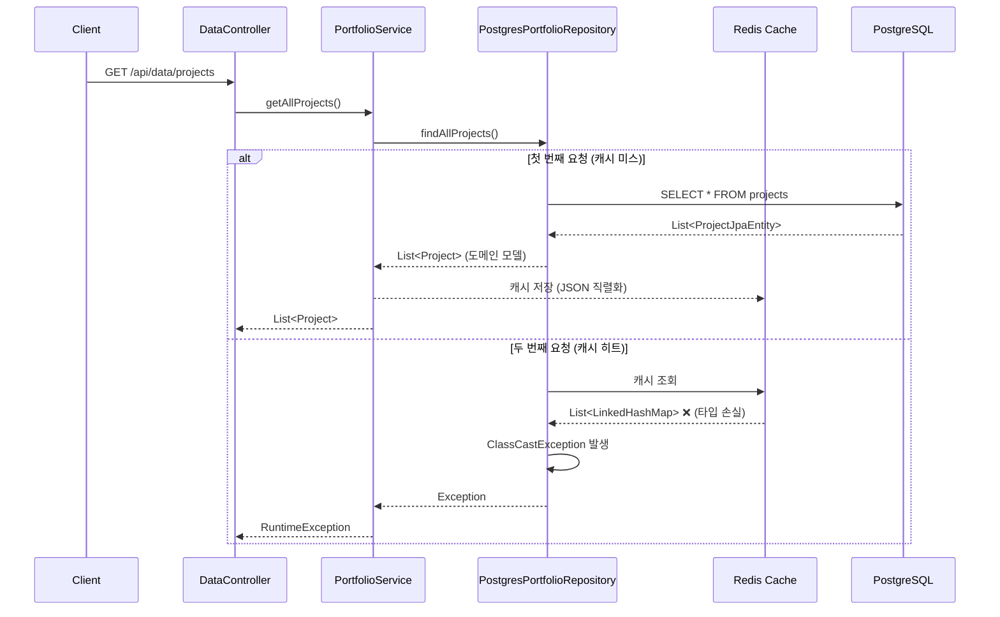

# 캐시 및 데이터 처리 개선 계획

## 📌 문제 요약

**발생 위치**: [PortfolioService.java:104](../../backend/src/main/java/com/aiportfolio/backend/application/portfolio/PortfolioService.java#L104)

**오류 내용**:
```
java.lang.RuntimeException: 프로젝트 데이터 조회 실패
	at com.aiportfolio.backend.application.portfolio.PortfolioService.getAllProjects(PortfolioService.java:104)
```

**근본 원인**:
- Redis 캐시에서 `Project` 객체를 역직렬화할 때 **타입 정보 손실**로 인한 `ClassCastException`
- 캐시된 데이터가 `LinkedHashMap` 등으로 역직렬화되어 `List<Project>` 타입 변환 실패

---

## 🔍 근본 원인 상세 분석

### 1. 문제 발생 메커니즘



### 2. 코드 레벨 분석

#### 문제 코드 1: Repository Layer의 캐싱
**파일**: [PostgresPortfolioRepository.java:61-82](../../backend/src/main/java/com/aiportfolio/backend/infrastructure/persistence/postgres/PostgresPortfolioRepository.java#L61-L82)

```java
@Override
@Cacheable(value = "portfolio", key = "'projects'")  // ❌ Repository에서 캐싱
public List<Project> findAllProjects() {
    log.info("PostgreSQL에서 프로젝트 데이터를 조회합니다.");
    try {
        List<ProjectJpaEntity> jpaEntities = projectJpaRepository.findAllOrderedBySortOrderAndStartDate();
        // ... 매핑 로직
        List<Project> projects = projectMapper.toDomainList(jpaEntities);
        return projects; // Redis에 직렬화됨
    } catch (Exception e) {
        log.error("프로젝트 조회 중 오류 발생", e);
        return new ArrayList<>();
    }
}
```

**문제점**:
- Infrastructure Layer에서 캐싱 → Hexagonal Architecture 원칙 위배
- 캐시 역직렬화 시 `List<Project>` 타입 정보 손실

---

#### 문제 코드 2: Controller의 타입 안전성 부재
**파일**: [DataController.java:65-71](../../backend/src/main/java/com/aiportfolio/backend/infrastructure/web/controller/DataController.java#L65-L71)

```java
@GetMapping("/projects")
public ResponseEntity<ApiResponse<List<ProjectDataResponse>>> getProjects() {
    List<?> rawProjects = getProjectsUseCase.getAllProjects(); // ❌ 타입 손실
    List<ProjectDataResponse> projects = rawProjects.stream()
        .map(this::toProjectResponse)  // ObjectMapper로 타입 변환 시도
        .collect(Collectors.toList());
    return ResponseEntity.ok(ApiResponse.success(projects));
}
```

**우회 로직**:
```java
private ProjectDataResponse toProjectResponse(Object value) {
    if (value instanceof Project project) {
        return ProjectDataResponse.from(project);
    }
    // 캐시 역직렬화 실패 시 ObjectMapper로 재변환
    Project project = objectMapper.convertValue(value, Project.class);
    return ProjectDataResponse.from(project);
}
```

**대조: Education/Experience는 정상 동작**
```java
@GetMapping("/experiences")
public ResponseEntity<ApiResponse<List<Experience>>> getExperiences() {
    List<Experience> experiences = getAllDataUseCase.getAllExperiences(); // ✅ 명시적 타입
    return ResponseEntity.ok(ApiResponse.success(experiences));
}
```

---

#### 문제 코드 3: Redis Serializer 설정
**파일**: [CacheConfig.java:36-48](../../backend/src/main/java/com/aiportfolio/backend/infrastructure/config/CacheConfig.java#L36-L48)

```java
ObjectMapper objectMapper = new ObjectMapper();
objectMapper.registerModule(new JavaTimeModule());
objectMapper.disable(SerializationFeature.WRITE_DATES_AS_TIMESTAMPS);
objectMapper.setDateFormat(new SimpleDateFormat("yyyy-MM"));
objectMapper.activateDefaultTyping(
    LaissezFaireSubTypeValidator.instance,
    ObjectMapper.DefaultTyping.NON_FINAL,
    JsonTypeInfo.As.PROPERTY  // "@class" 속성 추가하지만 컬렉션 타입은 보존 안 됨
);
GenericJackson2JsonRedisSerializer serializer = new GenericJackson2JsonRedisSerializer(objectMapper);
```

**문제점**:
- `NON_FINAL` 타입만 타입 정보 저장 → `List<Project>`의 제네릭 정보는 런타임에 소거됨
- 컬렉션 내부 요소의 타입 정보는 보존되지 않음

---

### 3. 중복된 Service 레이어 문제

**현재 구조**:
```
PortfolioService (Bean: "portfolioService")
├── GetAllDataUseCase 구현
├── GetProjectsUseCase 구현
└── ManageProjectCacheUseCase 구현

PortfolioApplicationService (Bean: "portfolioApplicationService")
├── GetAllDataUseCase 구현 (중복)
└── GetProjectsUseCase 위임 (PortfolioService에 의존)
```

**파일**: [PortfolioApplicationService.java:29-34](../../backend/src/main/java/com/aiportfolio/backend/application/portfolio/PortfolioApplicationService.java#L29-L34)
```java
public PortfolioApplicationService(
    @Qualifier("portfolioService") GetProjectsUseCase getProjectsUseCase,  // 다른 서비스에 의존
    PortfolioRepositoryPort portfolioRepositoryPort) {
    this.getProjectsUseCase = getProjectsUseCase;
    this.portfolioRepositoryPort = portfolioRepositoryPort;
}
```

**문제점**:
- 역할 중복 및 의존성 복잡도 증가
- DataController가 두 개의 서비스를 주입받음

---

## ✅ 개선 계획

### 우선순위 1: 타입 안전성 즉시 개선 (긴급)

#### 1.1. DataController 타입 명시화

**파일**: `backend/src/main/java/com/aiportfolio/backend/infrastructure/web/controller/DataController.java`

**변경 전**:
```java
@GetMapping("/projects")
public ResponseEntity<ApiResponse<List<ProjectDataResponse>>> getProjects() {
    List<?> rawProjects = getProjectsUseCase.getAllProjects();
    List<ProjectDataResponse> projects = rawProjects.stream()
        .map(this::toProjectResponse)
        .collect(Collectors.toList());
    return ResponseEntity.ok(ApiResponse.success(projects, "프로젝트 목록 조회 성공"));
}
```

**변경 후**:
```java
@GetMapping("/projects")
public ResponseEntity<ApiResponse<List<ProjectDataResponse>>> getProjects() {
    List<Project> projects = getProjectsUseCase.getAllProjects();  // ✅ 명시적 타입
    List<ProjectDataResponse> responses = projects.stream()
        .map(ProjectDataResponse::from)
        .toList();
    return ResponseEntity.ok(ApiResponse.success(responses, "프로젝트 목록 조회 성공"));
}
```

**효과**: 컴파일 타임에 타입 체크 가능, ObjectMapper 우회 로직 제거

---

#### 1.2. toProjectResponse() 메서드 강화

**변경 전**:
```java
private ProjectDataResponse toProjectResponse(Object value) {
    if (value instanceof Project project) {
        return ProjectDataResponse.from(project);
    }
    Project project = objectMapper.convertValue(value, Project.class);
    return ProjectDataResponse.from(project);
}
```

**변경 후**:
```java
private ProjectDataResponse toProjectResponse(Object value) {
    if (value instanceof Project project) {
        return ProjectDataResponse.from(project);
    }

    // 캐시 역직렬화 실패 시 명확한 로그와 예외 처리
    log.error("캐시 역직렬화 타입 불일치 - 예상: Project, 실제: {}", value.getClass().getName());

    try {
        Project project = objectMapper.convertValue(value, Project.class);
        log.warn("ObjectMapper를 통한 타입 변환 성공 (캐시 역직렬화 문제 가능성)");
        return ProjectDataResponse.from(project);
    } catch (Exception e) {
        log.error("프로젝트 타입 변환 실패", e);
        throw new IllegalStateException("캐시된 프로젝트 데이터의 타입이 올바르지 않습니다", e);
    }
}
```

**효과**: 문제 발생 시 명확한 디버깅 정보 제공

---

### 우선순위 2: 캐시 레이어 재설계 (중요)

#### 2.1. Repository에서 캐싱 제거

**파일**: `backend/src/main/java/com/aiportfolio/backend/infrastructure/persistence/postgres/PostgresPortfolioRepository.java`

**변경 전**:
```java
@Override
@Cacheable(value = "portfolio", key = "'projects'")  // ❌ 제거
public List<Project> findAllProjects() {
    // ...
}
```

**변경 후**:
```java
@Override
// @Cacheable 어노테이션 제거 - Repository는 순수 데이터 접근만 담당
public List<Project> findAllProjects() {
    log.info("PostgreSQL에서 프로젝트 데이터를 조회합니다.");
    try {
        List<ProjectJpaEntity> jpaEntities = projectJpaRepository.findAllOrderedBySortOrderAndStartDate();
        // ... 기존 로직 유지
        return projectMapper.toDomainList(jpaEntities);
    } catch (Exception e) {
        log.error("프로젝트 조회 중 오류 발생", e);
        throw new RuntimeException("프로젝트 조회 실패", e);  // Repository에서 빈 리스트 반환 대신 예외 전파
    }
}
```

**효과**:
- Hexagonal Architecture 원칙 준수 (Repository는 데이터 접근만)
- 캐싱 책임을 Application Layer로 이동

---

#### 2.2. Application Service에서 캐싱

**파일**: `backend/src/main/java/com/aiportfolio/backend/application/portfolio/PortfolioService.java`

**변경 전**:
```java
@Override
public List<Project> getAllProjects() {
    try {
        log.debug("모든 프로젝트 조회 요청");
        List<Project> projects = portfolioRepositoryPort.findAllProjects();
        log.info("프로젝트 조회 완료: {} 개", projects.size());
        return projects;
    } catch (Exception e) {
        log.error("프로젝트 데이터 조회 중 오류 발생", e);
        throw new RuntimeException("프로젝트 데이터 조회 실패", e);
    }
}
```

**변경 후**:
```java
@Override
@Cacheable(
    value = "portfolio",
    key = "'projects:all'",  // ✅ 명확한 캐시 키
    unless = "#result == null || #result.isEmpty()"  // 빈 결과는 캐싱 안 함
)
public List<Project> getAllProjects() {
    log.debug("캐시 미스 - PostgreSQL에서 프로젝트 조회");
    List<Project> projects = portfolioRepositoryPort.findAllProjects();
    log.info("프로젝트 조회 완료: {} 개", projects.size());
    return projects;
}
```

**캐시 무효화 개선**:
```java
@Override
@CacheEvict(value = "portfolio", key = "'projects:all'")  // ✅ 특정 키만 무효화
public void refreshProjectsCache() {
    log.info("프로젝트 캐시 무효화");
}

@Override
@CacheEvict(value = "portfolio", allEntries = true)  // 모든 포트폴리오 캐시 무효화
public void refreshAllPortfolioCache() {
    log.info("전체 포트폴리오 캐시 무효화");
}
```

**효과**:
- Application Layer에서 비즈니스 로직과 캐싱을 함께 관리
- 세분화된 캐시 무효화 가능

---

### 우선순위 3: Service 레이어 통합 (권장)

#### 3.1. PortfolioService와 PortfolioApplicationService 역할 명확화

**옵션 A: PortfolioApplicationService를 메인으로 사용**

**파일**: `backend/src/main/java/com/aiportfolio/backend/application/portfolio/PortfolioApplicationService.java`

```java
@Slf4j
@Service("portfolioApplicationService")
public class PortfolioApplicationService implements
    GetAllDataUseCase,
    GetProjectsUseCase,
    ManageProjectCacheUseCase {  // ✅ 모든 Use Case 직접 구현

    private final PortfolioRepositoryPort repositoryPort;

    public PortfolioApplicationService(PortfolioRepositoryPort repositoryPort) {
        this.repositoryPort = repositoryPort;
    }

    // === GetProjectsUseCase 구현 ===

    @Override
    @Cacheable(value = "portfolio", key = "'projects:all'", unless = "#result == null || #result.isEmpty()")
    public List<Project> getAllProjects() {
        log.debug("캐시 미스 - PostgreSQL에서 프로젝트 조회");
        return repositoryPort.findAllProjects();
    }

    @Override
    public Optional<Project> getProjectById(String id) {
        log.debug("프로젝트 ID로 조회 요청: {}", id);
        return repositoryPort.findProjectById(id);
    }

    // ... 기타 GetProjectsUseCase 메서드

    // === GetAllDataUseCase 구현 ===

    @Override
    public Map<String, Object> getAllPortfolioData() {
        try {
            List<Project> projects = getAllProjects();  // 캐시 활용
            List<Experience> experiences = getAllExperiences();
            List<Education> educations = getAllEducations();
            List<Certification> certifications = getAllCertifications();

            return Map.of(
                "projects", projects,
                "experiences", experiences,
                "educations", educations,
                "certifications", certifications
            );
        } catch (Exception e) {
            log.error("포트폴리오 데이터 조회 중 오류 발생", e);
            throw new RuntimeException("포트폴리오 데이터 조회 실패", e);
        }
    }

    @Override
    @Cacheable(value = "portfolio", key = "'experiences:all'", unless = "#result == null || #result.isEmpty()")
    public List<Experience> getAllExperiences() {
        log.debug("캐시 미스 - PostgreSQL에서 경험 조회");
        return repositoryPort.findAllExperiences();
    }

    @Override
    @Cacheable(value = "portfolio", key = "'educations:all'", unless = "#result == null || #result.isEmpty()")
    public List<Education> getAllEducations() {
        log.debug("캐시 미스 - PostgreSQL에서 교육 조회");
        return repositoryPort.findAllEducations();
    }

    @Override
    @Cacheable(value = "portfolio", key = "'certifications:all'", unless = "#result == null || #result.isEmpty()")
    public List<Certification> getAllCertifications() {
        log.debug("캐시 미스 - PostgreSQL에서 자격증 조회");
        return repositoryPort.findAllCertifications();
    }

    // === ManageProjectCacheUseCase 구현 ===

    @Override
    @CacheEvict(value = "portfolio", key = "'projects:all'")
    public void refreshProjectsCache() {
        log.info("프로젝트 캐시 무효화");
    }

    @Override
    @CacheEvict(value = "portfolio", allEntries = true)
    public void refreshCache() {
        log.info("전체 포트폴리오 캐시 무효화");
    }

    @Override
    public boolean isCacheValid() {
        return true;  // Redis TTL로 자동 관리
    }
}
```

**PortfolioService 제거 또는 역할 변경**:
- 옵션 1: `PortfolioService` 클래스 삭제
- 옵션 2: `PortfolioService`를 Admin 전용 서비스로 변경 (캐시 없이 항상 최신 데이터 조회)

---

#### 3.2. Controller 의존성 단순화

**파일**: `backend/src/main/java/com/aiportfolio/backend/infrastructure/web/controller/DataController.java`

**변경 전**:
```java
private final GetProjectsUseCase getProjectsUseCase;
private final GetAllDataUseCase getAllDataUseCase;

public DataController(
    @Qualifier("portfolioService") GetProjectsUseCase getProjectsUseCase,
    @Qualifier("portfolioApplicationService") GetAllDataUseCase getAllDataUseCase,
    ObjectMapper objectMapper) {
    this.getProjectsUseCase = getProjectsUseCase;
    this.getAllDataUseCase = getAllDataUseCase;
    this.objectMapper = objectMapper;
}
```

**변경 후**:
```java
private final PortfolioApplicationService portfolioApplicationService;

public DataController(
    @Qualifier("portfolioApplicationService") PortfolioApplicationService portfolioApplicationService) {
    this.portfolioApplicationService = portfolioApplicationService;
}

@GetMapping("/all")
public ResponseEntity<ApiResponse<Map<String, Object>>> getAllData() {
    Map<String, Object> allData = portfolioApplicationService.getAllPortfolioData();
    // ... 프로젝트 응답 변환 로직
    return ResponseEntity.ok(ApiResponse.success(responseData));
}

@GetMapping("/projects")
public ResponseEntity<ApiResponse<List<ProjectDataResponse>>> getProjects() {
    List<Project> projects = portfolioApplicationService.getAllProjects();  // ✅ 타입 안전
    List<ProjectDataResponse> responses = projects.stream()
        .map(ProjectDataResponse::from)
        .toList();
    return ResponseEntity.ok(ApiResponse.success(responses));
}
```

**효과**:
- 의존성 단순화
- 타입 안전성 보장
- ObjectMapper 불필요

---

### 우선순위 4: Redis Serializer 개선 (선택)

#### 4.1. CacheConfig 개선

**파일**: `backend/src/main/java/com/aiportfolio/backend/infrastructure/config/CacheConfig.java`

**추가 설정**:
```java
@Bean
@Primary
public CacheManager redisCacheManager(RedisConnectionFactory connectionFactory) {
    ObjectMapper objectMapper = new ObjectMapper();
    objectMapper.registerModule(new JavaTimeModule());
    objectMapper.disable(SerializationFeature.WRITE_DATES_AS_TIMESTAMPS);
    objectMapper.setDateFormat(new SimpleDateFormat("yyyy-MM"));

    // 타입 정보 보존 강화
    objectMapper.activateDefaultTyping(
        LaissezFaireSubTypeValidator.instance,
        ObjectMapper.DefaultTyping.NON_FINAL,
        JsonTypeInfo.As.PROPERTY
    );

    // 컬렉션 타입 정보 보존 (추가)
    objectMapper.configure(DeserializationFeature.FAIL_ON_UNKNOWN_PROPERTIES, false);
    objectMapper.configure(MapperFeature.USE_ANNOTATIONS, true);

    GenericJackson2JsonRedisSerializer serializer = new GenericJackson2JsonRedisSerializer(objectMapper);

    RedisCacheConfiguration defaultConfig = RedisCacheConfiguration.defaultCacheConfig()
        .entryTtl(Duration.ofHours(1))
        .serializeKeysWith(RedisSerializationContext.SerializationPair.fromSerializer(new StringRedisSerializer()))
        .serializeValuesWith(RedisSerializationContext.SerializationPair.fromSerializer(serializer))
        .disableCachingNullValues();

    // 캐시별 TTL 설정
    Map<String, RedisCacheConfiguration> cacheConfigurations = new HashMap<>();
    cacheConfigurations.put("portfolio", defaultConfig.entryTtl(Duration.ofDays(1)));
    cacheConfigurations.put("github", defaultConfig.entryTtl(Duration.ofMinutes(30)));

    return RedisCacheManager.builder(connectionFactory)
        .cacheDefaults(defaultConfig)
        .withInitialCacheConfigurations(cacheConfigurations)
        .build();
}
```

**주의**: 이 방법도 제네릭 타입 완전 보존은 어려움. **우선순위 2 (Application Layer 캐싱)**가 더 근본적인 해결책.

---

### 우선순위 5: UseCase 인터페이스에 캐시 무효화 메서드 추가

**파일**: `backend/src/main/java/com/aiportfolio/backend/domain/portfolio/port/in/ManageProjectCacheUseCase.java`

**변경 전**:
```java
public interface ManageProjectCacheUseCase {
    void refreshCache();
    boolean isCacheValid();
}
```

**변경 후**:
```java
public interface ManageProjectCacheUseCase {
    /**
     * 프로젝트 캐시만 무효화
     */
    void refreshProjectsCache();

    /**
     * 경험 캐시만 무효화
     */
    void refreshExperiencesCache();

    /**
     * 교육 캐시만 무효화
     */
    void refreshEducationsCache();

    /**
     * 자격증 캐시만 무효화
     */
    void refreshCertificationsCache();

    /**
     * 모든 포트폴리오 캐시 무효화
     */
    void refreshCache();

    /**
     * 캐시 유효성 확인 (Redis TTL 기반)
     */
    boolean isCacheValid();
}
```

**사용 예시**:
```java
// 프로젝트 수정 시
@Override
public Project updateProject(Project project) {
    Project updated = repositoryPort.updateProject(project);
    manageProjectCacheUseCase.refreshProjectsCache();  // 프로젝트 캐시만 무효화
    return updated;
}
```

---

## 📋 작업 체크리스트

### Phase 1: 긴급 수정 (즉시 적용)
- [ ] **DataController.getProjects() 타입 명시화**
  - `List<?>` → `List<Project>` 변경
  - `toProjectResponse()` 로그 강화
  - 파일: `DataController.java`

- [ ] **예외 처리 개선**
  - `toProjectResponse()`에서 명확한 예외 메시지
  - 캐시 역직렬화 실패 로그 추가

### Phase 2: 캐시 레이어 재설계 (중요)
- [ ] **Repository에서 @Cacheable 제거**
  - `PostgresPortfolioRepository.findAllProjects()` 캐싱 제거
  - `findAllExperiences()`, `findAllEducations()`, `findAllCertifications()` 캐싱 제거
  - 파일: `PostgresPortfolioRepository.java`

- [ ] **Application Service에 캐싱 추가**
  - `PortfolioApplicationService`에 `@Cacheable` 추가
  - 캐시 키: `projects:all`, `experiences:all`, `educations:all`, `certifications:all`
  - 파일: `PortfolioApplicationService.java`

- [ ] **캐시 무효화 메서드 추가**
  - `ManageProjectCacheUseCase` 인터페이스 확장
  - 세분화된 캐시 무효화 구현

### Phase 3: Service 레이어 통합 (권장)
- [ ] **PortfolioApplicationService 통합**
  - 모든 Use Case 직접 구현
  - PortfolioService 의존성 제거

- [ ] **PortfolioService 역할 변경 또는 제거**
  - 옵션 1: 삭제
  - 옵션 2: Admin 전용 서비스로 변경

- [ ] **DataController 의존성 단순화**
  - `@Qualifier` 제거 또는 단순화
  - 단일 서비스 주입

### Phase 4: 테스트 및 검증
- [ ] **캐시 동작 검증**
  - 첫 요청: 캐시 미스 로그 확인
  - 두 번째 요청: 캐시 히트 확인
  - 타입 변환 오류 없는지 확인

- [ ] **캐시 무효화 테스트**
  - 프로젝트 수정 후 캐시 갱신 확인
  - `refreshProjectsCache()` 동작 검증

- [ ] **성능 테스트**
  - 캐시 히트율 확인
  - 응답 시간 개선 확인

---

## 🚀 기대 효과

### 1. 타입 안전성 확보
- 컴파일 타임에 타입 체크 가능
- `ClassCastException` 근본적 해결
- `ObjectMapper` 우회 로직 제거

### 2. 아키텍처 원칙 준수
- Hexagonal Architecture: Application Layer에서 캐싱
- Repository는 순수 데이터 접근만 담당
- 관심사의 분리 (Separation of Concerns)

### 3. 유지보수성 향상
- Service 레이어 역할 명확화
- 캐시 무효화 전략 세분화
- 명확한 의존성 구조

### 4. 디버깅 용이성
- 명확한 로그 메시지
- 문제 발생 지점 추적 가능
- 캐시 히트/미스 가시성

---

## 📚 참고 자료

### 관련 커밋
- `431dff2` - Fix project cache deserialization
- `7d5afe8` - Handle cached project payloads in data controller
- `8086f4e` - Fix ClassCastException in getProjects method

### 관련 파일
- [PortfolioService.java](../../backend/src/main/java/com/aiportfolio/backend/application/portfolio/PortfolioService.java)
- [DataController.java](../../backend/src/main/java/com/aiportfolio/backend/infrastructure/web/controller/DataController.java)
- [PostgresPortfolioRepository.java](../../backend/src/main/java/com/aiportfolio/backend/infrastructure/persistence/postgres/PostgresPortfolioRepository.java)
- [CacheConfig.java](../../backend/src/main/java/com/aiportfolio/backend/infrastructure/config/CacheConfig.java)

### 아키텍처 문서
- [Backend Hexagonal Architecture Guide](../ai/agent_guideline/backend/hexagonal-architecture-guide.md)
- [CLAUDE.md - 프로젝트 가이드라인](../../.claude/CLAUDE.md)
