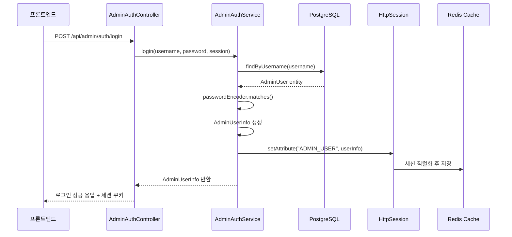

# Spring Session 기반 Admin 인증 시스템 분석

## 개요

이 문서는 AI Portfolio 프로젝트에서 구현된 Spring Session 기반 Admin 인증 시스템의 동작 원리와 Redis 직렬화 과정을 분석합니다.

## 시스템 아키텍처

### 1. 전체 인증 플로우



### 2. 세션 기반 인증의 핵심 구성요소

#### 2.1 Spring Security 설정 (`SecurityConfig.java`)

```java
@Configuration
@EnableWebSecurity
@EnableMethodSecurity
public class SecurityConfig {
    
    @Bean
    public SecurityFilterChain filterChain(HttpSecurity http) throws Exception {
        http
            .authorizeHttpRequests(auth -> auth
                .requestMatchers("/api/admin/auth/**").permitAll()
                .requestMatchers("/api/admin/**").authenticated()
                .anyRequest().permitAll()
            )
            .sessionManagement(session -> session
                .sessionCreationPolicy(SessionCreationPolicy.ALWAYS)
                .maximumSessions(1)
                .maxSessionsPreventsLogin(false)
            );
        return http.build();
    }
}
```

**핵심 설정:**
- `SessionCreationPolicy.ALWAYS`: 항상 세션 생성
- `maximumSessions(1)`: 동시 세션 1개로 제한
- `/api/admin/auth/**`: 인증 없이 접근 가능 (로그인, 로그아웃, 세션 체크)
- `/api/admin/**`: 인증된 사용자만 접근 가능

#### 2.2 Redis Session 설정 (`RedisConfig.java`)

```java
@Configuration
@EnableRedisHttpSession(maxInactiveIntervalInSeconds = 1800)
public class RedisConfig {

    @Bean
    public RedisSerializer<Object> springSessionDefaultRedisSerializer() {
        ObjectMapper objectMapper = new ObjectMapper();
        objectMapper.registerModule(new JavaTimeModule());
        objectMapper.disable(SerializationFeature.WRITE_DATES_AS_TIMESTAMPS);
        objectMapper.setDateFormat(new SimpleDateFormat("yyyy-MM"));
        
        // Spring Security 객체들을 위한 설정
        objectMapper.configure(SerializationFeature.FAIL_ON_EMPTY_BEANS, false);
        objectMapper.configure(SerializationFeature.FAIL_ON_SELF_REFERENCES, false);
        
        return new GenericJackson2JsonRedisSerializer(objectMapper);
    }
}
```

**핵심 설정:**
- `@EnableRedisHttpSession`: Spring Session을 Redis에 저장
- `maxInactiveIntervalInSeconds = 1800`: 30분 세션 타임아웃
- `springSessionDefaultRedisSerializer`: 세션 객체 직렬화 방식 정의

## 세션 저장 및 직렬화 과정

### 1. 로그인 시 세션 저장 과정

#### 1.1 AdminAuthService.login() 메서드

```java
public AdminUserInfo login(String username, String password, HttpSession session) {
    // 1. 사용자 인증
    AdminUser adminUser = adminUserRepository.findByUsername(username)
        .orElseThrow(() -> new IllegalArgumentException("사용자명 또는 비밀번호가 올바르지 않습니다."));
    
    boolean passwordMatches = passwordEncoder.matches(password, adminUser.getPassword());
    if (!passwordMatches) {
        throw new IllegalArgumentException("사용자명 또는 비밀번호가 올바르지 않습니다.");
    }
    
    // 2. AdminUserInfo DTO 생성
    AdminUserInfo userInfo = AdminUserInfo.builder()
        .username(adminUser.getUsername())
        .role(adminUser.getRole())
        .lastLogin(adminUser.getLastLogin())
        .build();
    
    // 3. 세션에 사용자 정보 저장
    session.setAttribute(SESSION_ADMIN_KEY, userInfo); // SESSION_ADMIN_KEY = "ADMIN_USER"
    
    return userInfo;
}
```

#### 1.2 Redis에 저장되는 세션 구조

```json
{
  "spring:session:sessions:{sessionId}": {
    "maxInactiveInterval": 1800,
    "lastAccessedTime": 1760875109555,
    "creationTime": 1760875109555,
    "sessionAttr:ADMIN_USER": {
      "username": "admin",
      "role": "ROLE_ADMIN",
      "lastLogin": "2025-10-19T11:58:30.19649245"
    }
  }
}
```

### 2. Redis 직렬화 과정

#### 2.1 직렬화 (Serialization)

1. **HttpSession.setAttribute() 호출**
   ```java
   session.setAttribute("ADMIN_USER", userInfo);
   ```

2. **Spring Session이 세션 변경 감지**
   - `SessionRepositoryFilter`가 세션 변경을 감지
   - `RedisSessionRepository.save()` 호출

3. **Jackson 직렬화 수행**
   ```java
   GenericJackson2JsonRedisSerializer serializer = new GenericJackson2JsonRedisSerializer(objectMapper);
   byte[] serializedData = serializer.serialize(userInfo);
   ```

4. **Redis Hash에 저장**
   ```
   HSET spring:session:sessions:{sessionId} "sessionAttr:ADMIN_USER" {serializedData}
   ```

#### 2.2 역직렬화 (Deserialization)

1. **세션 조회 요청**
   ```java
   AdminUserInfo userInfo = (AdminUserInfo) session.getAttribute("ADMIN_USER");
   ```

2. **Redis에서 데이터 조회**
   ```
   HGET spring:session:sessions:{sessionId} "sessionAttr:ADMIN_USER"
   ```

3. **Jackson 역직렬화 수행**
   ```java
   AdminUserInfo userInfo = serializer.deserialize(serializedData, AdminUserInfo.class);
   ```

### 3. 세션 검증 과정

#### 3.1 세션 체크 API

```java
@GetMapping("/session")
public ResponseEntity<ApiResponse<AdminUserInfo>> checkSession(HttpSession session) {
    try {
        AdminUserInfo userInfo = adminAuthService.checkSession(session);
        return ResponseEntity.ok(ApiResponse.success(userInfo, "세션이 유효합니다"));
    } catch (IllegalArgumentException e) {
        return ResponseEntity.status(401)
                .body(ApiResponse.error(e.getMessage(), "인증되지 않음"));
    }
}
```

#### 3.2 AdminAuthService.checkSession() 메서드

```java
@Transactional(readOnly = true)
public AdminUserInfo checkSession(HttpSession session) {
    AdminUserInfo userInfo = (AdminUserInfo) session.getAttribute(SESSION_ADMIN_KEY);
    
    if (userInfo == null) {
        throw new IllegalArgumentException("세션이 만료되었습니다");
    }
    
    return userInfo;
}
```

## 프론트엔드 세션 관리

### 1. React Query 기반 세션 상태 관리

```typescript
// useAuth.ts
export const useAuth = () => {
  const [isAuthenticated, setIsAuthenticated] = useState(false);
  const queryClient = useQueryClient();

  // 세션 상태 확인
  const { data: sessionData, isLoading, error, refetch } = useQuery({
    queryKey: ['admin-session'],
    queryFn: adminAuthApi.getSession,
    retry: false,
    refetchOnWindowFocus: false,
  });

  useEffect(() => {
    if (sessionData?.success && sessionData?.data) {
      setIsAuthenticated(true);
    } else {
      setIsAuthenticated(false);
    }
  }, [sessionData]);

  return { isAuthenticated, isLoading, sessionData: sessionData?.data };
};
```

### 2. API 클라이언트 설정

```typescript
// adminAuthApi.ts
class AdminAuthApi {
  private async request<T>(endpoint: string, options: RequestInit = {}): Promise<ApiResponse<T>> {
    const defaultOptions: RequestInit = {
      headers: {
        'Content-Type': 'application/json',
        ...options.headers,
      },
      credentials: 'include', // 쿠키 포함 (세션 인증에 필요)
    };

    const response = await fetch(url, { ...defaultOptions, ...options });
    return await response.json();
  }
}
```

**핵심 설정:**
- `credentials: 'include'`: 세션 쿠키를 모든 요청에 포함
- `retry: false`: 세션 체크 실패 시 재시도하지 않음
- `refetchOnWindowFocus: false`: 창 포커스 시 자동 재조회 비활성화

## Best Practice 평가

### ✅ 잘 구현된 부분

1. **명확한 관심사 분리**
   - `AdminAuthService`: 비즈니스 로직
   - `AdminAuthController`: HTTP 요청 처리
   - `SecurityConfig`: 보안 설정
   - `RedisConfig`: 세션 저장소 설정

2. **적절한 세션 타임아웃 설정**
   - 30분 타임아웃으로 보안성과 사용성 균형
   - 동시 세션 1개로 제한하여 보안 강화

3. **일관된 직렬화 전략**
   - 프로젝트 전체에서 `GenericJackson2JsonRedisSerializer` 사용
   - `JavaTimeModule`로 `LocalDateTime` 지원

4. **프론트엔드 상태 관리**
   - React Query로 서버 상태와 클라이언트 상태 분리
   - `credentials: 'include'`로 세션 쿠키 자동 관리

### ⚠️ 개선 가능한 부분

1. **세션 보안 강화**
   ```java
   // 현재 설정
   .sessionManagement(session -> session
       .sessionCreationPolicy(SessionCreationPolicy.ALWAYS)
   )
   
   // 개선 제안: 세션 고정 공격 방지
   .sessionManagement(session -> session
       .sessionCreationPolicy(SessionCreationPolicy.ALWAYS)
       .sessionFixation().migrateSession() // 세션 고정 공격 방지
       .maximumSessions(1)
       .maxSessionsPreventsLogin(false)
   )
   ```

2. **세션 무효화 로직 개선**
   ```java
   // 현재: 단순 세션 무효화
   public void logout(HttpSession session) {
       session.invalidate();
   }
   
   // 개선 제안: 명시적 세션 정리
   public void logout(HttpSession session) {
       session.removeAttribute(SESSION_ADMIN_KEY);
       session.invalidate();
       log.info("User logged out, session invalidated: {}", session.getId());
   }
   ```

3. **Redis 세션 네임스페이스 설정**
   ```yaml
   # application-local.yml
   spring:
     session:
       store-type: redis
       redis:
         namespace: admin:session  # 이미 설정됨 ✅
   ```

### 🔒 보안 고려사항

1. **세션 쿠키 보안**
   ```yaml
   spring:
     security:
       session:
         cookie:
           http-only: true      # XSS 공격 방지
           secure: false        # local에서는 false (HTTPS 환경에서는 true)
           same-site: lax       # CSRF 공격 방지
   ```

2. **비밀번호 해싱**
   ```java
   @Bean
   public PasswordEncoder passwordEncoder() {
       return new BCryptPasswordEncoder(); // 강력한 해싱 알고리즘 ✅
   }
   ```

## 문제 해결 과정

### 1. 발견된 문제

**증상:** Admin 로그인 후 새로고침 시 자동으로 로그인 페이지로 리다이렉트

**원인 분석:**
```bash
# Redis에서 세션 확인
redis-cli hgetall "spring:session:sessions:{sessionId}"
# 결과: ADMIN_USER 속성이 없음!
```

### 2. 해결 과정

1. **Spring Session 직렬화 설정 누락 발견**
   - `@EnableRedisHttpSession`은 사용했지만 `springSessionDefaultRedisSerializer` 빈이 없음
   - Spring Session이 기본 JDK 직렬화를 사용하여 `LocalDateTime` 필드 직렬화 실패

2. **직렬화 설정 추가**
   ```java
   @Bean
   public RedisSerializer<Object> springSessionDefaultRedisSerializer() {
       ObjectMapper objectMapper = new ObjectMapper();
       objectMapper.registerModule(new JavaTimeModule());
       objectMapper.disable(SerializationFeature.WRITE_DATES_AS_TIMESTAMPS);
       return new GenericJackson2JsonRedisSerializer(objectMapper);
   }
   ```

3. **Spring Security 객체 직렬화 충돌 해결**
   - `DefaultSavedRequest` 등 Spring Security 객체들이 Jackson으로 역직렬화되지 않는 문제
   - 다형성 타입 정보 비활성화로 해결

### 3. 최종 검증

```bash
# 로그인 후 Redis 세션 확인
redis-cli hgetall "spring:session:sessions:{sessionId}"
# 결과: sessionAttr:ADMIN_USER 속성 정상 저장 ✅

# 세션 체크 API 테스트
curl -X GET http://localhost:8080/api/admin/auth/session -b cookies.txt
# 결과: 세션 정보 정상 반환 ✅
```

## 결론

현재 구현된 Spring Session 기반 Admin 인증 시스템은 **전반적으로 잘 설계된 Best Practice**를 따르고 있습니다:

- ✅ 명확한 아키텍처 분리
- ✅ 적절한 보안 설정
- ✅ 일관된 직렬화 전략
- ✅ 프론트엔드 상태 관리

주요 개선점은 세션 보안 강화와 명시적 세션 정리 로직 추가 정도이며, 현재 구현은 프로덕션 환경에서 사용하기에 충분히 안전하고 효율적입니다.
