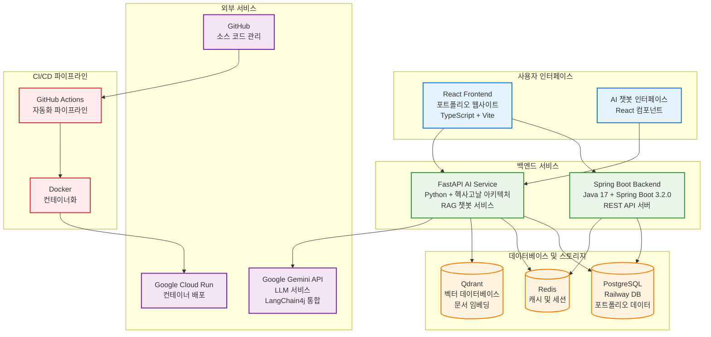
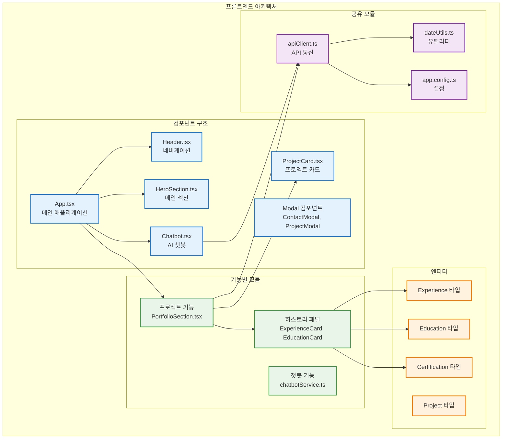
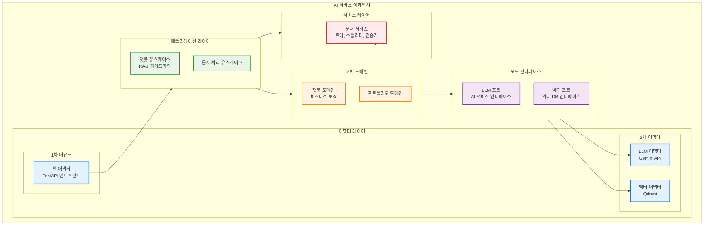
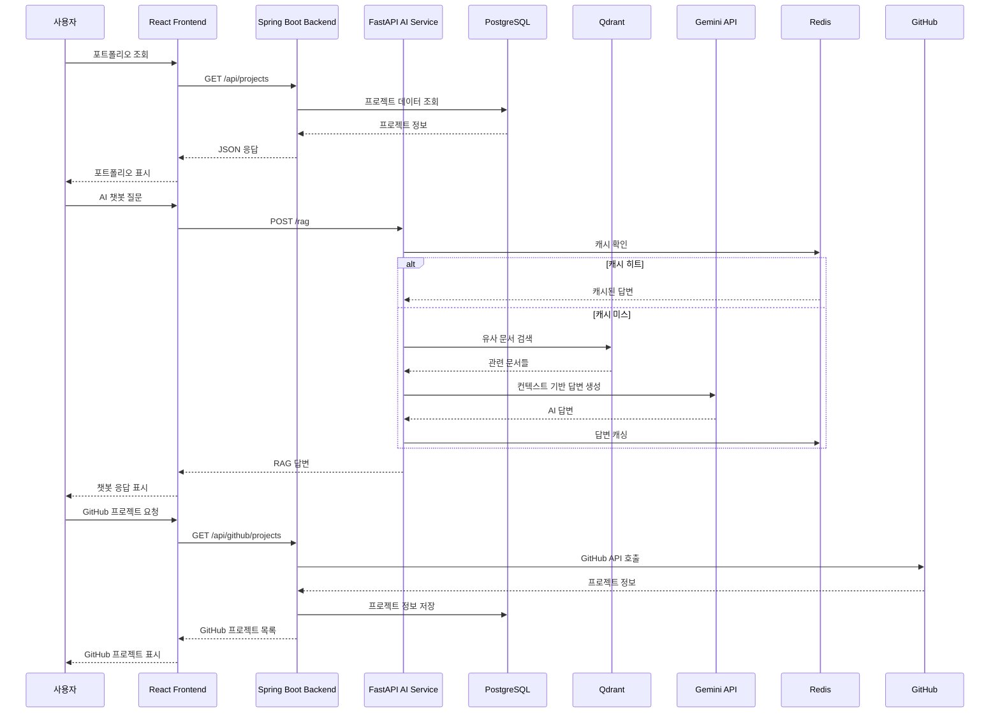

# 현재 브랜치 서비스 구성도

## 전체 시스템 아키텍처

현재 브랜치에서는 프론트엔드, 백엔드, AI 서비스로 구성된 풀스택 포트폴리오 시스템이 구현되어 있습니다.



## 서비스별 상세 구성

### 1. 프론트엔드 (React + TypeScript)



### 2. 백엔드 (Spring Boot)

```mermaid
graph TB
    subgraph Backend ["백엔드 아키텍처"]
        subgraph Controllers ["컨트롤러 레이어"]
            ChatController[ChatController<br/>챗봇 API]
            DataController[DataController<br/>데이터 API]
            GitHubController[GitHubController<br/>GitHub 연동]
            ProjectController[ProjectController<br/>프로젝트 API]
            PromptController[PromptController<br/>프롬프트 API]
        end

        subgraph Services ["서비스 레이어"]
            ChatService[ChatService<br/>챗봇 비즈니스 로직]
            ProjectService[ProjectService<br/>프로젝트 관리]
            GitHubService[GitHubService<br/>GitHub 연동]
            PromptService[PromptService<br/>프롬프트 관리]
        end

        subgraph Domain ["도메인 모델"]
            Chat[Chat 도메인]
            Portfolio[Portfolio 도메인]
            Project[Project 모델]
            Experience[Experience 모델]
            Education[Education 모델]
            Certification[Certification 모델]
        end

        subgraph Infrastructure ["인프라 레이어"]
            AIService[AI 서비스<br/>Gemini API 연동]
            Persistence[데이터 영속성<br/>JSON 파일 기반]
        end

        subgraph Config ["설정"]
            AppConfig[AppConfig<br/>애플리케이션 설정]
            WebConfig[WebConfig<br/>웹 설정]
        end
    end

    Controllers --> Services
    Services --> Domain
    Services --> Infrastructure
    Infrastructure --> AIService
    Infrastructure --> Persistence
    Controllers --> Config

    classDef controller fill:#e3f2fd,stroke:#1976d2,stroke-width:2px
    classDef service fill:#e8f5e8,stroke:#388e3c,stroke-width:2px
    classDef domain fill:#fff3e0,stroke:#f57c00,stroke-width:2px
    classDef infra fill:#f3e5f5,stroke:#7b1fa2,stroke-width:2px
    classDef config fill:#ffebee,stroke:#d32f2f,stroke-width:2px

    class ChatController,DataController,GitHubController,ProjectController,PromptController controller
    class ChatService,ProjectService,GitHubService,PromptService service
    class Chat,Portfolio,Project,Experience,Education,Certification domain
    class AIService,Persistence infra
    class AppConfig,WebConfig config
```



### 3. AI 서비스 (FastAPI + 헥사고날 아키텍처)



## 데이터 흐름 시퀀스 다이어그램



## 기술 스택 상세

| 구성 요소 | 기술 스택 | 버전 | 주요 특징 |
|-----------|-----------|------|-----------|
| **프론트엔드** | React + TypeScript + Vite | React 19.1.0 | FSD 아키텍처, 반응형 디자인 |
| **백엔드** | Spring Boot + Java | Spring Boot 3.2.0, Java 17 | REST API, JPA, LangChain4j |
| **AI 서비스** | FastAPI + Python | FastAPI | 헥사고날 아키텍처, RAG 파이프라인 |
| **데이터베이스** | PostgreSQL + Redis + Qdrant | - | Railway PostgreSQL, Cloud Run Redis/Qdrant |
| **외부 서비스** | Google Gemini API | - | LLM 서비스, LangChain4j 통합 |
| **배포** | Google Cloud Run + Docker | - | 컨테이너 기반 클라우드 배포 |
| **CI/CD** | GitHub Actions | - | 자동화 파이프라인 |

## 현재 구현 상태

### ✅ 완료된 기능
- 프론트엔드 기본 구조 및 UI (React + TypeScript)
- 백엔드 REST API 서버 (Spring Boot)
- AI 서비스 헥사고날 아키텍처 (FastAPI)
- Docker 컨테이너화
- CI/CD 파이프라인
- Google Cloud Run 배포
- Railway PostgreSQL 데이터베이스 연동
- LangChain4j를 통한 Gemini API 연동

### 🚧 진행 중인 기능
- RAG 파이프라인 최적화
- 벡터 데이터베이스 연동
- 캐시 시스템 구현

### 📋 계획된 기능
- 사용자 인증 시스템
- 실시간 채팅 기능
- 모니터링 및 로깅
- 성능 최적화

---

## 아키텍처 규칙 및 표준

### Spring Boot / FastAPI 공통 아키텍처 원칙

#### 1. Entity / DTO / Mapper / Repository 분리 규칙

**레이어별 책임 분리**:

```
┌─────────────────────────────────────────────────────────┐
│ Controller Layer (Web Adapter)                          │
│ - Request DTO → Command 변환                            │
│ - Domain Model → Response DTO 변환                      │
│ - HTTP 응답 생성                                         │
└──────────────────┬──────────────────────────────────────┘
                   │
┌──────────────────▼──────────────────────────────────────┐
│ Application Service Layer                                │
│ - UseCase 인터페이스 구현                                 │
│ - 비즈니스 로직 조합                                      │
│ - Domain Model만 다룸 (DTO 변환 없음)                    │
└──────────────────┬──────────────────────────────────────┘
                   │
┌──────────────────▼──────────────────────────────────────┐
│ Domain Layer                                             │
│ - Domain Model (순수 POJO, 비즈니스 로직 포함)           │
│ - Port 인터페이스 (UseCase, Repository)                  │
│ - Domain Exception                                       │
└──────────────────┬──────────────────────────────────────┘
                   │
┌──────────────────▼──────────────────────────────────────┐
│ Infrastructure Layer                                     │
│ - Repository Adapter (Port 구현)                         │
│ - Mapper (JPA Entity ↔ Domain Model)                    │
│ - JPA Entity (DB 스키마와 1:1 매핑)                      │
└─────────────────────────────────────────────────────────┘
```

**각 레이어의 역할**:

1. **JPA Entity** (`infrastructure/persistence/postgres/entity/`)
   - DB 스키마와 1:1 매핑
   - JPA 애노테이션 사용 (`@Entity`, `@Table`, `@Column`)
   - snake_case 필드명 (DB 컬럼명과 일치)
   - 예: `EducationJpaEntity`, `ProjectJpaEntity`

2. **Domain Model** (`domain/{domain}/model/`)
   - 비즈니스 로직을 포함한 순수 Java 클래스
   - JPA 의존성 없음 (POJO)
   - camelCase 필드명
   - Builder 패턴 사용
   - 예: `Education`, `Project`

3. **DTO** (`infrastructure/web/dto/` 또는 `infrastructure/web/admin/dto/`)
   - API 요청/응답용 데이터 구조
   - JSON 직렬화/역직렬화 담당
   - Validation 애노테이션 포함 가능
   - 예: `EducationDto`, `ProjectResponse`, `AdminEducationCreateRequest`

4. **Mapper** (`infrastructure/persistence/postgres/mapper/`)
   - JPA Entity ↔ Domain Model 변환
   - 단방향 또는 양방향 변환 메서드 제공
   - 예: `EducationMapper`, `ProjectMapper`

5. **Repository Port** (`domain/{domain}/port/out/`)
   - 데이터 접근 인터페이스 정의
   - Domain Model을 다룸 (JPA Entity 노출 안 함)
   - 예: `PortfolioRepositoryPort`

6. **Repository Adapter** (`infrastructure/persistence/postgres/adapter/`)
   - Repository Port 구현
   - JPA Repository 사용
   - Mapper를 통한 Entity ↔ Domain 변환
   - 예: `PostgresPortfolioRepository`

**데이터 흐름 예시**:

```java
// 1. Controller: Request DTO → Command
@PostMapping
public ResponseEntity<ApiResponse<EducationDto>> createEducation(
        @Valid @RequestBody AdminEducationCreateRequest request) {
    EducationCreateCommand command = request.toCommand();
    
    // 2. Service: Domain Model 반환
    Education education = manageEducationUseCase.createEducation(command);
    
    // 3. Controller: Domain Model → Response DTO
    EducationDto dto = toDto(education);
    return ResponseEntity.ok(ApiResponse.success(dto, "교육 생성 성공"));
}

// 4. Repository Adapter: JPA Entity ↔ Domain Model 변환
@Repository
public class PostgresPortfolioRepository implements PortfolioRepositoryPort {
    private final EducationJpaRepository jpaRepository;
    private final EducationMapper mapper;
    
    @Override
    public Education saveEducation(Education domain) {
        EducationJpaEntity entity = mapper.toEntity(domain);  // Domain → Entity
        EducationJpaEntity saved = jpaRepository.save(entity);
        return mapper.toDomain(saved);  // Entity → Domain
    }
}
```

**핵심 원칙**:
- ✅ Controller는 DTO만 다룸
- ✅ Service는 Domain Model만 다룸
- ✅ Repository Adapter는 Mapper를 통해 Entity ↔ Domain 변환
- ✅ Domain Model은 JPA 의존성 없음
- ❌ Controller에서 JPA Repository 직접 사용 금지
- ❌ Service에서 DTO 변환 금지 (복잡한 경우 예외)

**참고**: 상세한 가이드는 [`docs/guides/backend-architecture-guide.md`](./guides/backend-architecture-guide.md) 참고

---

## 공통 에러 & 응답 규격

### 1. DomainError → HTTP Status 매핑 규칙

**표준 예외 타입 및 HTTP Status 매핑**:

| Domain Exception | HTTP Status | 설명 | 사용 예시 |
|-----------------|-------------|------|----------|
| `IllegalArgumentException` | 400 Bad Request | 잘못된 요청 파라미터 | 필수 필드 누락, 잘못된 형식 |
| `AdminAuthenticationException` | 401 Unauthorized | 인증 필요 | 세션 만료, 인증 실패 |
| `MethodArgumentNotValidException` | 400 Bad Request | 요청 데이터 검증 실패 | Validation 애노테이션 위반 |
| `LLMException` | 503 Service Unavailable | LLM 서비스 오류 | Gemini API 호출 실패 |
| `RuntimeException` (일반) | 500 Internal Server Error | 서버 내부 오류 | 예상치 못한 오류 |
| `Exception` (일반) | 500 Internal Server Error | 서버 내부 오류 | 예상치 못한 오류 |

**예외 처리 흐름**:

```
Controller → Service → Repository
     ↓           ↓          ↓
   예외 발생 → 예외 전파 → 예외 전파
     ↓
Exception Handler (전역 처리)
     ↓
HTTP Status + ApiResponse 반환
```

### 2. Spring Boot 에러 처리 미들웨어/필터

**Exception Handler 구조**:

1. **GlobalExceptionHandler** (Main 앱)
   - 위치: `infrastructure/web/exception/GlobalExceptionHandler.java`
   - 범위: `/api/data/*` 엔드포인트
   - 처리 예외:
     - `IllegalArgumentException` → 400 Bad Request
     - `MaxUploadSizeExceededException` → 413 Payload Too Large
     - `Exception` → 500 Internal Server Error

2. **AdminApiExceptionHandler** (Admin 앱)
   - 위치: `infrastructure/web/admin/exception/AdminApiExceptionHandler.java`
   - 범위: `/api/admin/*` 엔드포인트
   - 처리 예외:
     - `AdminAuthenticationException` → 401 Unauthorized
     - `MethodArgumentNotValidException` → 400 Bad Request
     - `IllegalArgumentException` → 400 Bad Request
     - `Exception` → 500 Internal Server Error

**표준 응답 형식**:

```java
// 성공 응답
{
  "success": true,
  "message": "조회 성공",
  "data": { ... }
}

// 에러 응답
{
  "success": false,
  "message": "에러 메시지",
  "error": "에러 타입"
}
```

**Exception Handler 구현 예시**:

```java
@RestControllerAdvice(basePackages = "com.aiportfolio.backend.infrastructure.web")
@Slf4j
public class GlobalExceptionHandler {

    @ExceptionHandler(IllegalArgumentException.class)
    public ResponseEntity<ApiResponse<Object>> handleIllegalArgument(
            IllegalArgumentException exception) {
        log.warn("Illegal argument: {}", exception.getMessage());
        return ResponseEntity.badRequest()
                .body(ApiResponse.error(exception.getMessage(), "잘못된 요청"));
    }

    @ExceptionHandler(Exception.class)
    public ResponseEntity<ApiResponse<Object>> handleUnexpected(Exception exception) {
        log.error("Unexpected error", exception);
        return ResponseEntity.status(HttpStatus.INTERNAL_SERVER_ERROR)
                .body(ApiResponse.error("요청 처리 중 오류가 발생했습니다.", "서버 오류"));
    }
}
```

**Controller 패턴** (예외 전파):

```java
@RestController
public class EducationController {
    
    @GetMapping
    public ResponseEntity<ApiResponse<List<EducationDto>>> getAllEducations() {
        // try-catch 없이 예외를 전파 → Exception Handler에서 처리
        List<Education> educations = getEducationUseCase.getAllEducations();
        List<EducationDto> dtos = educations.stream()
                .map(this::toDto)
                .collect(Collectors.toList());
        return ResponseEntity.ok(ApiResponse.success(dtos, "교육 목록 조회 성공"));
    }
}
```

### 3. Gemini / Qdrant 호출 Retry / Timeout / Fallback 규칙

#### Spring Boot (LangChain4j 통합)

**Gemini API 호출 규칙**:

1. **Retry 전략**
   - 최대 재시도 횟수: 3회
   - 재시도 조건:
     - 네트워크 오류 (ConnectionException, TimeoutException)
     - 5xx 서버 오류 (503 Service Unavailable, 500 Internal Server Error)
     - Rate Limit 오류 (429 Too Many Requests)
   - 재시도 간격: 지수 백오프 (1초, 2초, 4초)

2. **Timeout 설정**
   - 연결 타임아웃: 10초
   - 읽기 타임아웃: 60초
   - 전체 타임아웃: 90초

3. **Fallback 전략**
   - LLM 호출 실패 시:
     - 캐시된 응답 반환 (있는 경우)
     - 기본 응답 메시지 반환: "죄송합니다. AI 서비스를 일시적으로 사용할 수 없습니다. 잠시 후 다시 시도해주세요."

**구현 예시**:

```java
@Service
@RequiredArgsConstructor
@Slf4j
public class ChatApplicationService implements ChatUseCase {
    
    private final LLMPort llmPort;
    private static final int MAX_RETRIES = 3;
    private static final Duration TIMEOUT = Duration.ofSeconds(90);
    
    @Override
    public ChatResponse processQuestion(ChatRequest request) {
        try {
            // LLM 사용 가능 여부 확인
            if (!llmPort.isAvailable()) {
                log.warn("LLM을 사용할 수 없습니다");
                return createUnavailableResponse();
            }
            
            // Retry 로직 포함 LLM 호출
            String aiResponse = callLLMWithRetry(request);
            return ChatResponse.success(aiResponse, ChatResponseType.SUCCESS).build();
            
        } catch (LLMException e) {
            log.error("LLM 호출 중 오류 발생", e);
            return createFallbackResponse();
        } catch (Exception e) {
            log.error("예상치 못한 오류 발생", e);
            return createFallbackResponse();
        }
    }
    
    private String callLLMWithRetry(ChatRequest request) throws LLMException {
        int retries = 0;
        Exception lastException = null;
        
        while (retries < MAX_RETRIES) {
            try {
                String systemPrompt = buildSystemPrompt();
                String userMessage = buildUserMessage(request);
                
                // Timeout 설정된 LLM 호출
                return llmPort.chat(systemPrompt, userMessage);
                
            } catch (LLMException e) {
                lastException = e;
                if (isRetryable(e) && retries < MAX_RETRIES - 1) {
                    long delayMs = (long) Math.pow(2, retries) * 1000; // 지수 백오프
                    log.warn("LLM 호출 실패, {}ms 후 재시도... ({}/{})", 
                            delayMs, retries + 1, MAX_RETRIES);
                    try {
                        Thread.sleep(delayMs);
                    } catch (InterruptedException ie) {
                        Thread.currentThread().interrupt();
                        throw new LLMException("재시도 중단됨", ie);
                    }
                    retries++;
                } else {
                    throw e;
                }
            }
        }
        
        throw new LLMException("LLM 호출 실패: 최대 재시도 횟수 초과", lastException);
    }
    
    private boolean isRetryable(LLMException e) {
        String message = e.getMessage().toLowerCase();
        return message.contains("timeout") ||
               message.contains("connection") ||
               message.contains("503") ||
               message.contains("429");
    }
    
    private ChatResponse createFallbackResponse() {
        return ChatResponse.error(
            "죄송합니다. AI 서비스를 일시적으로 사용할 수 없습니다. 잠시 후 다시 시도해주세요."
        ).build();
    }
}
```

#### FastAPI (Python)

**Gemini / Qdrant 호출 규칙**:

1. **Retry 전략**
   - 최대 재시도 횟수: 3회
   - 재시도 조건:
     - 네트워크 오류 (ConnectionError, TimeoutError)
     - 5xx 서버 오류
     - Rate Limit 오류 (429)
   - 재시도 간격: 지수 백오프 (1초, 2초, 4초)

2. **Timeout 설정**
   - Gemini API: 60초
   - Qdrant API: 10초

3. **Fallback 전략**
   - Gemini 호출 실패 시:
     - 캐시된 응답 반환
     - 기본 응답: "죄송합니다. AI 서비스를 일시적으로 사용할 수 없습니다."
   - Qdrant 호출 실패 시:
     - 빈 컨텍스트로 LLM 호출
     - 로그 기록 및 모니터링 알림

**구현 예시 (Python)**:

```python
from tenacity import retry, stop_after_attempt, wait_exponential, retry_if_exception_type
import httpx
from typing import Optional

class GeminiAdapter:
    MAX_RETRIES = 3
    TIMEOUT = 60.0
    
    @retry(
        stop=stop_after_attempt(MAX_RETRIES),
        wait=wait_exponential(multiplier=1, min=1, max=4),
        retry=retry_if_exception_type((httpx.TimeoutException, httpx.NetworkError)),
        reraise=True
    )
    async def call_gemini(self, prompt: str) -> str:
        async with httpx.AsyncClient(timeout=self.TIMEOUT) as client:
            try:
                response = await client.post(
                    "https://generativelanguage.googleapis.com/v1/models/gemini-pro:generateContent",
                    json={"contents": [{"parts": [{"text": prompt}]}]},
                    headers={"Authorization": f"Bearer {self.api_key}"}
                )
                response.raise_for_status()
                return response.json()["candidates"][0]["content"]["parts"][0]["text"]
            except httpx.HTTPStatusError as e:
                if e.response.status_code in [503, 429]:
                    raise  # 재시도 가능
                raise Exception(f"Gemini API 오류: {e.response.status_code}")
    
    async def call_with_fallback(self, prompt: str, cache_key: Optional[str] = None) -> str:
        try:
            return await self.call_gemini(prompt)
        except Exception as e:
            logger.error(f"Gemini 호출 실패: {e}")
            # 캐시 확인
            if cache_key:
                cached = await self.cache.get(cache_key)
                if cached:
                    return cached
            # Fallback 응답
            return "죄송합니다. AI 서비스를 일시적으로 사용할 수 없습니다."

class QdrantAdapter:
    MAX_RETRIES = 3
    TIMEOUT = 10.0
    
    @retry(
        stop=stop_after_attempt(MAX_RETRIES),
        wait=wait_exponential(multiplier=1, min=1, max=4),
        retry=retry_if_exception_type((httpx.TimeoutException, httpx.NetworkError)),
        reraise=True
    )
    async def search(self, query_vector: list, limit: int = 5) -> list:
        async with httpx.AsyncClient(timeout=self.TIMEOUT) as client:
            try:
                response = await client.post(
                    f"{self.qdrant_url}/collections/{self.collection_name}/points/search",
                    json={"vector": query_vector, "limit": limit}
                )
                response.raise_for_status()
                return response.json()["result"]
            except Exception as e:
                logger.error(f"Qdrant 검색 실패: {e}")
                return []  # 빈 결과 반환 (Fallback)
```

**설정 파일 예시** (`application.yml`):

```yaml
# Spring Boot 설정
llm:
  gemini:
    retry:
      max-attempts: 3
      initial-interval: 1000ms
      multiplier: 2.0
      max-interval: 4000ms
    timeout:
      connect: 10s
      read: 60s
      total: 90s
  qdrant:
    retry:
      max-attempts: 3
      initial-interval: 1000ms
      multiplier: 2.0
    timeout:
      connect: 5s
      read: 10s
```

**모니터링 및 로깅**:

- 모든 재시도 시도 로그 기록
- 타임아웃 발생 시 경고 로그
- Fallback 응답 사용 시 알림
- 성공률 메트릭 수집 (Prometheus/Micrometer)

---

**참고 문서**:
- [`docs/guides/backend-architecture-guide.md`](./guides/backend-architecture-guide.md) - 상세한 아키텍처 가이드
- [`docs/ai/agent_guideline/backend/hexagonal-architecture-guide.md`](./ai/agent_guideline/backend/hexagonal-architecture-guide.md) - 헥사고날 아키텍처 가이드


