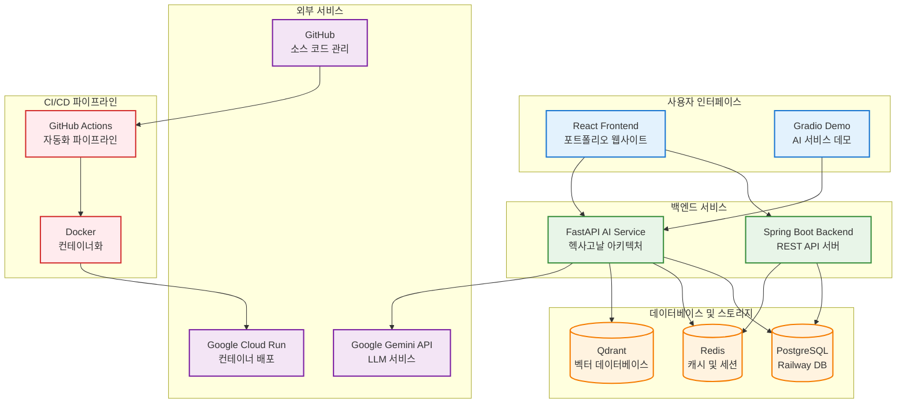
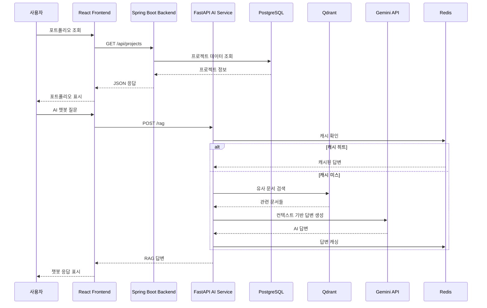
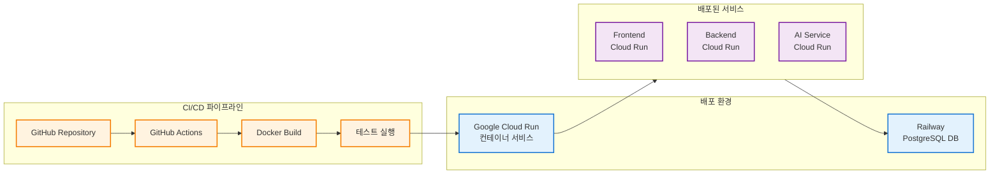

# AI 포트폴리오 시스템 구성도

## 전체 시스템 아키텍처

이 프로젝트는 프론트엔드, 백엔드, AI 서비스로 구성된 풀스택 포트폴리오 시스템입니다. 각 서비스는 Google Cloud Run에 배포되며, 데이터베이스는 Railway에서 관리됩니다.

## 서비스별 상세 구성

### 1. 프론트엔드 (React)
- **기술 스택**: React, TypeScript, Vite
- **주요 기능**: 포트폴리오 웹사이트, AI 챗봇 인터페이스
- **아키텍처**: Feature-Sliced Design (FSD)
- **배포**: Google Cloud Run

### 2. 백엔드 (Spring Boot)
- **기술 스택**: Java, Spring Boot, JPA
- **주요 기능**: REST API, 사용자 관리, 프로젝트 정보 관리
- **아키텍처**: 레이어드 아키텍처
- **데이터베이스**: Railway PostgreSQL (클라우드)
- **캐시**: Redis
- **배포**: Google Cloud Run

### 3. AI 서비스 (FastAPI)
- **기술 스택**: Python, FastAPI, LangChain
- **주요 기능**: RAG 챗봇, 문서 처리, 벡터 검색
- **아키텍처**: 헥사고날 아키텍처 (Ports & Adapters)
- **벡터 DB**: Qdrant
- **LLM**: Google Gemini API
- **데이터베이스**: Railway PostgreSQL (클라우드)
- **배포**: Google Cloud Run

## 데이터 흐름 다이어그램

## 배포 아키텍처

## 기술 스택 요약

| 구성 요소 | 기술 스택 | 주요 특징 |
|-----------|-----------|-----------|
| **프론트엔드** | React + TypeScript + Vite | FSD 아키텍처, 반응형 디자인 |
| **백엔드** | Spring Boot + Java | REST API, JPA, 보안 |
| **AI 서비스** | FastAPI + Python | 헥사고날 아키텍처, RAG 파이프라인 |
| **데이터베이스** | PostgreSQL + Redis + Qdrant | Railway PostgreSQL (클라우드), Cloud Run Redis/Qdrant |
| **외부 서비스** | Google Gemini API | LLM 서비스 |
| **배포** | Google Cloud Run + Docker | 컨테이너 기반 클라우드 배포 |
| **CI/CD** | GitHub Actions | 자동화 파이프라인 |

## 구현 상태

### ✅ 완료된 기능
- 프론트엔드 기본 구조 및 UI
- 백엔드 REST API 서버
- AI 서비스 헥사고날 아키텍처
- Docker 컨테이너화
- CI/CD 파이프라인
- Google Cloud Run 배포
- Railway PostgreSQL 데이터베이스 연동

### 🚧 진행 중인 기능
- RAG 파이프라인 최적화
- 벡터 데이터베이스 연동
- 캐시 시스템 구현

### 📋 계획된 기능
- 사용자 인증 시스템
- 실시간 채팅 기능
- 모니터링 및 로깅
- 성능 최적화
