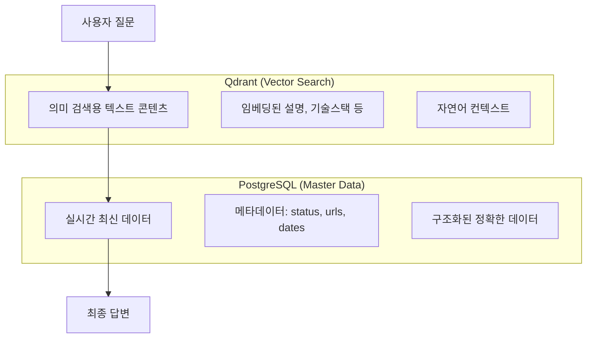

# 벡터 검색 후 PostgreSQL 조회 필요성

## 🎯 핵심 이유: 데이터 일관성과 최신성 보장

### 1. 벡터 DB와 PostgreSQL의 역할 분리



### 2. 구체적인 예시 시나리오

#### 시나리오 A: 프로젝트 상태 업데이트
```python
# 오전 10:00 - 관리자가 프로젝트 완료 처리
UPDATE projects SET 
    status = 'completed',
    end_date = '2024-12-31',
    live_url = 'https://ai-portfolio-demo.com'
WHERE business_id = 'PJT001';

# 오전 10:05 - 사용자 질문: "AI Portfolio 프로젝트는 완료되었나요?"

# 벡터 검색 결과 (아직 업데이트 안됨):
{
    "content": "AI Portfolio 프로젝트를 현재 개발 중입니다...",
    "metadata": {
        "project_id": "PJT001",
        "status": "in-progress",  # 오래된 정보
        "last_updated": "2024-12-20"
    }
}

# PostgreSQL 최신 조회:
{
    "business_id": "PJT001",
    "status": "completed",  # 최신 정보
    "end_date": "2024-12-31",
    "live_url": "https://ai-portfolio-demo.com"
}

# 최종 답변:
"네, AI Portfolio 프로젝트는 2024년 12월 31일에 완료되었습니다. 
데모는 https://ai-portfolio-demo.com 에서 확인하실 수 있습니다."
```

#### 시나리오 B: 새 프로젝트 추가
```python
# 오후 2:00 - 새 프로젝트 추가
INSERT INTO projects (business_id, title, status, technologies) 
VALUES ('PJT004', 'E-Commerce Platform', 'completed', ARRAY['Vue.js', 'Node.js']);

# 오후 2:10 - 사용자 질문: "Vue.js 프로젝트 경험이 있나요?"

# 벡터 검색 결과: 새 프로젝트는 아직 벡터화 안됨
# 기존 Vue.js 관련 knowledge base만 검색됨

# PostgreSQL 보완 조회:
SELECT * FROM projects WHERE technologies @> ARRAY['Vue.js'];
# → PJT004 발견!

# 최종 답변:
"네, Vue.js로 E-Commerce Platform 프로젝트를 완료했습니다. 
Node.js와 함께 풀스택으로 개발했습니다."
```

### 3. 데이터 레이어별 특성

#### A. Qdrant (벡터 DB)
```python
# 장점: 의미 기반 검색, 자연어 이해
# 단점: 업데이트 지연, 정확한 메타데이터 부족

vector_result = {
    "content": "React와 TypeScript를 사용하여 포트폴리오 사이트를 개발했습니다. 컴포넌트 기반 아키텍처로 재사용성을 높였고...",
    "score": 0.89,
    "metadata": {
        "project_id": "PJT001",
        "technologies": ["React", "TypeScript"],
        "last_vectorized": "2024-12-20T10:00:00Z"  # 벡터화 시점
    }
}
```

#### B. PostgreSQL (마스터 DB)
```python
# 장점: 실시간 최신 데이터, 정확한 메타데이터
# 단점: 의미 검색 불가, 자연어 이해 제한

postgres_result = {
    "business_id": "PJT001",
    "title": "AI Portfolio Chatbot",
    "status": "completed",
    "start_date": "2024-07-01",
    "end_date": "2024-12-31",
    "live_url": "https://ai-portfolio-demo.com",
    "github_url": "https://github.com/user/ai-portfolio",
    "technologies": ["React", "TypeScript", "Spring Boot"],
    "updated_at": "2024-12-31T15:30:00Z"  # 실제 업데이트 시점
}
```

### 4. 최적화된 조회 전략

```python
class SmartRAGService:
    async def process_question(self, question: str):
        # 1. 벡터 검색으로 관련 콘텐츠 찾기
        vector_results = await self.qdrant.search(question)
        
        # 2. 벡터 결과 분석
        needs_fresh_data = self.analyze_freshness(vector_results)
        
        if needs_fresh_data:
            # 3. 선택적 PostgreSQL 조회
            fresh_metadata = await self.get_fresh_metadata(vector_results)
            context = self.merge_contexts(vector_results, fresh_metadata)
        else:
            # 벡터 데이터만으로 충분
            context = vector_results
        
        # 4. 최종 응답 생성
        return await self.generate_response(question, context)
    
    def analyze_freshness(self, vector_results):
        """벡터 데이터의 신선도 분석"""
        for result in vector_results:
            last_vectorized = result.metadata.get('last_vectorized')
            if last_vectorized:
                age_hours = (datetime.now() - last_vectorized).total_seconds() / 3600
                if age_hours > 24:  # 24시간 이상 된 데이터
                    return True
        return False
    
    async def get_fresh_metadata(self, vector_results):
        """최신 메타데이터만 선별 조회"""
        project_ids = [r.metadata.get('project_id') for r in vector_results 
                      if r.metadata.get('content_type') == 'project']
        
        if project_ids:
            return await self.postgres.get_latest_project_metadata(project_ids)
        return None
```

### 5. 실제 응답 품질 비교

#### 벡터 검색만 사용한 경우:
```
사용자: "AI Portfolio 프로젝트 데모를 볼 수 있나요?"

AI 답변: "AI Portfolio 프로젝트는 현재 개발 중입니다. 
완료되면 데모 링크를 제공해드리겠습니다."
(오래된 벡터 데이터 기반)
```

#### 벡터 검색 + PostgreSQL 보완:
```
사용자: "AI Portfolio 프로젝트 데모를 볼 수 있나요?"

AI 답변: "네! AI Portfolio 프로젝트가 완료되었습니다. 
데모는 https://ai-portfolio-demo.com 에서 확인하실 수 있고,
소스코드는 https://github.com/user/ai-portfolio 에서 보실 수 있습니다."
(최신 PostgreSQL 데이터로 보완)
```

### 6. 성능 최적화 고려사항

```python
# 불필요한 PostgreSQL 조회 방지
class OptimizedRAGService:
    def __init__(self):
        self.cache = {}
        self.freshness_threshold = 3600  # 1시간
    
    async def smart_metadata_fetch(self, vector_results):
        """필요한 경우에만 PostgreSQL 조회"""
        
        # 캐시 확인
        cached_metadata = self.get_cached_metadata(vector_results)
        if cached_metadata and self.is_cache_fresh(cached_metadata):
            return cached_metadata
        
        # 벡터 데이터 신선도 확인
        if not self.needs_fresh_data(vector_results):
            return None
        
        # 선별적 조회 (변경된 항목만)
        changed_items = self.identify_changed_items(vector_results)
        if changed_items:
            fresh_data = await self.postgres.get_selective_updates(changed_items)
            self.update_cache(fresh_data)
            return fresh_data
        
        return None
```

## 🎯 결론

**벡터 검색 후 PostgreSQL 조회가 필요한 이유:**

1. **데이터 동기화 지연**: n8n 워크플로우로 인한 벡터 업데이트 지연
2. **메타데이터 정확성**: URL, 상태, 날짜 등 정확한 최신 정보 필요
3. **새 데이터 누락**: 최근 추가된 프로젝트가 아직 벡터화 안됨
4. **사용자 경험**: 항상 최신이고 정확한 정보 제공

**최적화 전략:**
- 벡터 데이터 신선도 분석 후 선택적 조회
- 자주 변경되지 않는 데이터는 벡터만 사용
- 메타데이터만 선별적으로 PostgreSQL에서 보완
- 캐싱으로 불필요한 중복 조회 방지

이렇게 하면 **의미 검색의 장점 + 실시간 정확성**을 모두 확보할 수 있습니다!